## 一、Docker 简介

### 1.1 docker 是什么

【问题】：问什么会有 docker 出现

​ Docker 的出现 使得 Docker 得以打破过去「程序即应用」的观念。透过镜像(images)将作业系统核心除外，运作应用程式所需要的系统环境，由下而上打包，达到应用程式跨平台间的无缝接轨运作。

【docker 理念】：解决了运行环境和配置问题的软件容器，方便持续继承并有助于整体发布的容器虚拟化技术。

### 1.2 容器与虚拟机比较

#### 1.2.1 容器发展简史

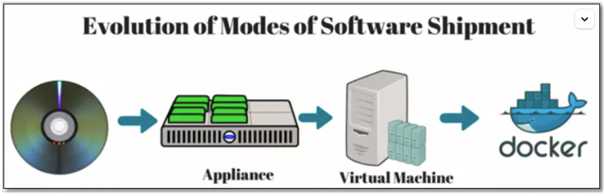

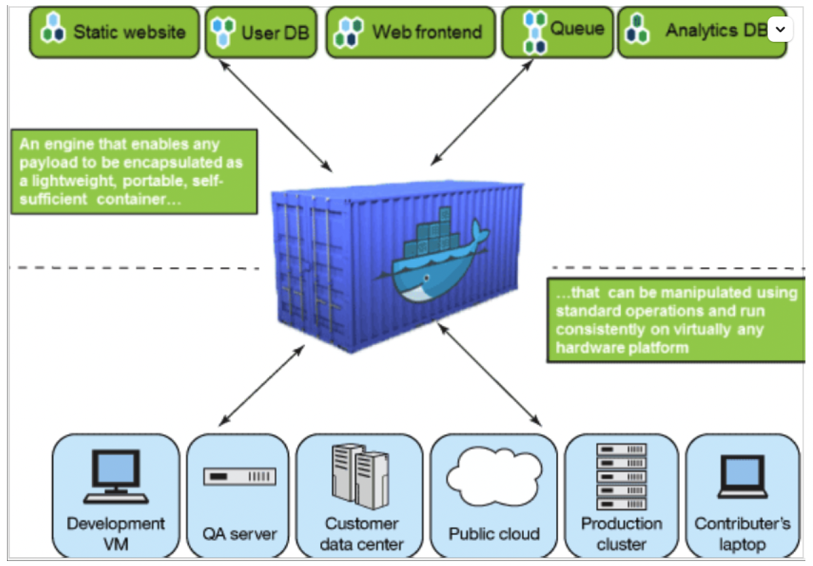

#### 1.2.2 传统虚拟机技术

虚拟机（virtual machine）就是带环境安装的一种解决方案。

它可以在一种操作系统里面运行另一种操作系统，比如在 Windows10 系统里面运行 Linux 系统 CentOS7。应用程序对此毫无感知，因为虚拟机看上去跟真实系统一模一样，而对于底层系统来说，虚拟机就是一个普通文件，不需要了就删掉，对其他部分毫无影响。这类虚拟机完美的运行了另一套系统，能够使应用程序，操作系统和硬件三者之间的逻辑不变。

| Win10 | VMWare | Centos7 | 各种 cpu、内存网络额配置+各种软件 | 虚拟机实例 |
| ----- | ------ | ------- | --------------------------------- | ---------- |
|       |        |         |                                   |            |

虚拟机的缺点：

1 资源占用多 2 冗余步骤多 3 启动慢

#### 1.2.3 容器虚拟化技术

由于前面虚拟机存在某些缺点，Linux 发展出了另一种虚拟化技术：

Linux 容器(Linux Containers，缩写为 LXC)

Linux 容器是与系统其他部分隔离开的一系列进程，从另一个镜像运行，并由该镜像提供支持进程所需的全部文件。容器提供的镜像包含了应用的所有依赖项，因而在从开发到测试再到生产的整个过程中，它都具有可移植性和一致性。

Linux 容器不是模拟一个完整的操作系统 而是对进程进行隔离。有了容器，就可以将软件运行所需的所有资源打包到一个隔离的容器中。 容器与虚拟机不同，不需要捆绑一整套操作系统 ，只需要软件工作所需的库资源和设置。系统因此而变得高效轻量并保证部署在任何环境中的软件都能始终如一地运行。

#### 1.2.4 对比

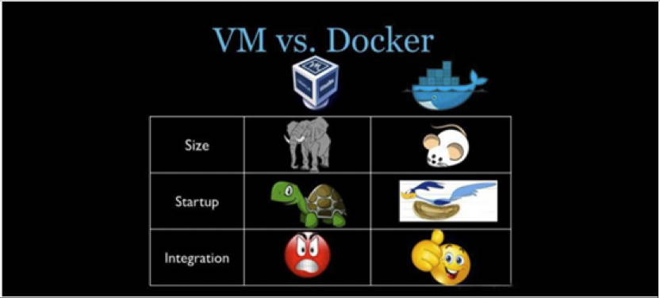

比较了 Docker 和传统虚拟化方式的不同之处：

传统虚拟机技术是虚拟出一套硬件后，在其上运行一个完整操作系统，在该系统上再运行所需应用进程； 容器内的应用进程直接运行于宿主的内核，容器内没有自己的内核 且也没有进行硬件虚拟 。因此容器要比传统虚拟机更为轻便。 每个容器之间互相隔离，每个容器有自己的文件系统 ，容器之间进程不会相互影响，能区分计算资源。

### 1.3 能干什么

#### 1.3.1 技术职级变化

coder -> programmer -> software engineer -> DevOps engineer

#### 1.3.2 开发/运维（Devops)新一代开发工程师

- 一次构建、随处运行
- 更快速的应用交付和部署
- 更便捷的升级和扩缩容
- 更简单的系统运维
- 更高效的计算资源利用

#### 1.3.3 Docker 应用场景

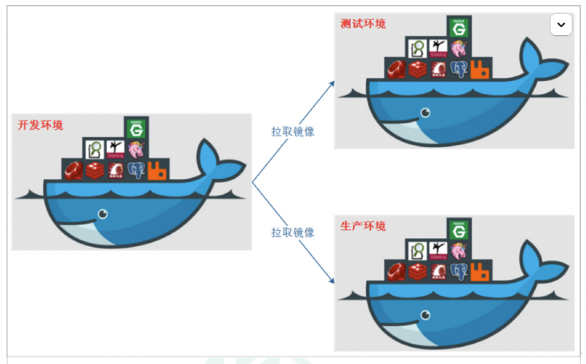

Docker 借鉴了标砖集装箱的概念。标准集装箱将货物运往世界各地，Docker 将这个模型运用到自己的设计中，唯一不同的是：集装箱运输货物，而 Docker 运输软件。

### 1.4 那些企业在使用

- 新浪

  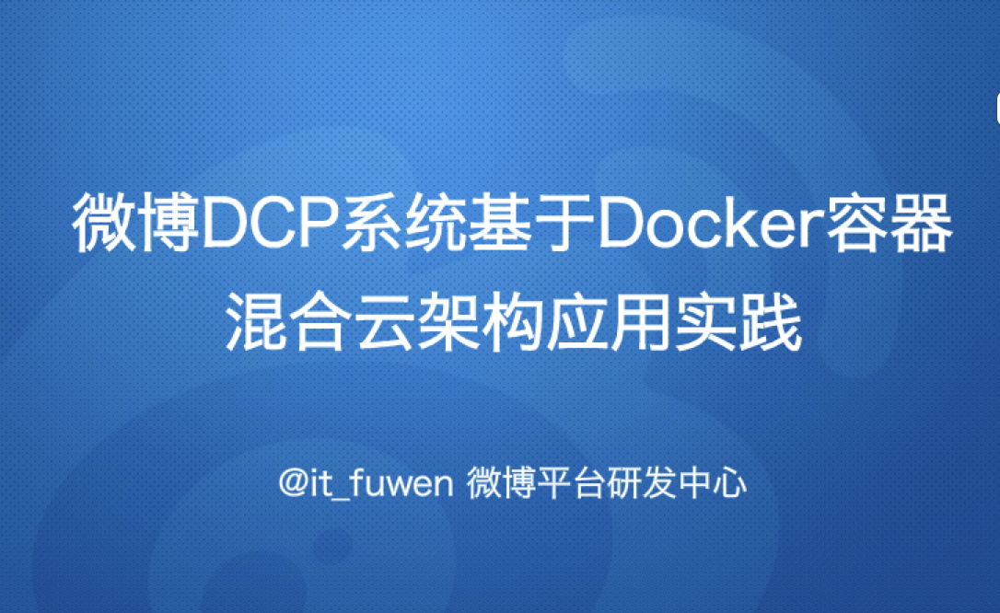

  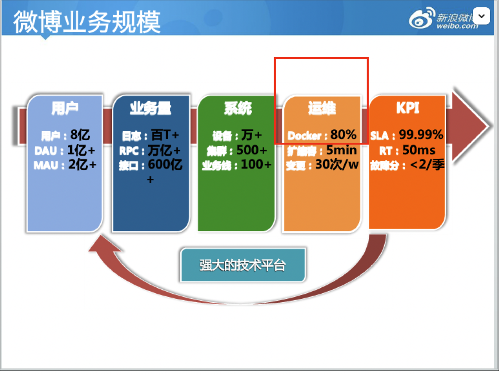

  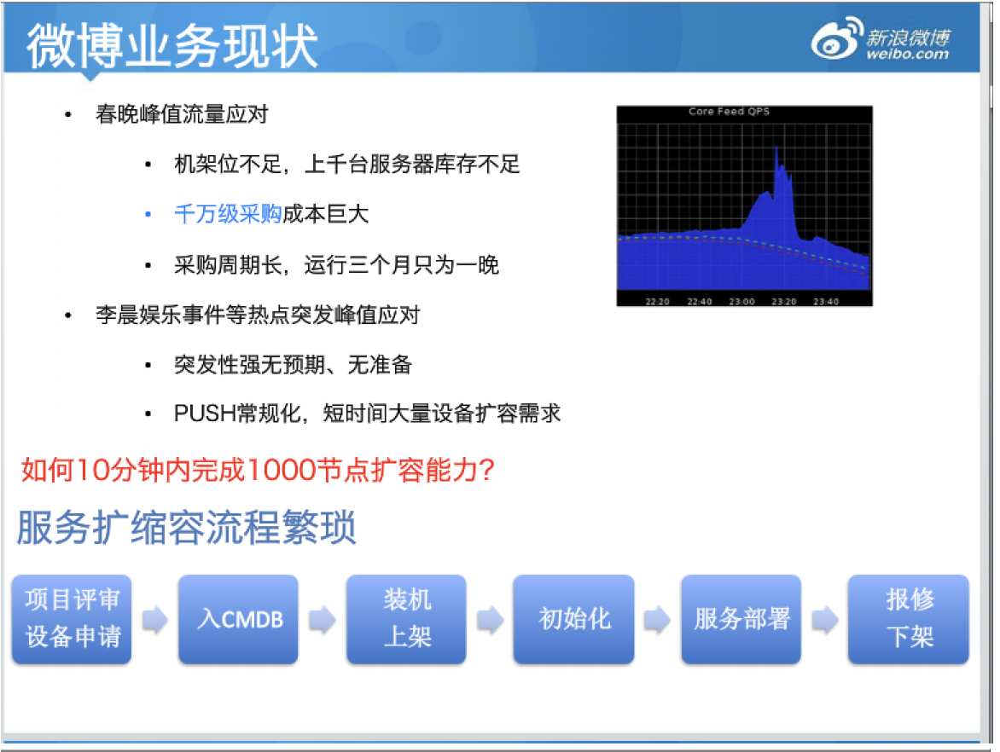

  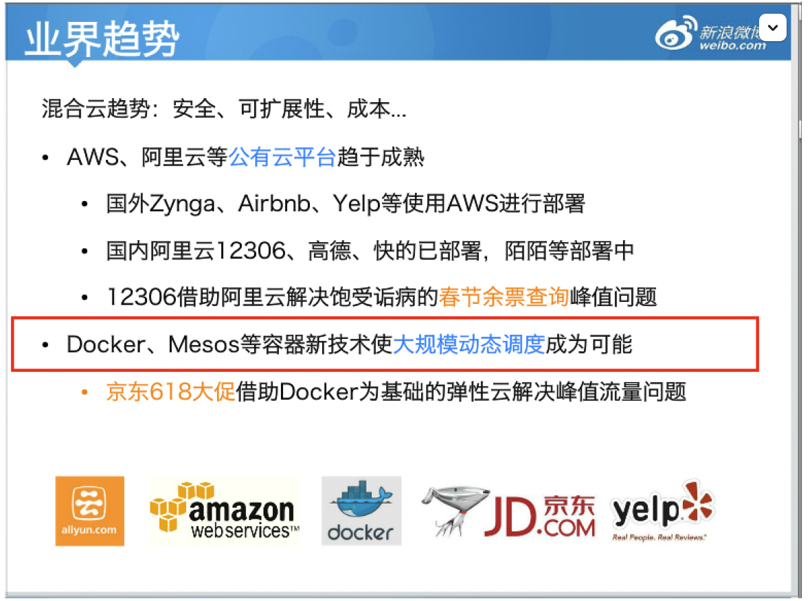

- 美团

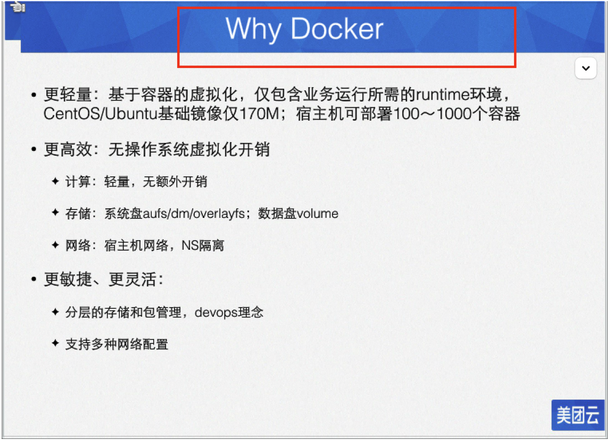

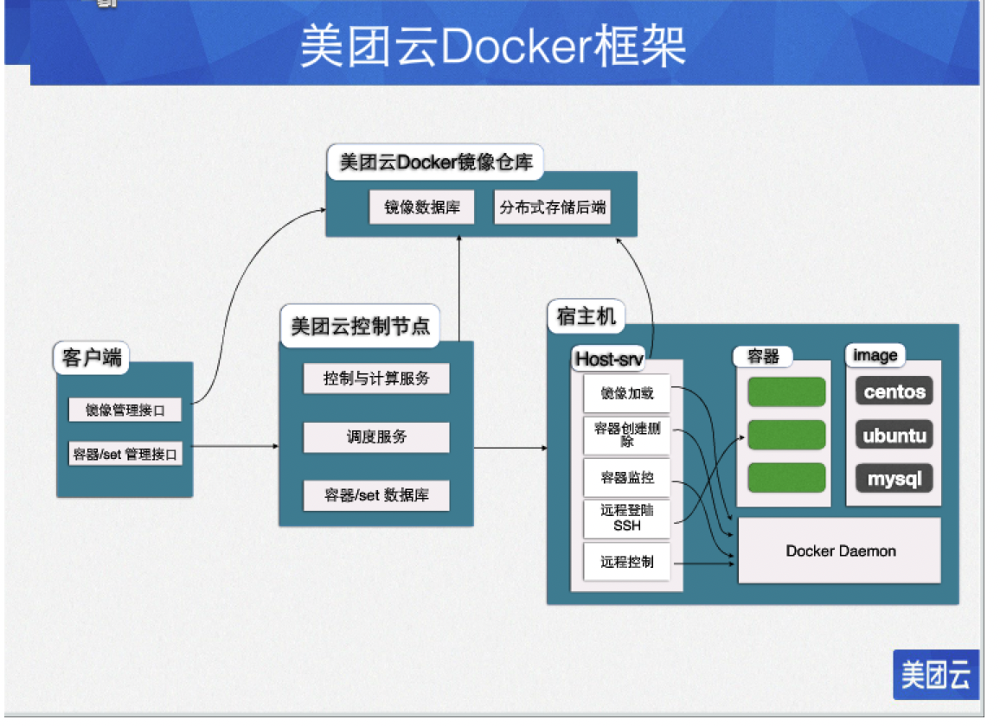

- 蘑菇街

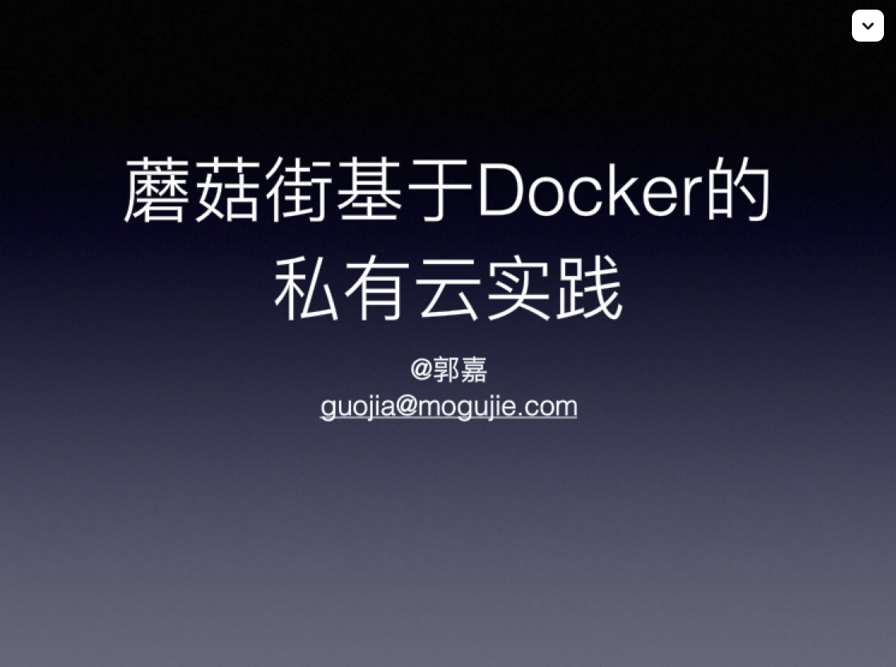

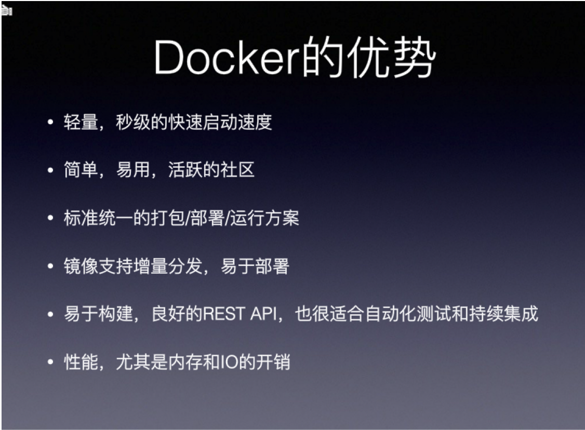

### 1.5 下载地址

官网：<http://www.docker.com>

Docker Hub 官网：<https://hub.docker.com>
