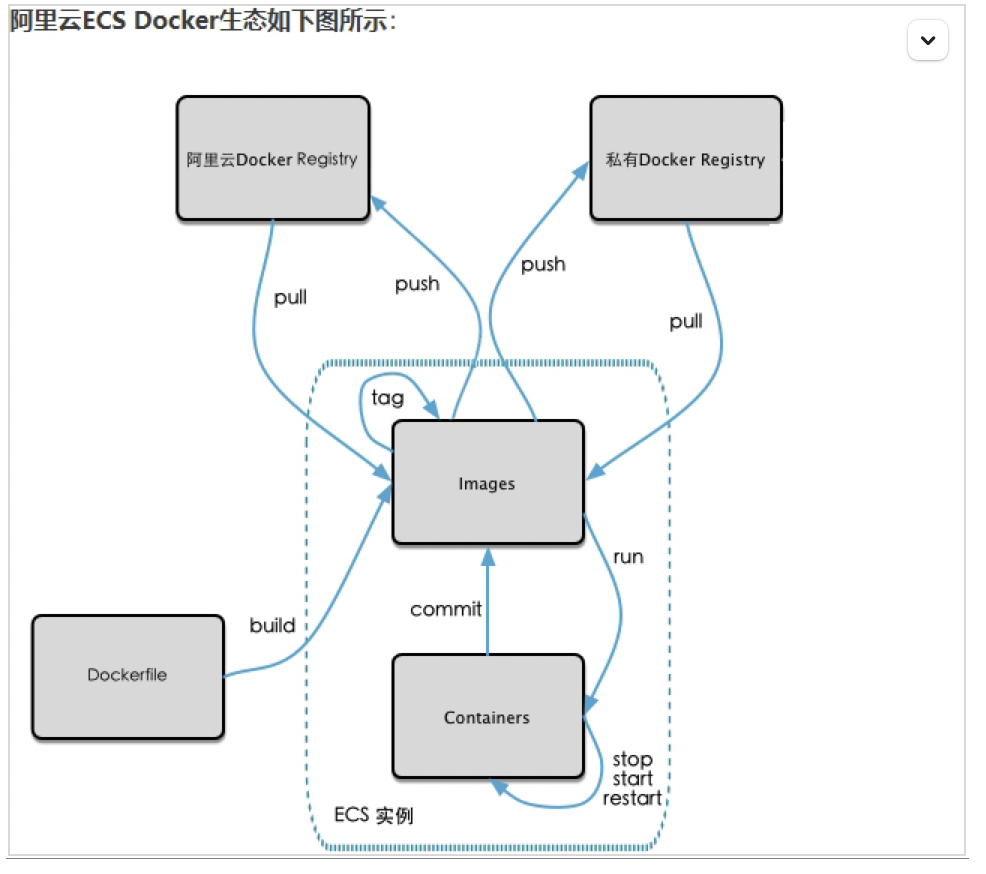
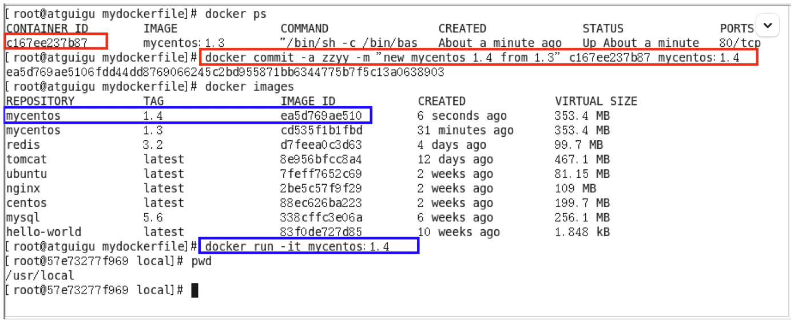
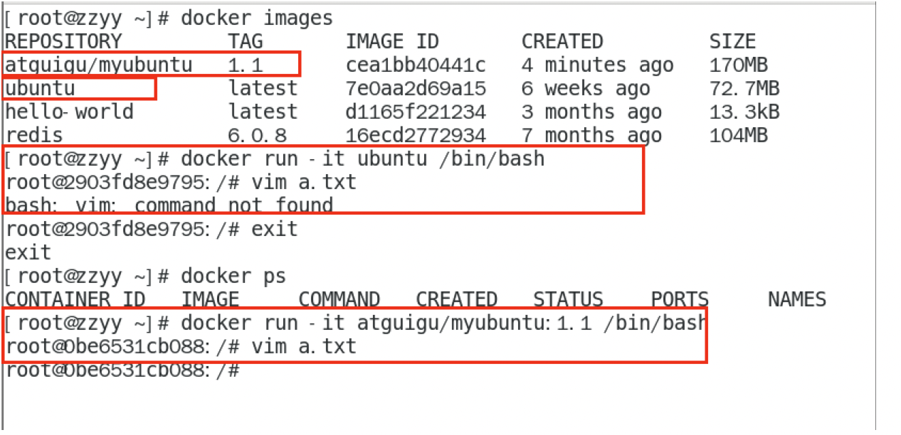
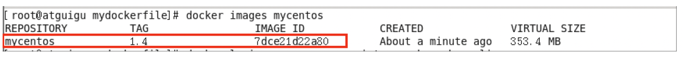
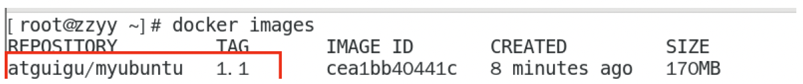
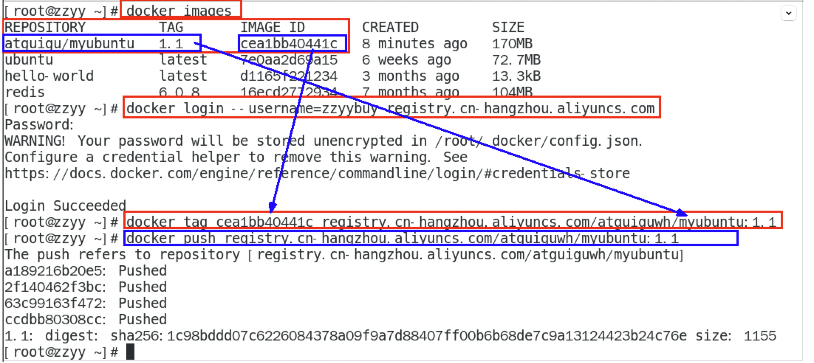
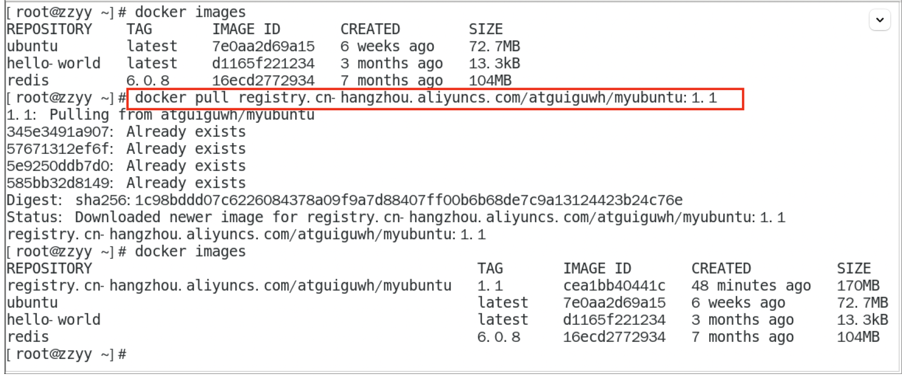

## 五、本地镜像发布到阿里云

### 5.1 本地镜像发布到阿里云流程



### 5.2 镜像生成的方法

上一讲已经介绍过

基于当前容器创建一个新的镜像，新功能增强

docker commit [OPTIONS]容器 ID [REPOSOTORY[:TAG]]

**OPTIONS 说明：**

-a :提交的镜像作者；

-m :提交时的说明文字；

本次案例 centos+ubuntu 两个，当堂讲解一个，家庭作业一个，请大家务必动手，亲自实操。





### 5.3 将本地镜像推送到阿里云

#### 本地镜像素材原型





#### 阿里云开发者平台

地址：<https://promotion.aliyun.com/ntms/act/kubernetes.html>

#### 将镜像推送到阿里云

将镜像推送到阿里云 registry ，管理界面脚本

#### 脚本实例

```bash
docker login --username=zzyybuy registry.cn-hangzhou.aliyuncs.com

docker tag cea1bb40441c registry.cn-hangzhou.aliyuncs.com/atguiguwh/myubuntu:1.1

docker push registry.cn-hangzhou.aliyuncs.com/atguiguwh/myubuntu:1.1

# 上面命令是我自己本地的，你自己酌情处理，不要粘贴我的。
```



### 5.4 将阿里云上的镜像下载到本地



```bash
docker pull registry.cn-hangzhou.aliyuncs.com/atguiguwh/myubuntu:1.1
```
