## 六、本地镜像发布到私有库

### 6.1 本地镜像发布到私有库流程

- 1. 下载镜像 Docker Registry

docker pull registry

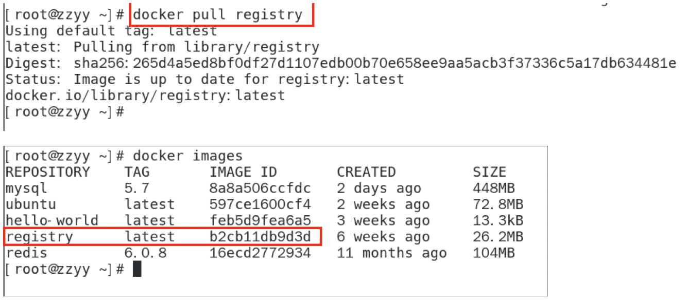

- 2. 运行私有库 Registry，相当于本地有个私有库 Docker hub

docker run -d -p 5000:5000 -v /zzyyuse/myregistry/:/tmp/registry --privileged=true registry

默认情况，仓库被创建在容器的/var/lib/registry 目录下，建议自行用容器卷映射，方便于宿主机联调

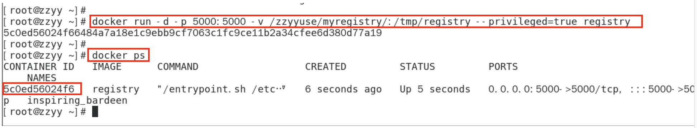

- 3. 案例演示创建一个新镜像，ubuntu 安装 ifconfig 命令

从 Hub 上下载 ubuntu 镜像到本地并成功运行

原始 Ubuntu 镜像是不带着 ifconfig 命令的

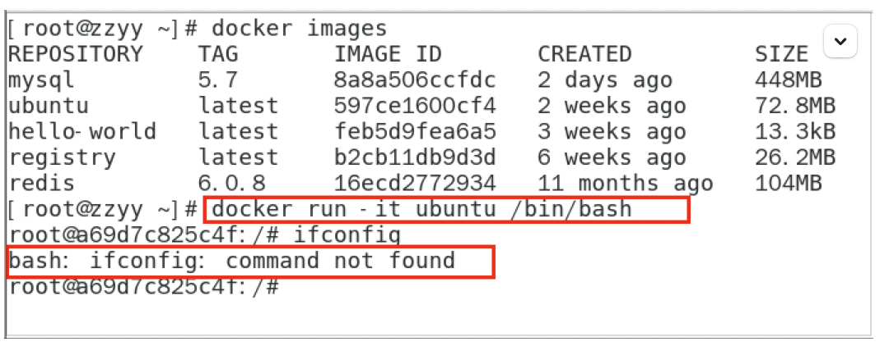

从 Hub 上下载 ubuntu 镜像到本地并成功运行

原始 Ubuntu 镜像是不带着 ifconfig 命令的
**外网连通情况下，安装 ifconfig 命令通过测试**

docker 容器内 执行上述两条命令：

apt-get update

apt-get install net-tools

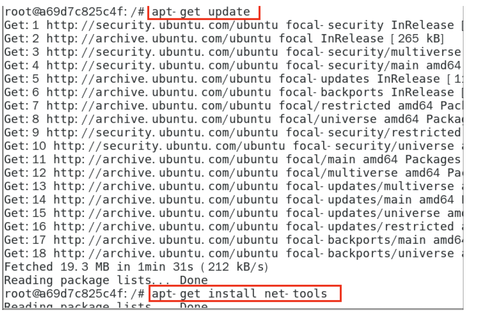

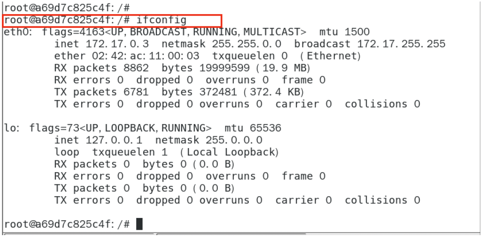
**安装完成后，commit 我们自己的新镜像**

公式：

docker commit -m=" 提交的描述信息 " -a=" 作者 " 容器 ID 要创建的目标镜像名 :[ 标签名 ]

命令： 在容器外执行，记得

docker commit -m=" ifconfig cmd add " -a=" zzyy " a69d7c825c4f zzyyubuntu:1.2

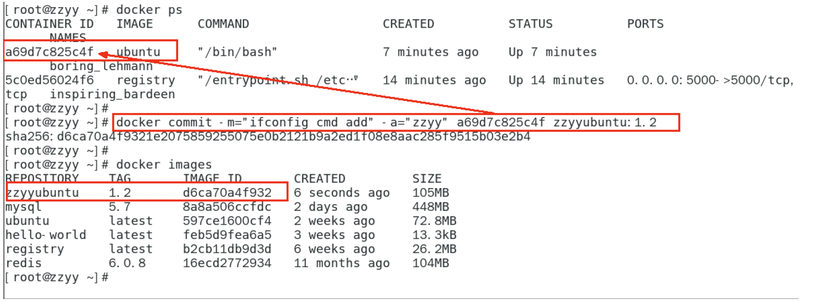
**启动我们的新镜像并和原来的对比**

1.官网是默认下载的 Ubuntu 没有 ifconfig 命令

2.我们自己 commit 构建的新镜像，新增加了 ifconfig 功能，可以成功使用。

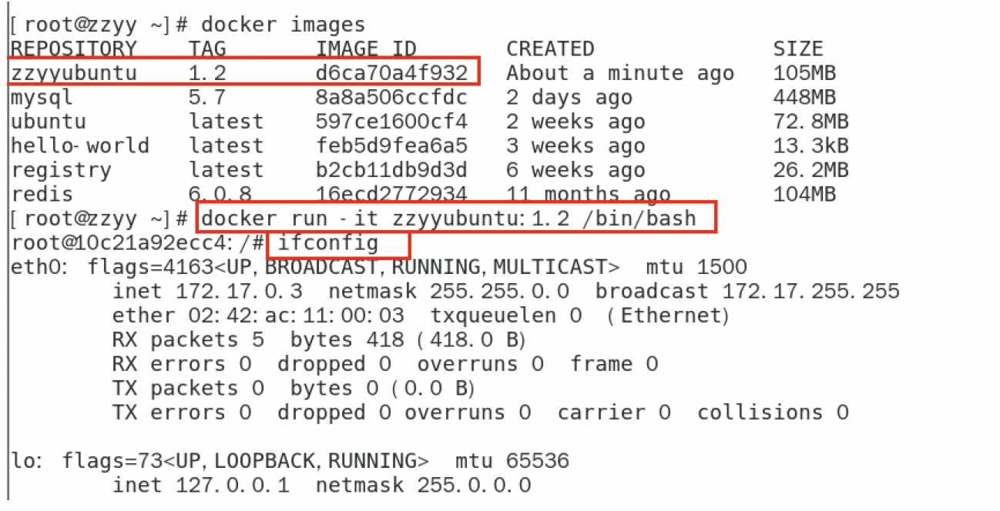

- 4. curl 验证私服库上有什么镜像

```bash
curl -XGET http://192.168.111.162:5000/v2/_catalog
```

可以看到，目前私服库没有任何镜像上传过。。。。。。

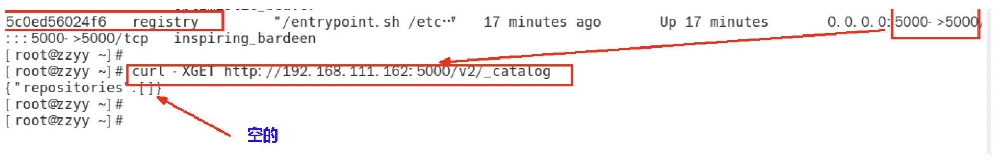

- 5. 将新镜像 zzyyubuntu:1.2 修改符合私服规范的 Tag

按照公式： docker   tag   镜像:Tag   Host:Port/Repository:Tag
自己 host 主机 IP 地址，填写同学你们自己的，不要粘贴错误，O(∩_∩)O
使用命令 docker tag 将 zzyyubuntu:1.2 这个镜像修改为 192.168.111.162:5000/zzyyubuntu:1.2

```bash
  docker tag  zzyyubuntu:1.2  192.168.111.162:5000/zzyyubuntu:1.2
```

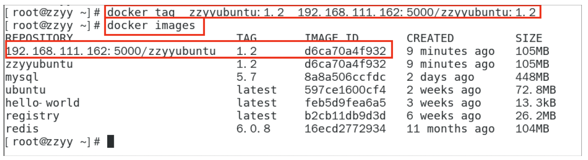

- 6. 修改配置文件使之支持 http

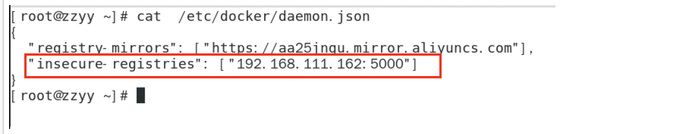

别无脑照着复制，registry-mirrors 配置的是国内阿里提供的镜像加速地址，不用加速的话访问官网的会很慢。
2 个配置中间有个逗号 ','别漏了 ，这个配置是 json 格式的。

vim 命令新增如下红色内容：vim /etc/docker/daemon.json

```bash
{
  "registry-mirrors": ["https://aa25jngu.mirror.aliyuncs.com"] ,
  "insecure-registries": ["192.168.111.162:5000"]
}
```

上述理由：docker 默认不允许 http 方式推送镜像，通过配置选项来取消这个限制。====> 修改完后如果不生效，建议重启 docker

- 7. push 推送到私服库

```bash
docker push 192.168.111.162:5000/zzyyubuntu:1.2
```

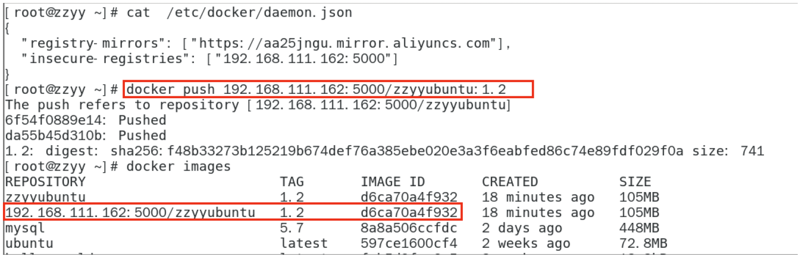

- 8. curl 验证私服库上有什么镜像

```bash
curl -XGET http://192.168.111.162:5000/v2/_catalog
```

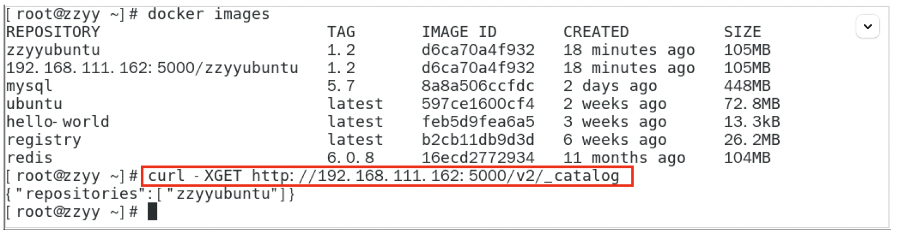

- 9. pull 到本地并运行

```bash
docker pull 192.168.111.162:5000/zzyyubuntu:1.2
```

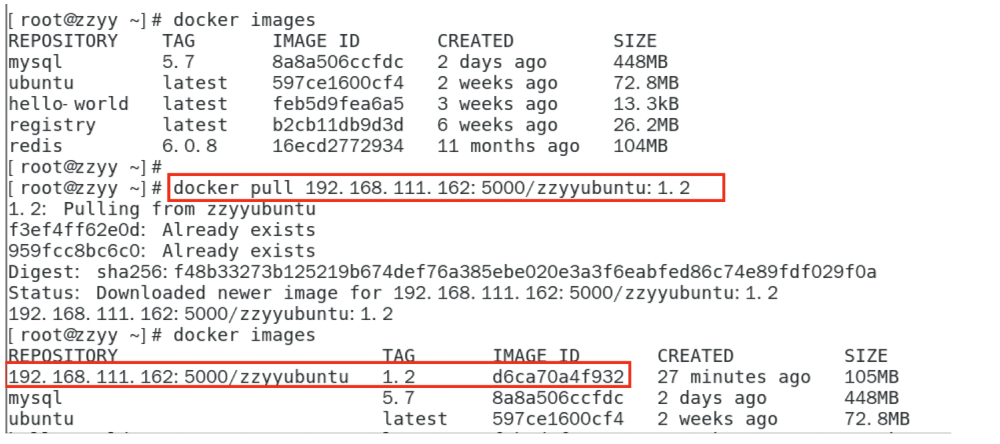

docker run -it 镜像 ID /bin/bash

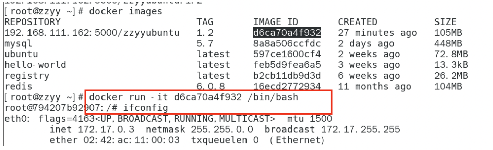
