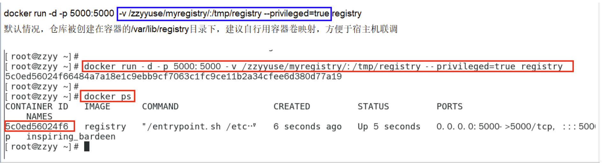
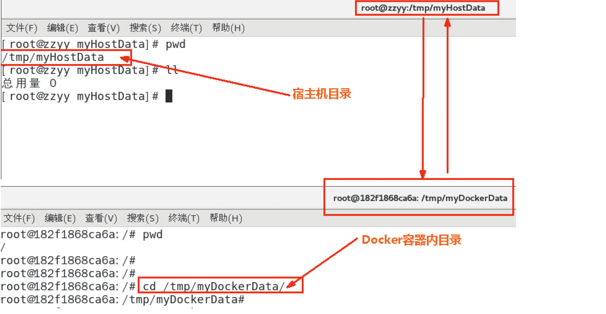
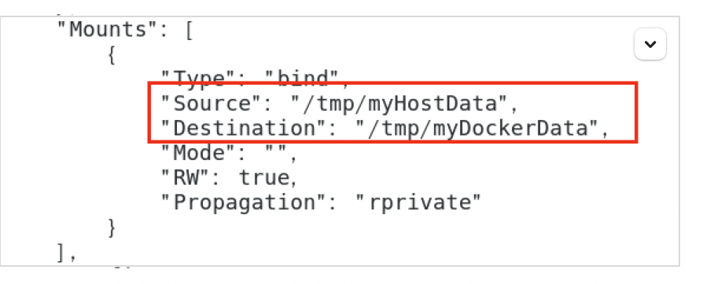
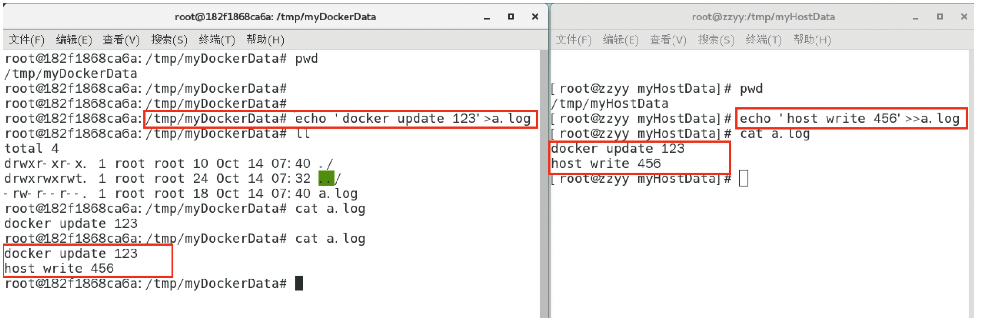
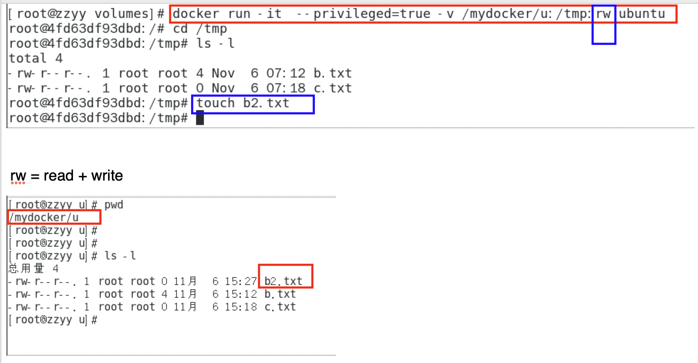
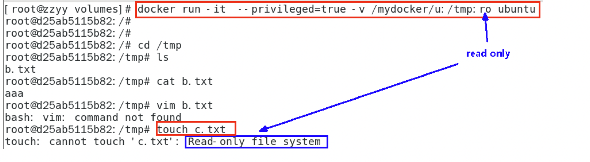
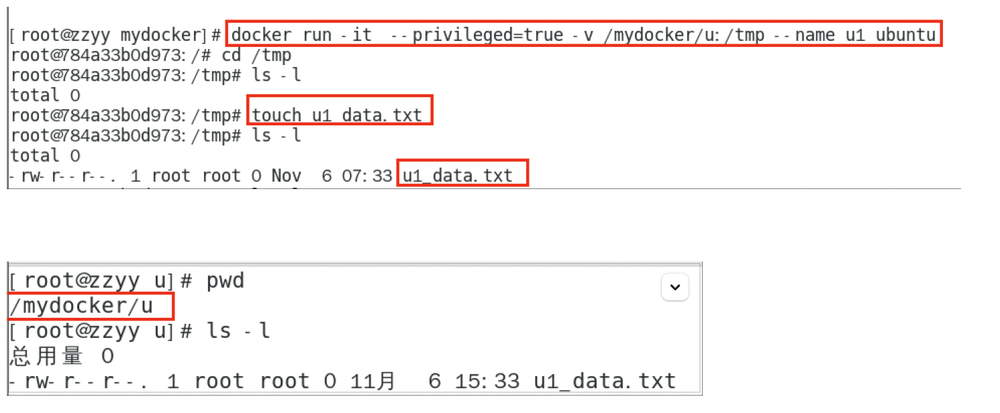

## 七、Docker 容器数据卷

### 7.1 坑：容器卷记得加入

```bash
--privileged=true
```

原因:

Docker 挂载主机目录访问 如果出现 cannot open directory .: Permission denied
解决办法：在挂载目录后多加一个--privileged=true 参数即可

如果是 CentOS7 安全模块会比之前系统版本加强，不安全的会先禁止，所以目录挂载的情况被默认为不安全的行为，
在 SELinux 里面挂载目录被禁止掉了额，如果要开启，我们一般使用--privileged=true 命令，扩大容器的权限解决挂载目录没有权限的问题，也即
使用该参数，container 内的 root 拥有真正的 root 权限，否则，container 内的 root 只是外部的一个普通用户权限。

### 7.2 回顾下上一将的知识点，参数 V

还记得蓝色框框中的内容嘛



### 7.3 容器数据卷是什么

一句话：有点类似我们 Redis 里面的 rdb 和 aof 文件
将 docker 容器内的数据保存进宿主机的磁盘中
运行一个带有容器卷存储功能的容器实例

```bash
docker run -it --privileged=true -v /宿主机绝对路径目录:/容器内目录      镜像名
```

### 7.4 容器数据卷能干什么

将运用与运行的环境打包镜像，run 后形成容器实例运行 ，但是我们对数据的要求希望是 持久化的

Docker 容器产生的数据，如果不备份，那么当容器实例删除后，容器内的数据自然也就没有了。
为了能保存数据在 docker 中我们使用卷。

特点:

1. 数据卷可在容器之间共享或重用数据
2. 卷中的更改可以直接实时生效，爽
3. 数据卷中的更改不会包含在镜像的更新中
4. 数据卷的生命周期一直持续到没有容器使用它为止

### 7.5 数据卷案例

#### 7.5.1 宿主 vs 容器之间映射添加容器卷

##### 直接命令添加

```bash
docker run -it -v /宿主机目录:/容器内目录
ubuntu /bin/bash
docker run -it --name myu3 --privileged=true -v /tmp/myHostData:/tmp/myDockerData ubuntu /bin/bash
```



##### 查看数据卷是否挂成功

```bash
docker inspect 容器ID
```



##### 容器和宿主机之间数据共享

1. docker 修改，主机同步获得
2. 主机修改，docker 同步获得
3. docker 容器 stop，主机修改，docker 容器重启看数据是否同步。



#### 7.5.2 读写规则映射添加说明

##### 读写(默认)

```bash
docker run -it --privileged=true -v /宿主机绝对路径目录:/容器内目录:rw  镜像名
默认同上案例，默认就是rw
```



默认同上案例，默认就是 rw

##### 只读

容器实例内部被限制，只能读取不能写



/容器目录:ro 镜像名                就能完成功能，此时容器自己只能读取不能写
ro = read only
此时如果宿主机写入内容，可以同步给容器内，容器可以读取到。

```bash
docker run -it --privileged=true -v /宿主机绝对路径目录:/容器内目录:ro      镜像名
```

#### 7.5.3 卷的集成和共享

容器 1 完成和宿主机的映射

```bash
docker run -it --privileged=true -v /mydocker/u:/tmp --name u1 ubuntu
```



容器 2 集成容器 1 的卷规则

```bash
docker run -it --privileged=true --volumes-from 父类 --name u2 ubuntu
```
