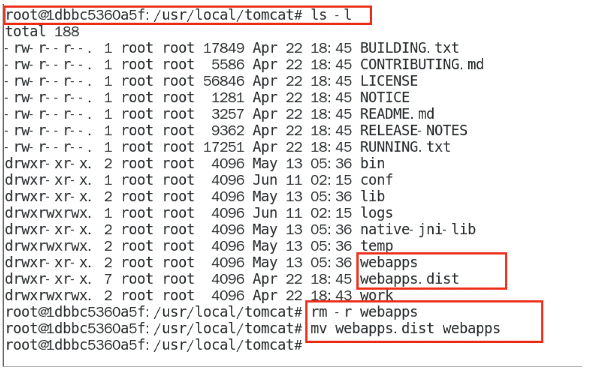
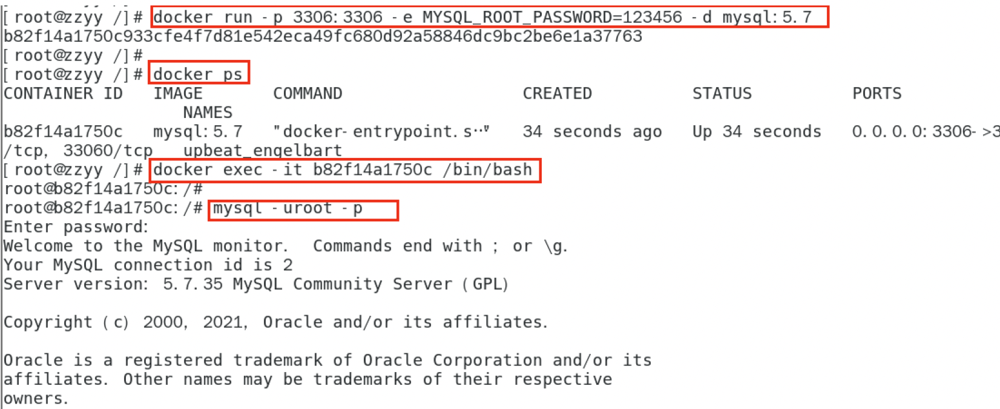
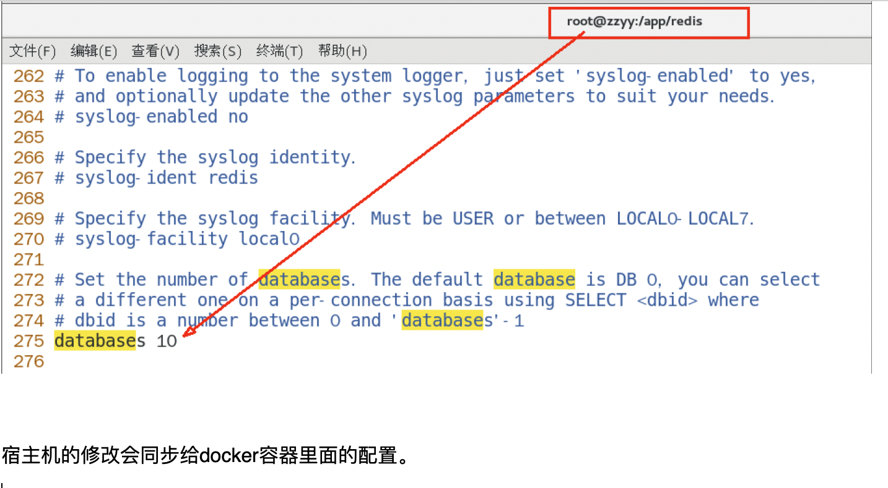
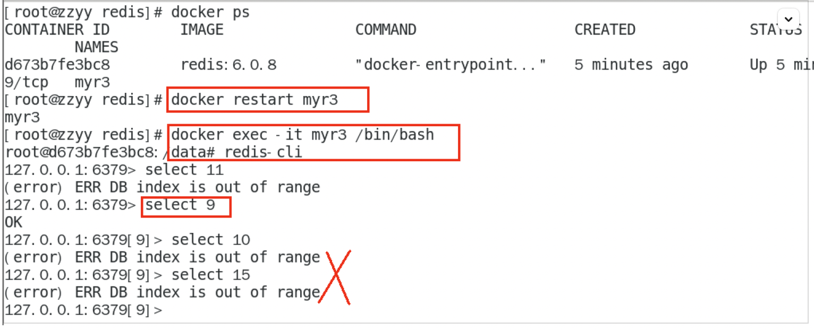

## 八、Docker 常规安装简介

### 8.1 总体步骤

1. 搜索镜像
2. 拉取镜像
3. 查看镜像
4. 启动镜像
5. 服务端口映射
6. 停止容器

### 8.2 安装 tomcat

1、docker hub 上面查找 tomcat 镜像

```bash
# 命令
docker search tomcat
```

2、从 docker hub 上拉取 tomcat 镜像到本地

```bash
# 命令
docker pull tomcat
```

3、docker images 查看是否有拉取到 tomcat

```bash
# 命令
docker images tomcat
```

4、使用 tomcat 镜像创建容器实例（也叫运行镜像）

```bash
# 命令
docker run -it -p 8080:8080 tomcat

# -p 小写，主机端口:docker容器端口

# -P 大写，随机分配端口

# i:交互

# t:终端

# d:后台
```

5、访问 tomcat 首页

可能出现 404 的情况

解决

1. 可能没有映射端口或者没有关闭防火墙
2. 把 webapps.dist 目录换成 webapps
   先成功启动 tomcat


查看 webapps 文件夹查看为空



6、免修改版说明

docker pull billygoo/tomcat8-jdk8

Docker run -d -p 8080:8080 --name mytomcat8 billygoo/tomcat8-djk8

### 8.3 安装 mysql

1、docker hub 上面查找 mysql 镜像

```bash
# 命令
docker search mysql
```

2、从 docker hub 上（阿里云加速器）拉取 mysql 镜像到本地标签为 5.7

```bash
# 命令
docker pull mysql:5.7
```

3、使用 mysql5.7 镜像创建容器（也叫运行镜像）

```bash
# 1、命令出处，哪里来的
地址：https://hub.docker.com/_/mysql
# 2、简单版
docker run -p 3306:3306 -e MYSQL_ROOT_PASSWORD=123456 -d mysql:5.7

docker ps

docker exec -it 容器ID /bin/bash

mysql -uroot -p
```



```bash
# 4、 建库建表插入数据
```


外部 Win10 也来连接运行在 dokcer 上的 mysql 容器实例服务
【问题】
插入中文数据试试，为什么报错？ docker 上默认字符集编码隐患

docker 里面的 mysql 容器实例查看，内容如下：

```bash
SHOW VARIABLES LIKE 'character%'
```

删除容器后，里面的 mysql 数据如何办

容器实例一删除，你还有什么？
删容器到跑路。。。。。？

【实战版】

```bash
#1、新建mysql容器实例
docker run -d -p 3306:3306 --privileged=true -v /zzyyuse/mysql/log:/var/log/mysql -v /zzyyuse/mysql/data:/var/lib/mysql -v /zzyyuse/mysql/conf:/etc/mysql/conf.d -e MYSQL_ROOT_PASSWORD=123456  --name mysql mysql:5.7

#2、新建my.cnf  通过容器卷同步给MySQL容器实例
[client]
default_character_set=utf8
[mysqld]
collation_server = utf8_general_ci
character_set_server = utf8

#3、重新启动mysql容器实例在重新进入并查看字符编码
docker restart mysql

docker exec -it mysql_bash

show variables like 'character%';
#4、再新建库新建表再插入中文测试
完全正常
#5、结论
之前的DB  无效
修改字符集操作+重启mysql容器实例
之后的DB  有效，需要新建
结论： docker安装完MySQL并run出容器后，建议请先修改完字符集编码后再新建mysql库-表-插数据
#6、假如将当前容器实例删除，再重新来一次，之前建的db01实例还有吗？trytry
```

### 8.4 安装 redis

1、从 docker hub 上（阿里云加速器）拉取 redis 镜像到本地标签 6.0.8

```bash
# 拉取镜像
docker pull redis:6.0.8
# 查看镜像
docker images
```

2、入门命令

```bash
# 启动命令
docker run -d -p 6379:6379 redis:6.0.8
# docker ps
# 后台启动
docker exec -it CONTAINER ID /bin/bash
```

3、命令提醒：容器卷记得加入 --privileged=true

Docker 挂载主机目录 Docker 访问出现 cannot open directory .: Permission denied
解决办法：在挂载目录后多加一个--privileged=true 参数即可

4、在 CentOS 宿主机下新建目录/app/redis

```bash
# 新建目录
mkdir -p /app/redis
```

5、将一个 redis.conf 文件模板拷贝进 /app/redis 目录下

```bash
mkdir -p /app/redis

cp /myredis/redis.conf  /app/redis/

cp /app/redis
```

6、/app/redis 目录下修改 redis.conf

```bash
# 修改redis.conf文件
/app/redis目录下修改redis.conf文件
开启redis验证     可选
requirepass 123
允许redis外地连接  必须
注释掉 # bind 127.0.0.1

# 注释daemonize no
daemonize no
将daemonize yes注释起来或者 daemonize no设置，因为该配置和docker run中-d参数冲突，会导致容器一直启动失败

# 开启redis数据持久化
appendonly yes  可选
```

7、使用 redis6.0.8 镜像创建容器(也叫运行镜像)

```bash
docker run  -p 6379:6379 --name myr3 --privileged=true -v /app/redis/redis.conf:/etc/redis/redis.conf -v /app/redis/data:/data -d redis:6.0.8 redis-server /etc/redis/redis.conf
```

8、测试 redis-cli 连接上

docker exec -it 运行着 Rediis 服务的容器 ID redis-cli


9、请证明 docker 启动使用了我们自己指定的配置文件

【修改前】


【修改后】



10、测试 redis-cli 连接上来第 2 次


