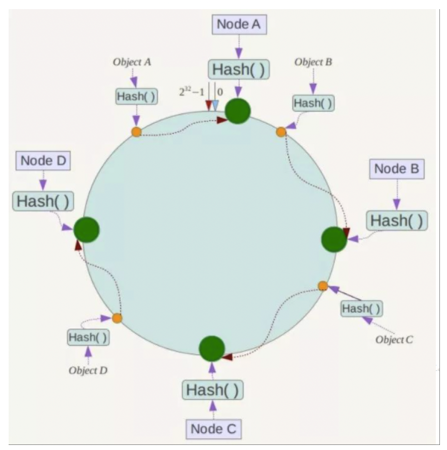
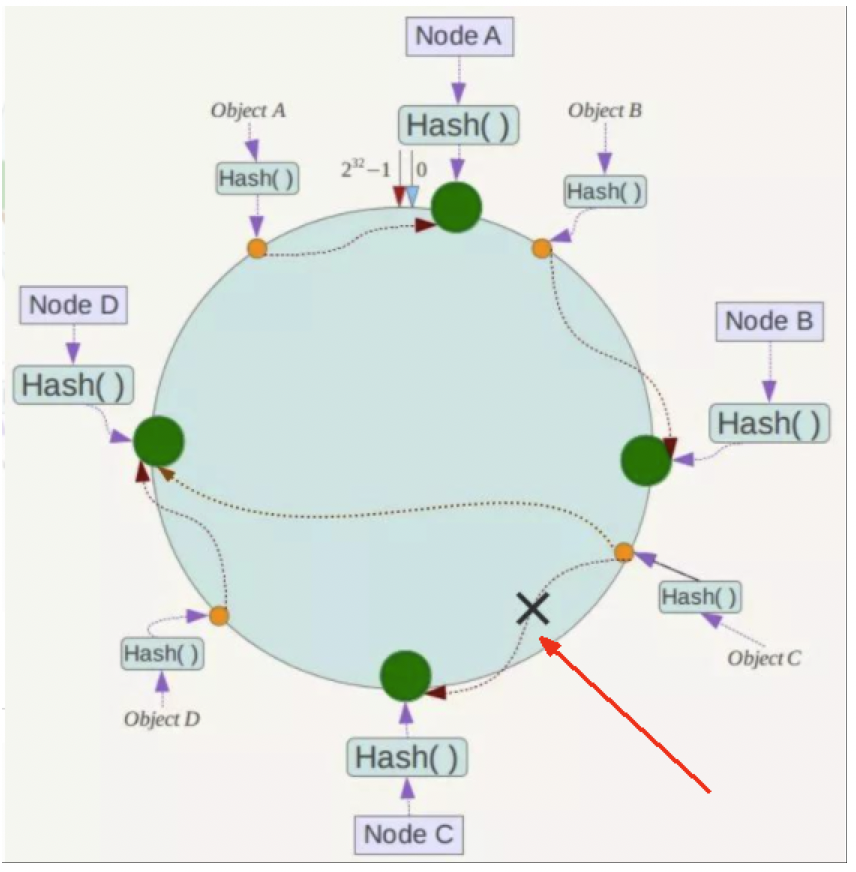
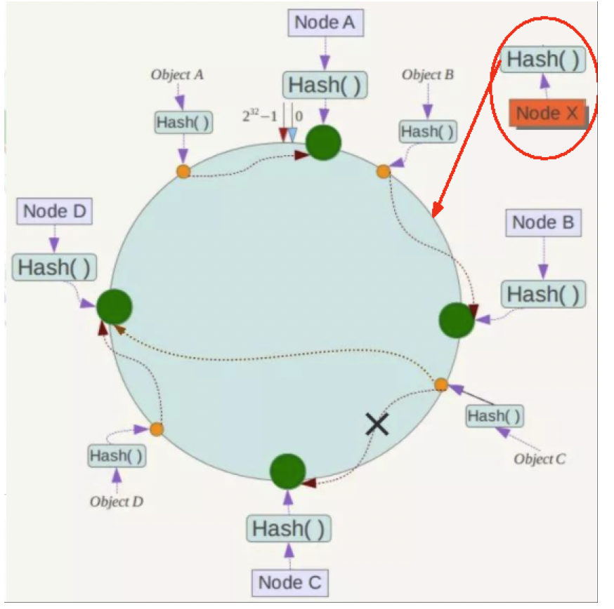
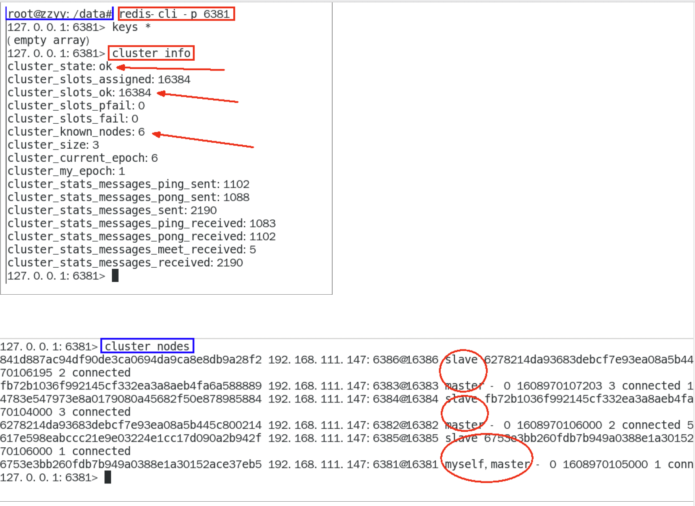
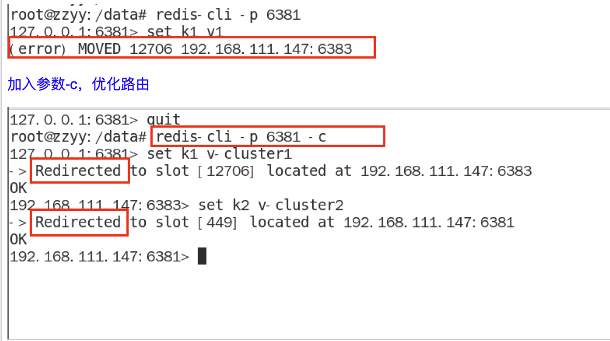
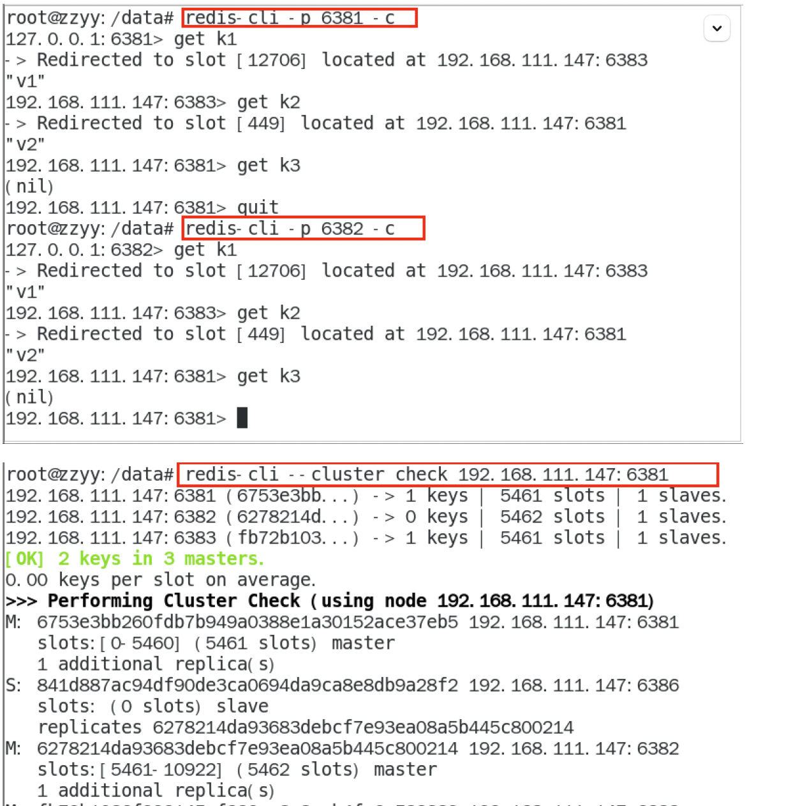
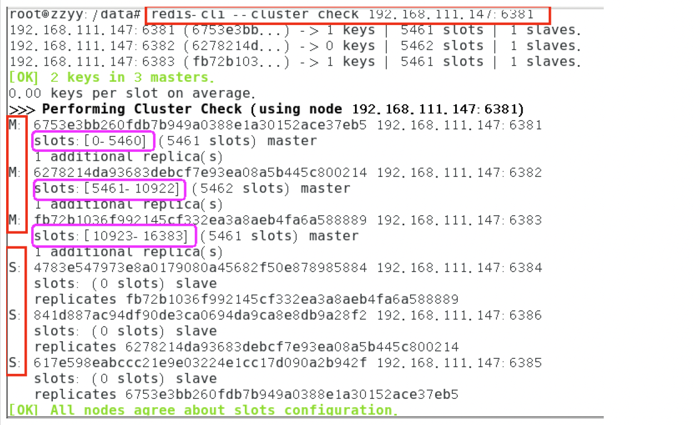
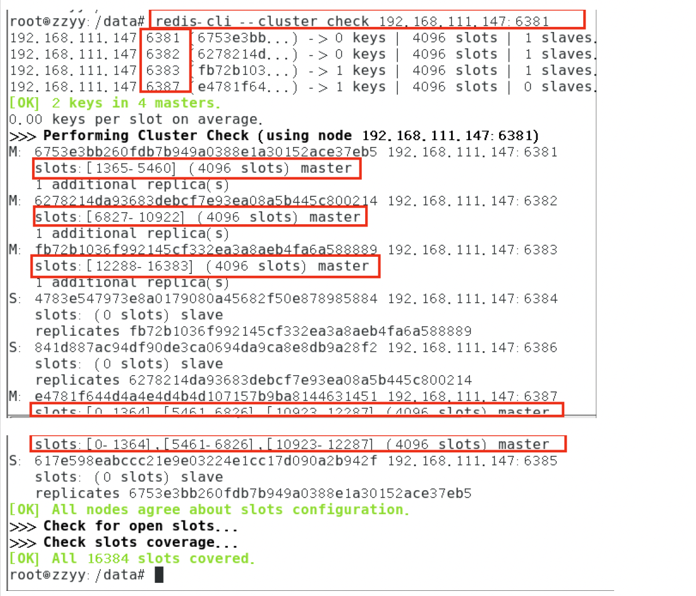
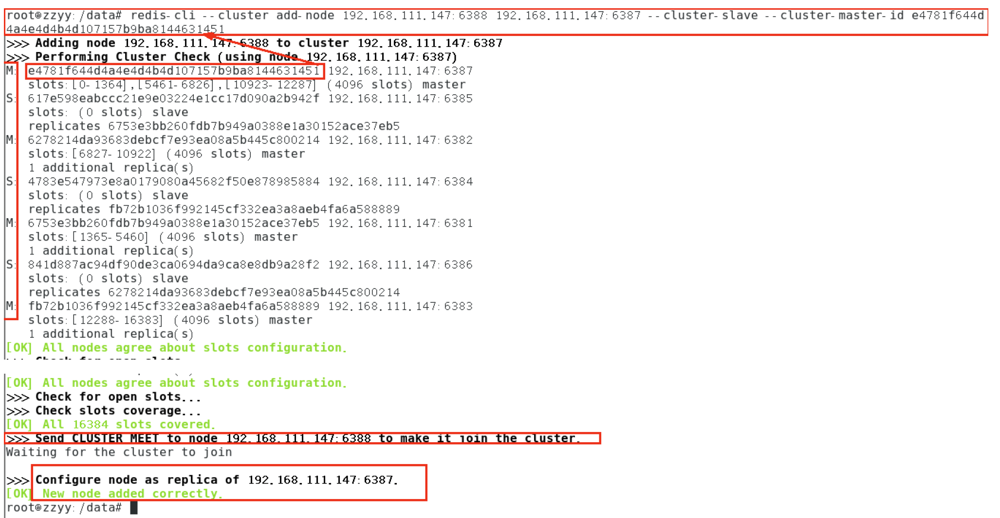
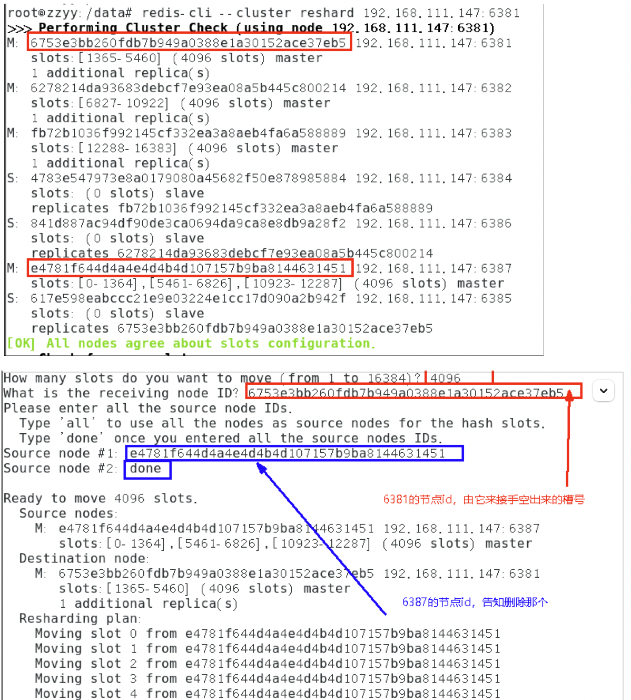

## 一、Docker 复杂安装

### 1.1 安装 mysql 主从复制

#### 1.1.1 主从复制原理

默认你已经了解

#### 1.1.2 主从搭建步骤

1、新建主服务器容器实例 3307

```bash
docker run -p 3307:3306 --name mysql-master \
-v /mydata/mysql-master/log:/var/log/mysql \
-v /mydata/mysql-master/data:/var/lib/mysql \
-v /mydata/mysql-master/conf:/etc/mysql \
-e MYSQL_ROOT_PASSWORD=root  \
-d mysql:5.7
```

2、进入/mydata/mysql-master/conf 目录下新建 my.cnf

```bash
[mysqld]
## 设置server_id，同一局域网中需要唯一
server_id=101 
## 指定不需要同步的数据库名称
binlog-ignore-db=mysql  
## 开启二进制日志功能
log-bin=mall-mysql-bin  
## 设置二进制日志使用内存大小（事务）
binlog_cache_size=1M  
## 设置使用的二进制日志格式（mixed,statement,row）
binlog_format=mixed  
## 二进制日志过期清理时间。默认值为0，表示不自动清理。
expire_logs_days=7  
## 跳过主从复制中遇到的所有错误或指定类型的错误，避免slave端复制中断。
## 如：1062错误是指一些主键重复，1032错误是因为主从数据库数据不一致
slave_skip_errors=1062
## 设置utf8
collation_server = utf8_general_ci
## 设置server字符集
character_set_server = utf8
[client]
default_character_set=utf8
```

3、修改完配置后重启 master 实例

```bash
docker restart mysql-master
```

4、进入 mysql-master 容器

```bash
docker exec -it mysql-master /bin/bash

mysql -uroot -proot
```

5、maser 容器实例内创建数据同步用户

```bash
# 创建同步用户
CREATE USER 'slave'@'%' IDENTIFIED BY '123456';

# 同步用户授权
GRANT REPLICATION SLAVE, REPLICATION CLIENT ON *.* TO 'slave'@'%';
```

6、新建从服务容器实例 3308

```bash
docker run -p 3308:3306 --name mysql-slave \
-v /mydata/mysql-slave/log:/var/log/mysql \
-v /mydata/mysql-slave/data:/var/lib/mysql \
-v /mydata/mysql-slave/conf:/etc/mysql \
-e MYSQL_ROOT_PASSWORD=root  \
-d mysql:5.7
```

7、进入/mydata/mysql-slave/conf 目录下新建 my.cnf

```bash
# 添加配置文件
[mysqld]
## 设置server_id，同一局域网中需要唯一
server_id=102
## 指定不需要同步的数据库名称
binlog-ignore-db=mysql  
## 开启二进制日志功能，以备Slave作为其它数据库实例的Master时使用
log-bin=mall-mysql-slave1-bin  
## 设置二进制日志使用内存大小（事务）
binlog_cache_size=1M  
## 设置使用的二进制日志格式（mixed,statement,row）
binlog_format=mixed  
## 二进制日志过期清理时间。默认值为0，表示不自动清理。
expire_logs_days=7  
## 跳过主从复制中遇到的所有错误或指定类型的错误，避免slave端复制中断。
## 如：1062错误是指一些主键重复，1032错误是因为主从数据库数据不一致
slave_skip_errors=1062  
## relay_log配置中继日志
relay_log=mall-mysql-relay-bin  
## log_slave_updates表示slave将复制事件写进自己的二进制日志
log_slave_updates=1  
## slave设置为只读（具有super权限的用户除外）
read_only=1
## 设置utf8
collation_server = utf8_general_ci
## 设置server字符集
character_set_server = utf8
[client]
default_character_set=utf8
```

8、修改完配置后重启 slave 实例

```bash
docker restart mysql-slave
```

9、在主数据库中查看主从同步状态

```bash
show master status;
```

10、进入 mysql-slave 容器

```bash
docker exec -it mysql-slave /bin/bash
mysql -uroot -proot
```

11、在从数据库中配置主从复制

```bash
change master to master_host='宿主机ip', master_user='slave', master_password='123456', master_port=3307, master_log_file='mall-mysql-bin.000001', master_log_pos=617, master_connect_retry=30;
```


12、在从数据库中查看主从同步状态

```bash
show slave status\G;
```

13、在从数据库中开启主从同步

```bash
start slave;
```

14、查看从数据库状态发现已经同步


15、主从复制测试

1. 主机新建数据库 ---> 使用数据库 ---> 新建表 --->插入数据 ， ok
2. 从机使用库 ---> 查看记录 ok

### 1.2 安装 redis 集群(大厂面试题第 4 季-分布式存储案例真题)

#### 1.2.1 cluster(集群)模式-docker 版哈希槽分区进行亿级数据存储

一、面试题

问题：1~2 亿条数据需要缓存，请问如何设计这个存储案例

回答：单机单台 100%不可能，肯定是分布式存储，用 redis 如何落地？

上述问题阿里 P6~P7 工程案例和场景设计类必考题目，
一般业界有 3 种解决方案

- 1. 哈希取余分区

2 亿条记录就是 2 亿个 k,v，我们单机不行必须要分布式多机，假设有 3 台机器构成一个集群，用户每次读写操作都是根据公式：
hash(key) % N 个机器台数，计算出哈希值，用来决定数据映射到哪一个节点上。

优点：

简单粗暴，直接有效，只需要预估好数据规划好节点，例如 3 台、8 台、10 台，就能保证一段时间的数据支撑。使用 Hash 算法让固定的一部分请求落到同一台服务器上，这样每台服务器固定处理一部分请求（并维护这些请求的信息），起到负载均衡+分而治之的作用。

缺点：

原来规划好的节点，进行扩容或者缩容就比较麻烦了额，不管扩缩，每次数据变动导致节点有变动，映射关系需要重新进行计算，在服务器个数固定不变时没有问题，如果需要弹性扩容或故障停机的情况下，原来的取模公式就会发生变化：Hash(key)/3 会变成 Hash(key) /?。此时地址经过取余运算的结果将发生很大变化，根据公式获取的服务器也会变得不可控。
某个 redis 机器宕机了，由于台数数量变化，会导致 hash 取余全部数据重新洗牌。

- 2. 一致性哈希算法分区

1、是什么

一致性 Hash 算法背景

一致性哈希算法在 1997 年由麻省理工学院中提出的，设计目标是为了解决

分布式缓存数据 变动和映射问题 ，某个机器宕机了，分母数量改变了，自然取余数不 OK 了。

2、能干什么

提出一致性 Hash 解决方案。目的是当服务器个数发生变动时，尽量减少影响客户端到服务器的映射关系。

3、3 大步骤

【算法构建一致性哈希环】

一致性哈希算法必然有个 hash 函数并按照算法产生 hash 值，这个算法的所有可能哈希值会构成一个全量集，这个集合可以成为一个 hash 空间[0,2^32-1]，这个是一个线性空间，但是在算法中，我们通过适当的逻辑控制将它首尾相连(0 = 2^32),这样让它逻辑上形成了一个环形空间。

它也是按照使用取模的方法，前面笔记介绍的节点取模法是对节点（服务器）的数量进行取模。而一致性 Hash 算法是对 2^32 取模，简单来说， 一致性 Hash 算法将整个哈希值空间组织成一个虚拟的圆环 ，如假设某哈希函数 H 的值空间为 0-2^32-1（即哈希值是一个 32 位无符号整形），整个哈希环如下图：整个空间 按顺时针方向组织 ，圆环的正上方的点代表 0，0 点右侧的第一个点代表 1，以此类推，2、3、4、……直到 2^32-1，也就是说 0 点左侧的第一个点代表 2^32-1， 0 和 2^32-1 在零点中方向重合，我们把这个由 2^32 个点组成的圆环称为 Hash 环。


【服务器 IP 节点映射】
将集群中各个 IP 节点映射到环上的某一个位置。
将各个服务器使用 Hash 进行一个哈希，具体可以选择服务器的 IP 或主机名作为关键字进行哈希，这样每台机器就能确定其在哈希环上的位置。假如 4 个节点 NodeA、B、C、D，经过 IP 地址的 哈希函数 计算(hash(ip))，使用 IP 地址哈希后在环空间的位置如下：


【key 落到服务器的落键规则】

当我们需要存储一个 kv 键值对时，首先计算 key 的 hash 值，hash(key)，将这个 key 使用相同的函数 Hash 计算出哈希值并确定此数据在环上的位置， 从此位置沿环顺时针“行走” ，第一台遇到的服务器就是其应该定位到的服务器，并将该键值对存储在该节点上。
如我们有 Object A、Object B、Object C、Object D 四个数据对象，经过哈希计算后，在环空间上的位置如下：根据一致性 Hash 算法，数据 A 会被定为到 Node A 上，B 被定为到 Node B 上，C 被定为到 Node C 上，D 被定为到 Node D 上。



4、优点

一致性哈希算法的容错性

假设 Node C 宕机，可以看到此时对象 A、B、D 不会受到影响，只有 C 对象被重定位到 Node D。一般的，在一致性 Hash 算法中，如果一台服务器不可用，则 受影响的数据仅仅是此服务器到其环空间中前一台服务器（即沿着逆时针方向行走遇到的第一台服务器）之间数据 ，其它不会受到影响。简单说，就是 C 挂了，受到影响的只是 B、C 之间的数据，并且这些数据会转移到 D 进行存储。



一致性哈希算法的扩展性

数据量增加了，需要增加一台节点 NodeX，X 的位置在 A 和 B 之间，那收到影响的也就是 A 到 X 之间的数据，重新把 A 到 X 的数据录入到 X 上即可，
不会导致 hash 取余全部数据重新洗牌。



5、缺点

一致性哈希算法的数据倾斜问题

一致性 Hash 算法在服务 节点太少时 ，容易因为节点分布不均匀而造成 数据倾斜 （被缓存的对象大部分集中缓存在某一台服务器上）问题，
例如系统中只有两台服务器：


6、小总结

为了在节点数目发生改变时尽可能少的迁移数据

将所有的存储节点排列在收尾相接的 Hash 环上，每个 key 在计算 Hash 后会 顺时针 找到临近的存储节点存放。
而当有节点加入或退出时仅影响该节点在 Hash 环上 顺时针相邻的后续节点 。

优点
加入和删除节点只影响哈希环中顺时针方向的相邻的节点，对其他节点无影响。

缺点  
数据的分布和节点的位置有关，因为这些节点不是均匀的分布在哈希环上的，所以数据在进行存储时达不到均匀分布的效果。

- 3. 哈希槽分区

  - 1. 为什么出现

  一致性哈希算法的数据倾斜问题
  哈希槽是指就是一个数组，数组[0,2^14-1]形成的 hash slot 空间。

  - 2. 能干什么

  解决均匀分配的问题，在数据和节点之间有加入了一层，把这层称为哈希槽(slot)，用于管理数据和节点之间的关系，现在就相当于节点上放的是槽，槽里放的是数据。

  

  槽解决的是粒度问题，相当于把粒度变大了，这样便于数据移动。
  哈希解决的是映射问题，使用 key 的哈希值来计算所在的槽，便于数据分配。

  - 3. 多少个 hash 槽

  一个集群只能有 16384 个槽，编号 0-16383（0-2^14-1）。这些槽会分配给集群中的所有主节点，分配策略没有要求。可以指定哪些编号的槽分配给哪个主节点。集群会记录节点和槽的对应关系。解决了节点和槽的关系后，接下来就需要对 key 求哈希值，然后对 16384 取余，余数是几 key 就落入对应的槽里。slot = CRC16(key) % 16384。以槽为单位移动数据，因为槽的数目是固定的，处理起来比较容易，这样数据移动问题就解决了。

#### 1.2.2 redis 集群 3 主 3 从扩缩容配置案例

一、关闭防火墙+启动 docker 后台服务

```bash
systemctl start docker
```

二、新建 6 个 docker 容器 redis 实例

```bash
# 创建并运行docker容器实例
docker run
# 容器名字
--name redis-node-6
# 使用宿主机的IP和端口，默认
--net host
# 获取宿主机root用户权限
--privileged=true
# 容器卷，宿主机地址:docker内部地址
-v /data/redis/share/redis-node-6:/data
# redis镜像和版本号
redis:6.0.8
# 开启redis集群
--cluster-enabled yes
# 开启持久化
--applendonly yes
```

```bash
docker run -d --name redis-node-1 --net host --privileged=true -v /data/redis/share/redis-node-1:/data redis:6.0.8 --cluster-enabled yes --appendonly yes --port 6381
 
docker run -d --name redis-node-2 --net host --privileged=true -v /data/redis/share/redis-node-2:/data redis:6.0.8 --cluster-enabled yes --appendonly yes --port 6382
 
docker run -d --name redis-node-3 --net host --privileged=true -v /data/redis/share/redis-node-3:/data redis:6.0.8 --cluster-enabled yes --appendonly yes --port 6383
 
docker run -d --name redis-node-4 --net host --privileged=true -v /data/redis/share/redis-node-4:/data redis:6.0.8 --cluster-enabled yes --appendonly yes --port 6384
 
docker run -d --name redis-node-5 --net host --privileged=true -v /data/redis/share/redis-node-5:/data redis:6.0.8 --cluster-enabled yes --appendonly yes --port 6385
 
docker run -d --name redis-node-6 --net host --privileged=true -v /data/redis/share/redis-node-6:/data redis:6.0.8 --cluster-enabled yes --appendonly yes --port 6386
```

三、进入容器 redis-node-1 并为 6 台机器构建集群关系

```bash
# 进入容器
docker exec -it redis-node-1 /bin/bash
```

//注意，进入 docker 容器后才能执行一下命令，且注意自己的真实 IP 地址

```bash
redis-cli --cluster create 192.168.111.147:6381 192.168.111.147:6382 192.168.111.147:6383 192.168.111.147:6384 192.168.111.147:6385 192.168.111.147:6386 --cluster-replicas 1
```

--cluster-replicas 1 表示为每个 master 创建一个 slave 节点


四、连接进入 6318 作为切入点，查看集群状态



```bash
cluster info

cluster nodes
```

#### 1.2.3 主从容错切换迁移案例

一、数据读写存储

启动 6 机构成的集群并通过 exec 进入

对 6381 新增两个 key

防止路由时效加参数-c 并新增连个 key



查看集群信息

```bash
redis-cli --cluster check 192.168.111.147:6381
```



二、容错切换迁移

- 1. 主 6381 和从机切换，先停止主机 6381

6381 主机停了，对应的真实从机上位

6381 作为 1 号主机分配的从机以实际情况为准，具体是几号机器就是几号

- 2. 再次查看集群信息


6381 宕机了，6385 上位成为了新的 master。

备注：本次脑图笔记 6381 为主下面挂从 6385 。

每次案例下面挂的从机以实际情况为准，具体是几号机器就是几号

- 3. 先还原之前的 3 主 3 从

```bash
# 先启6381
docker start redis-node-1
# 再停6385
docker stop redis-node-5
# 再起6385
docker start redis-node-5
# 主从机器分配情况一实际情况为准
```

- 4. 查看集群状态

```bash
redis-cli --cluster check 自己IP:6381
```



#### 1.2.4 主从扩容案例

一、新建 6387、6388 两个节点+新建后启动+查看是否 8 节点

```bash
docker run -d --name redis-node-7 --net host --privileged=true -v /data/redis/share/redis-node-7:/data redis:6.0.8 --cluster-enabled yes --appendonly yes --port 6387

docker run -d --name redis-node-8 --net host --privileged=true -v /data/redis/share/redis-node-8:/data redis:6.0.8 --cluster-enabled yes --appendonly yes --port 6388

docker ps
```

二、进入 6387 容器实例内部

```bash
docker exec -it redis-node-7 /bin/bash
```

三、将新增的 6387 节点(空槽号)作为 master 节点加入原集群

将新增的 6387 作为 master 节点加入集群

```bash
redis-cli --cluster  add-node  # 自己实际IP地址: 6387  自己实际IP地址: 6381
```

6387 就是将要作为 master 新增节点
6381 就是原来集群节点里面的领路人，相当于 6387 拜拜 6381 的码头从而找到组织加入集群

四、检查集群情况第 1 次

```bash
redis-cli --cluster check 真实ip地址:6381
# 例如
redis-cli --cluster check 192.168.111.147:6381
```

五、重新分派槽号

```bash
# 重新分派槽号
# 命令:redis-cli --cluster  reshard  IP地址:端口号
redis-cli --cluster reshard 192.168.111.147:6381
```


六、检查集群情况第 2 次

```bash
redis-cli --cluster check 真实ip地址:6381
```

为什么 6387 是 3 个新的区间，以前的还是连续？
重新分配成本太高，所以前 3 家各自匀出来一部分，从 6381/6382/6383 三个旧节点分别匀出 1364 个坑位给新节点 6387



七、为主节点 6387 分配从节点 6388

```bash
# 命令：redis-cli  --cluster add-node  ip:新slave端口 ip:新master端口 --cluster-slave --cluster-master-id 新主机节点ID
 
redis-cli --cluster add-node 192.168.111.147:6388 192.168.111.147:6387 --cluster-slave --cluster-master-id e4781f644d4a4e4d4b4d107157b9ba8144631451-------这个是6387的编号，按照自己实际情况
```



八、检查集群情况第 3 次

```bash
redis-cli --cluster check 192.168.111.147:6382
```


#### 1.2.5 主从缩容案例

一、目的：6387 和 6388 下线

二、检查集群情况 1 获得 6388 的节点 ID

```bash
redis-cli --cluster check 192.168.111.147:6382
```

三、将 6388 删除 从集群中将 4 号从节点 6388 删除

```bash
# 命令：redis-cli --cluster  del-node  ip:从机端口 从机6388节点ID
 
redis-cli --cluster  del-node  192.168.111.147:6388 5d149074b7e57b802287d1797a874ed7a1a284a8

redis-cli --cluster check 192.168.111.147:6382

检查一下发现，6388被删除了，只剩下7台机器了。
```

四、将 6387 的槽号清空，重新分配，本例将清出来的槽号都给 6381

```bash
redis-cli --cluster reshard 192.168.111.147:6381
```



五、检查集群情况第二次

```bash
redis-cli --cluster check 192.168.111.147:6381
 
4096个槽位都指给6381，它变成了8192个槽位，相当于全部都给6381了，不然要输入3次，一锅端
```


六、将 6387 删除

```bash
# 命令：redis-cli --cluster del-node ip:端口 6387节点ID
redis-cli --cluster del-node 192.168.111.147:6387 e4781f644d4a4e4d4b4d107157b9ba8144631451
```

七、检查集群情况第三次

```bash
redis-cli --cluster check 192.168.111.147:6381
```


