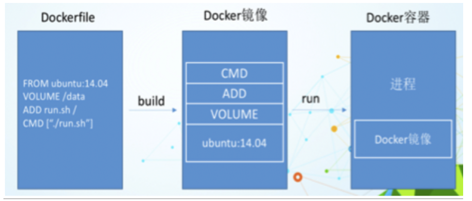
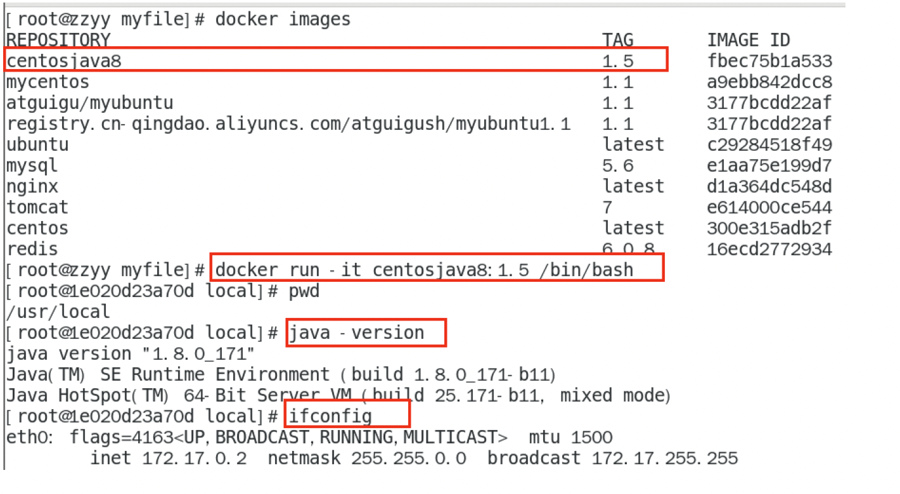
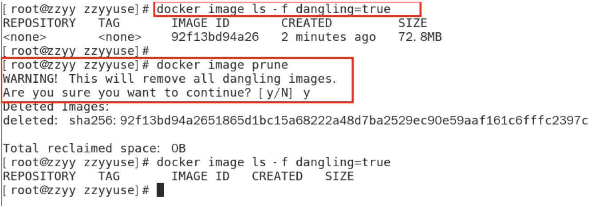

## 二、DockerFile 解析

### 2.1 DockerFile 是什么

DockerFile 是用来构建 Docker 镜像的文本文件，是有一条条构建镜像所需的指令和参数构成的脚本。


官网：<https://docs.docker.com/engine/reference/builder/>

构建三步骤

1. 编写 DockerFile 文件
2. docker build 命令构建镜像
3. docker run 依镜像运行容器实例

### 2.2 DockerFile 构建过程解析

- **DockerFile 内容基础知识**

1. 每条保留字指令都必须为大写字母且后面跟随至少一个参数
2. 指令按照从上到下，顺序执行
3. #表示注释
4. 每条指令都会创建一个新的镜像层并对镜像进行提交。

- **Docker 执行 DockerFile 的大致流程**

1. docker 从技术镜像运行一个容器
2. 执行一条指令比鞥对容器做出修改
3. 执行类似 docker commit 的操作提交一个新的镜像层
4. docker 在基于刚提交的镜像运行一个新容器
5. 执行 dockerfile 中的下一条指令直到所有执行执行完成。

### 2.3 小总结

从应用软件的角度来看，Dockerfile、Docker 镜像与 Docker 容器分别代表软件的三个不同阶段，

Dockerfile 是软件的原材料

Docker 镜像是软件的交付品

Docker 容器则可以认为是软件镜像的运行态，也即依照镜像运行的容器实例

Dockerfile 面向开发，Docker 镜像成为交付标准，Docker 容器则涉及部署与运维，三者缺一不可，合力充当 Docker 体系的基石。



1. Dockerfile，需要定义一个 Dockerfile，Dockerfile 定义了进程需要的一切东西。Dockerfile 涉及的内容包括执行代码或者是文件、环境变量、依赖包、运行时环境、动态链接库、操作系统的发行版、服务进程和内核进程(当应用进程需要和系统服务和内核进程打交道，这时需要考虑如何设计 namespace 的权限控制)等等;

2. Docker 镜像，在用 Dockerfile 定义一个文件之后，docker build 时会产生一个 Docker 镜像，当运行 Docker 镜像时会真正开始提供服务;

3. Docker 容器，容器是直接提供服务的。

### 2.4 DockerFile 常用保留字指令

- 1. 参考 tomcat8 的 dockerfile 入门

<https://github.com/docker-library/tomcat>

- 2. From

基础镜像，当前新镜像是基于哪个镜像的，指定一个已经存在的镜像作为模板，第一条必须是 from

- 3. MANINTAINER

镜像维护者的姓名和邮箱地址

- 4. Run

容器构建时需要运行的命令

两种格式：

shell 格式

```bash
# <命令行命令>等同于，在终端操作的shell命令

RUN yum -y install vim
```

exec 格式


RUN 是在 docker build 时运行

- 5. EXPOSE

当前容器对外暴露出的端口

- 6. WORKDIR

指定在创建容器后。终端默认登录的进来工作目录，一个落脚点。

- 7. USER

指定该镜像以什么样的用户去执行，如果都不指定，默认是 root

- 8. ENV

用来在构建镜像过程中设置环境变量

```bash
ENV MY_PATH /usr/mytest
```

这个环境变量可以在后续的任何 RUN 指令中使用，这就如同在命令前面指定了环境变量前缀一样；
也可以在其它指令中直接使用这些环境变量，

比如：WORKDIR $MY_PATH

- 9. ADD

将宿主机目录下的文件拷贝进镜像且会自动处理 URL 和解压 tar 压缩包

- 10. COPY

类似 ADD，拷贝文件和目录到镜像中。将从构建上下文目录中<源路径>的文件/目录复制到新的一层镜像内的<目标路径>位置

```bash
COPY src dest

COPY["src","dest"]

<src源路径>：源文件或源目录

<dest目标路径>: 容器内的指定路径，该路径不用事先建好，路径不存在的话，会自动创建。
```

- 11. VOLUME

容器数据卷，用于数据保存和持久化的工作

- 12. CMD

指定容器启动后的要干的事情。

【注意】

Dockerfile 中可以由多个 CMD 指令，但是只有最后一个生效，CMD 会被 docker run 之后的参数替换。

参考官网 Tomcat 的 dockerfile 演示讲解

官网最后一行命令

```bash
EXPOSE 8080
CMD ["catalina.sh","run"]
```

我们演示自己的覆盖操作

```bash
docker run -it -p 8080:8080  容器ID /bin/bash
```

他和前面 RUN 命令的区别

CMD 是在 docker run 时运行。

RUN 是在 docker build 时运行。

- 13. ENTRYPOINT

1. 也是用来指定一个容器启动时要运行的命令

2. 类似于 CMD 指令，但是 ENTRYPOINT 不会被 docker run 后面的命令覆盖，而且这些命令行参数会被当作参数送给 ENTRYPOINT 指令指定的程序。

3. 命令格式和案例说明

```bash
命令格式：ENTRYPOINT["<executeable>","<param1>","<param2>",...]

# ENTRYPOINT 可以和CMD一起用，一般是 变参 才会使用 CMD ，这里的CMD等于是在给 ENTRYPOINT 传参。当制定了 ENTRYPOINT 后，CMD的含义就发生了变化，不再是直接运行其命令而是将 CMD 的内容作为参数传递给 ENTRYPOINT 指定，他两个组合会变成<ENTRYPOINT> "<CMD>"
```

案例如下：假设已通过 Dockerfile 构建了 nginx:test 镜像


| 是否传参         | 按照 dockerfile 编写执行       | 传参运行                                      |
| ---------------- | ------------------------------ | --------------------------------------------- |
| Docker 命令      | docker run nginx:test          | docker run nginx:test -c /etc/nginx/ new.conf |
| 衍生出的实际命令 | nginx -c /etc/nginx/nginx.conf | nginx -c /etc/nginx/ new.conf                 |

优点：在执行 docker run 的时候可以指定 ENTRYPOINT 运行所需的参数。

注意：如果 Dockerfile 中如果存在多个 ENTRYPOINT 指令，最后一个生效。

- 14. 小总结

  

### 2.5 案例

#### 2.5.1 自定义镜像 mycentosjava8

- **要求**

Centos7 镜像具备 vim + ifconfig + jdk8

JDK 下载镜像地址
官网：<https://www.oracle.com/java/technologies/downloads/#java8>
<https://mirrors.yangxingzhen.com/jdk/>

- **编写**

```bash
# 准备编写Dockerfile文件
# 【注意】大写字母D

FROM centos
MAINTAINER zzyy<zzyybs@126.com>
 
ENV MYPATH /usr/local
WORKDIR $MYPATH
 
#安装vim编辑器
RUN yum -y install vim
#安装ifconfig命令查看网络IP
RUN yum -y install net-tools
#安装java8及lib库
RUN yum -y install glibc.i686
RUN mkdir /usr/local/java
#ADD 是相对路径jar,把jdk-8u171-linux-x64.tar.gz添加到容器中,安装包必须要和Dockerfile文件在同一位置
ADD jdk-8u171-linux-x64.tar.gz /usr/local/java/
#配置java环境变量
ENV JAVA_HOME /usr/local/java/jdk1.8.0_171
ENV JRE_HOME $JAVA_HOME/jre
ENV CLASSPATH $JAVA_HOME/lib/dt.jar:$JAVA_HOME/lib/tools.jar:$JRE_HOME/lib:$CLASSPATH
ENV PATH $JAVA_HOME/bin:$PATH
 
EXPOSE 80
 
CMD echo $MYPATH
CMD echo "success--------------ok"
CMD /bin/bash
```

- **构建**

```bash
docker build -t 新镜像名字: TAG

# 例如：docker build -t centosjava8:1.5 .

# 【注意】
# 上面TAG 后面有个空格，有个点
```

- **运行**

```bash
docker run -it 新镜像名字:TAG

docker run -it centosjava8:1.5 /bin/bash
```



- **再体会下 UnionFS（联合文件系统）**

UnionFS（联合文件系统）：Union 文件系统（UnionFS）是一种分层、轻量级并且高性能的文件系统，它支持 对文件系统的修改作为一次提交来一层层的叠加， 同时可以将不同目录挂载到同一个虚拟文件系统下(unite several directories into a single virtual filesystem)。Union 文件系统是 Docker 镜像的基础。 镜像可以通过分层来进行继承 ，基于基础镜像（没有父镜像），可以制作各种具体的应用镜像。

特性：一次同时加载多个文件系统，但从外面看起来，只能看到一个文件系统，联合加载会把各层文件系统叠加起来，这样最终的文件系统会包含所有底层的文件和目录

#### 2.5.2 虚悬镜像

- **是什么**

```bash
仓库名，标签都是 <none> 的镜像，俗称dangling image

Dockerfile 写一个
```


- **查看**

```bash
docker image ls -f dangling=true
```

命令结果如下图：


- **删除**

```bash
docker image prune

虚悬镜像已经市区存在价值，可以删除
```



#### 2.5.3 家庭作业自定义 myubuntu

```bash
# 编写
# 准备编写DockerFile文件
vim Dockerfile
----------------------
FROM ubuntu
MAINTAINER zzyy<zzyybs@126.com>
 
ENV MYPATH /usr/local
WORKDIR $MYPATH
 
RUN apt-get update
RUN apt-get install net-tools
#RUN apt-get install -y iproute2
#RUN apt-get install -y inetutils-ping
 
EXPOSE 80
 
CMD echo $MYPATH
CMD echo "install inconfig cmd into ubuntu success--------------ok"
CMD /bin/bash
------------------------
# 构建
docker build -t 新镜像名字:TAG

#运行
docker run -it 新镜像名字:TAG
```
