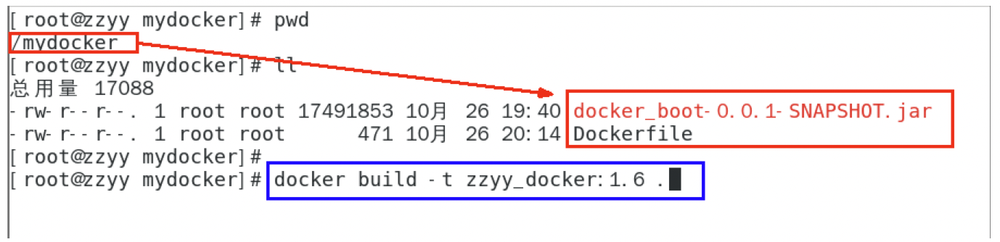
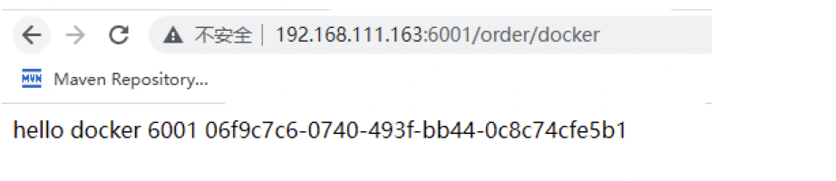

## 三、Docker 微服务实战

### 3.1 通过 IDEA 新建一个普通微服务模块

- **建 Module**

```bash
docker_boot
```

- **修改 POM**

```xml
<?xml version ="1.0" encoding ="UTF-8"?>
 <project xmlns ="http://maven.apache.org/POM/4.0.0" xmlns: xsi ="http://www.w3.org/2001/XMLSchema-instance"
      xsi :schemaLocation ="http://maven.apache.org/POM/4.0.0 https://maven.apache.org/xsd/maven-4.0.0.xsd">
   <modelVersion> 4.0.0 </modelVersion>
   <parent>
     <groupId> org.springframework.boot </groupId>
     <artifactId> spring-boot-starter-parent </artifactId>
     <version> 2.5.6 </version>
     <relativePath/>
   </parent>

   <groupId> com.atguigu.docker </groupId>
   <artifactId> docker_boot </artifactId>
   <version> 0.0.1-SNAPSHOT </version>

   <properties>
     <project.build.sourceEncoding> UTF-8 </project.build.sourceEncoding>
     <maven.compiler.source> 1.8 </maven.compiler.source>
     <maven.compiler.target> 1.8 </maven.compiler.target>
     <junit.version> 4.12 </junit.version>
     <log4j.version> 1.2.17 </log4j.version>
     <lombok.version> 1.16.18 </lombok.version>
     <mysql.version> 5.1.47 </mysql.version>
     <druid.version> 1.1.16 </druid.version>
     <mapper.version> 4.1.5 </mapper.version>
     <mybatis.spring.boot.version> 1.3.0 </mybatis.spring.boot.version>
   </properties>

   <dependencies>
     <!--SpringBoot 通用依赖模块 -->
     <dependency>
       <groupId> org.springframework.boot </groupId>
       <artifactId> spring-boot-starter-web </artifactId>
     </dependency>
     <dependency>
       <groupId> org.springframework.boot </groupId>
       <artifactId> spring-boot-starter-actuator </artifactId>
     </dependency>
     <!--test-->
     <dependency>
       <groupId> org.springframework.boot </groupId>
       <artifactId> spring-boot-starter-test </artifactId>
       <scope> test </scope>
     </dependency>
   </dependencies>
   <build>
     <plugins>
       <plugin>
         <groupId> org.springframework.boot </groupId>
         <artifactId> spring-boot-maven-plugin </artifactId>
       </plugin>
       <plugin>
         <groupId> org.apache.maven.plugins </groupId>
         <artifactId> maven-resources-plugin </artifactId>
         <version> 3.1.0 </version>
       </plugin>
     </plugins>
   </build>
 </project>
```

- **写 YML**

```yaml
server.port=6001
```

- **主启动**

```java
package com.atguigu.docker;
import  org.springframework.boot.SpringApplication;
import  org.springframework.boot.autoconfigure. SpringBootApplication ;
@SpringBootApplication
public class  DockerBootApplication {
  public static void  main(String[] args)    {
    SpringApplication. run (DockerBootApplication. class , args);
  }
}
```

- **业务类**

```java
 package com.atguigu.docker.controller;

 import org.springframework.beans.factory.annotation. Value ;
 import org.springframework.web.bind.annotation. RequestMapping ;
 import org.springframework.web.bind.annotation.RequestMethod;
 import org.springframework.web.bind.annotation. RestController ;

 import java.util.UUID;

 /
  *@auther  zzyy
  *@create  2021-10-25 17:43
 */
 @RestController
 public class OrderController
 {
   @Value ( "${server.port}" )
   private String port ;

   @RequestMapping ( "/order/docker" )
   public String helloDocker()
   {
     return "hello docker" + " \t " + port + " \t " + UUID. *randomUUID* ().toString();
   }

   @RequestMapping (value = "/order/index" ,method = RequestMethod. *GET\* )
   public String index()
   {
     return " 服务端口号 : " + " \t " + port + " \t " +UUID. *randomUUID* ().toString();
   }
 }
```

### 3.2 通过 dockerfile 发布微服务部署到 docker 容器

#### 3.2.1 **IDEA 工具里面搞定微服务 jar 包**


#### 3.2.2 **编写 Dockerfile**

- **Dockerfile 内容**

```bash
# 基础镜像使用java
FROM java:8
# 作者
MAINTAINER zzyy
# VOLUME 指定临时文件目录为/tmp，在主机/var/lib/docker目录下创建了一个临时文件并链接到容器的/tmp
VOLUME /tmp
# 将jar包添加到容器中并更名为zzyy_docker.jar
ADD docker_boot-0.0.1-SNAPSHOT.jar /zzyy_docker.jar
# 运行jar包
RUN bash -c 'touch /zzyy_docker.jar'
ENTRYPOINT ["java","-jar","/zzyy_docker.jar"]
#暴露6001端口作为微服务
EXPOSE 6001
```

- **将微服务 jar 包和 Dockerfile 文件上传到同一个目录下/mydocker**



```bash
docker build -t zzyy_docker:1.6 .
```

- **构建镜像**

```bash
docker build -t zzyy_docker:1.6 .

打包成镜像文件
# 命令
docker build -t zzyy_docker:1.6 .
```

- **运行容器**

```bash
# 运行命令
docker run -d -p 6001:6001 zzyy_docker:1.6
# 查看镜像运行命令
docker images
```

- **访问测试**


