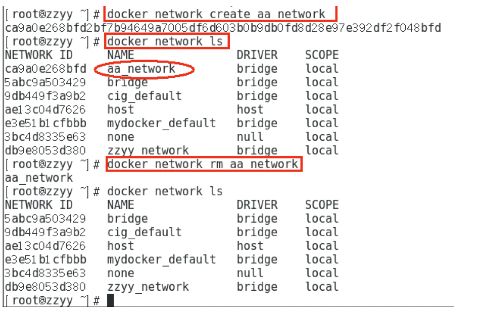
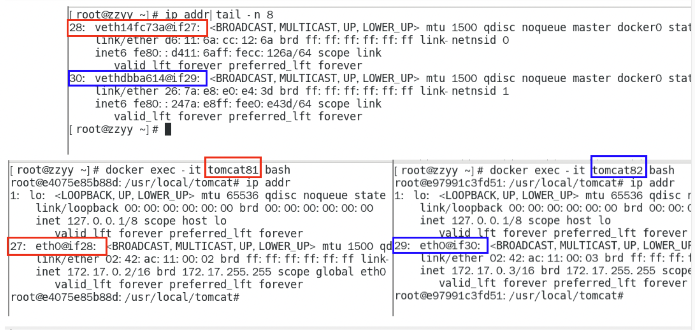
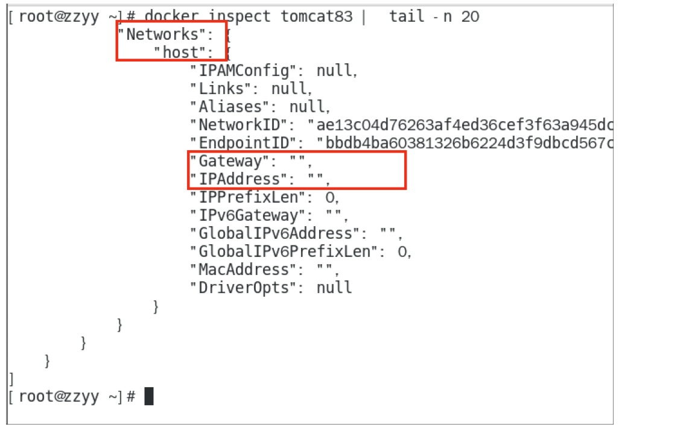
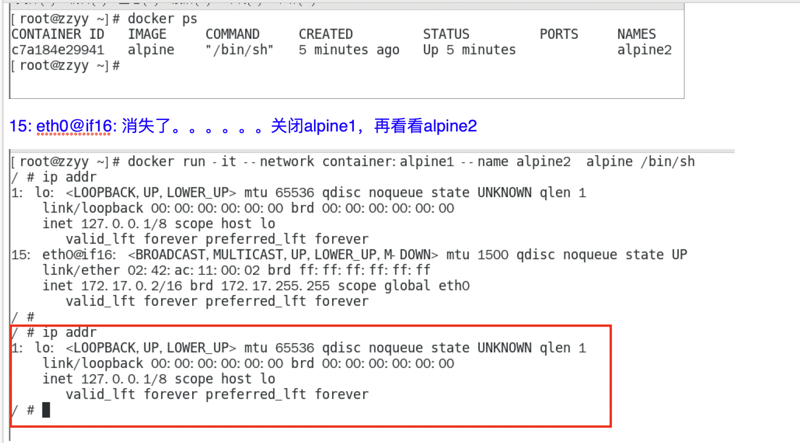
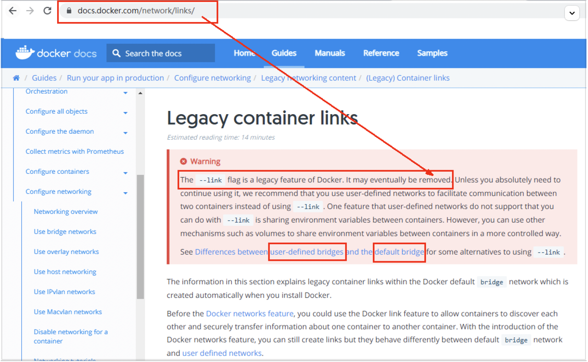
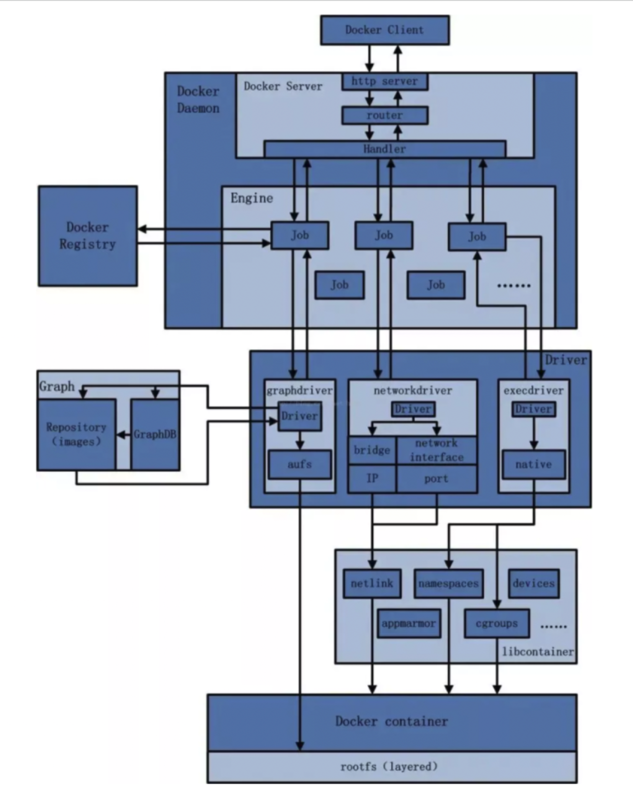

## 四、Docker 网络

### 4.1 Docker 网络是什么

#### 4.1.1 docker 不启动，默认网络情况

```bash
ens 33
lo
virbr0
```


在 CentOS7 的安装过程中如果有 选择相关虚拟化的的服务安装系统后 ，启动网卡时会发现有一个以网桥连接的私网地址的 virbr0 网卡(virbr0 网卡：它还有一个固定的默认 IP 地址 192.168.122.1)，是做虚拟机网桥的使用的，其作用是为连接其上的虚机网卡提供 NAT 访问外网的功能。

我们之前学习 Linux 安装，勾选安装系统的时候附带了 libvirt 服务才会生成的一个东西，如果不需要可以直接将 libvirtd 服务卸载，
yum remove libvirt-libs.x86_64

#### 4.1.2 docker 启动后，网络情况

查看 docker 网络模式命令


### 4.2 常用基本命令

#### 4.2.1 **All 命令**


#### 4.2.2 **查看网络**

```bash
docker network ls
```

#### 4.2.3 查看网络源数据

```bash
docker network inspect  XXX网络名字
```

#### 4.2.4 删除网络

```bash
docker network rm XXX网络名字
```

#### 4.2.5 案例



### 4.3 能干嘛

```bash
容器间的互联和通信以及端口映射
容器IP变动时候可以通过服务名直接网络通信而不受到影响
```

### 4.4 网络模式

#### 4.4.1 总体介绍

```bash
bridge模式：使用--network bridge指定，默认使用docker()

host模式：使用 --network host指定

none模式：使用 --network none指定

container模式：使用 --network container:Name或者容器ID指定
```

#### 4.4.2 容器实例内默认网络 IP 生产规则

1 先启动两个 ubuntu 容器实例


2 docker inspect 容器 ID or 容器名字


3 关闭 u2 实例，新建 u3，查看 ip 变化


#### 4.4.3 案例说明

- **bridge**

Docker 服务默认会创建一个 docker0 网桥（其上有一个 docker0 内部接口），该桥接网络的名称为 docker0，它在 内核层 连通了其他的物理或虚拟网卡，这就将所有容器和本地主机都放到 同一个物理网络 。Docker 默认指定了 docker0 接口 的 IP 地址和子网掩码， 让主机和容器之间可以通过网桥相互通信。

```bash
# 查看 bridge 网络的详细信息，并通过 grep 获取名称项
docker network inspect bridge | grep name

ifconfig
```

- **案例**

1. Docker 使用 Linux 桥接，在宿主机虚拟一个 Docker 容器网桥(docker0)，Docker 启动一个容器时会根据 Docker 网桥的网段分配给容器一个 IP 地址，称为 Container-IP，同时 Docker 网桥是每个容器的默认网关。因为在同一宿主机内的容器都接入同一个网桥，这样容器之间就能够通过容器的 Container-IP 直接通信。

2. docker run 的时候，没有指定 network 的话默认使用的网桥模式就是 bridge，使用的就是 docker0 。在宿主机 ifconfig,就可以看到 docker0 和自己 create 的 network(后面讲)eth0，eth1，eth2……代表网卡一，网卡二，网卡三…… ，lo 代表 127.0.0.1，即 localhost ，inet addr 用来表示网卡的 IP 地址

3. 网桥 docker0 创建一对对等虚拟设备接口一个叫 veth，另一个叫 eth0，成对匹配。

- 3.1 整个宿主机的网桥模式都是 docker0，类似一个交换机有一堆接口，每个接口叫 veth，在本地主机和容器内分别创建一个虚拟接口，并让他们彼此联通（这样一对接口叫 veth pair）；
- 3.2 每个容器实例内部也有一块网卡，每个接口叫 eth0；
- 3.3 docker0 上面的每个 veth 匹配某个容器实例内部的 eth0，两两配对，一一匹配。

通过上述，将宿主机上的所有容器都连接到这个内部网络上，两个容器在同一个网络下,会从这个网关下各自拿到分配的 ip，此时两个容器的网络是互通的。


【代码】

```bash
docker run -d -p 8081:8080   --name tomcat81 billygoo/tomcat8-jdk8

docker run -d -p 8082:8080   --name tomcat82 billygoo/tomcat8-jdk8
```

- **两两匹配验证**



- **Host**

一、是什么

直接使用宿主机的 IP 地址与外界进行通信，不再需要额外进行 NAT 转换。

二、案例

- 1. 说明

容器将 不会获得 一个独立的 Network Namespace， 而是和宿主机共用一个 Network Namespace。 容器将不会虚拟出自己的网卡而是使用宿主机的 IP 和端口。

- 2. 代码

```bash
# 警告：
docker run -d -p 8083:8080 --network host --name tomcat83 billygoo/tomcat8-jdk8

# 正确：
docker run -d --network host --name tomcat83 billygoo/tomcat8-jdk8
```

- 3. 无之前的配对显示了，看容器实例内部



- 4. 没有设置-p 的端口映射了，如何访问启动的 tomcat83？

http://宿主机 IP:8080/

在 CentOS 里面用默认的火狐浏览器访问容器内的 tomcat83 看到访问成功，因为此时容器的 IP 借用主机的，
所以容器共享宿主机网络 IP，这样的好处是外部主机与容器可以直接通信。

- **none**

一、是什么

禁用网络功能，只有 lo 标识（就是 127.0.0.1 表示本地回环）

二、案例

docker run -d -p8084:8080 --network none --name tomcat84 billygoo/tomcat8-jdk8

- **container**

一、是什么

container ⽹络模式

新建的容器和已经存在的一个容器共享一个网络 ip 配置而不是和宿主机共享。新创建的容器不会创建自己的网卡，配置自己的 IP，而是和一个指定的容器共享 IP、端口范围等。同样，两个容器除了网络方面，其他的如文件系统、进程列表等还是隔离的。

二、❎ 案例

```bash
docker run -d -p 8085:8080 --name tomcat85 billygoo/tomcat8-jdk8

docker run -d -p 8086:8080 --network container:tomcat85 --name tomcat86 billygoo/tomcat8-jdk8

运行结果

 docker：Error response from daemon: conflicting optisons: port ...........
 
# 相当于tomcat86和tomcat85公用同一个ip同一个端口，导致端口冲突
```

三、✅ 案例 2

Alpine 操作系统是一个面向安全的轻型 Linux 发行版

```bash

docker run -it --name alpine1 alpine /bin/sh

docker run -it --network container:alpine1 --name alpine2  alpine /bin/sh


```

运行结果，验证共用搭桥


假如此时关闭 alpine1，再看看 alpine2



- **自定义网络**

一、过时的 link



二、是什么

三、案例

【before】

```bash
案例：
docker run -d -p 8081:8080 --name tomcat81 billygoo/tomcat8-jdk8

docker run -d -p 8082:8080 --name tomcat82 billygoo/tomcat8-jdk8

# 上述成功启动并用docker exec进入各自容器实例内部
```

问题：

1. 按照 IP 地址 ping 是 OK 的?
2. 按照服务名 ping 结果???
   ping： tocmat82：Name or service not known

【after】

案例
自定义桥接网络,自定义网络默认使用的是桥接网络 bridge

新建自定义网络


新建容器加入上一步新建的自定义网络

```bash
docker run -d -p 8081:8080 --network zzyy_network --name tomcat81 billygoo/tomcat8-jdk8

docker run -d -p 8082:8080 --network zzyy_network --name tomcat82 billygoo/tomcat8-jdk8
```

互相 ping 测试


问题结论

自定义网络本身就维护好了主机名和 ip 的对应关系（ip 和域名都能通）

### 4.5 Docker 平台架构图解

从其架构和运行流程来看，Docker 是一个 C/S 模式的架构，后端是一个松耦合架构，众多模块各司其职。

Docker 运行的基本流程为：

1. 用户是使用 Docker Client 与 Docker Daemon 建立通信，并发送请求给后者。
2. Docker Daemon 作为 Docker 架构中的主体部分，首先提供 Docker Server 的功能使其可以接受 Docker Client 的请求。
3. Docker Engine 执行 Docker 内部的一系列工作，每一项工作都是以一个 Job 的形式的存在。
4. Job 的运行过程中，当需要容器镜像时，则从 Docker Registry 中下载镜像，并通过镜像管理驱动 Graph driver 将下载镜像以 Graph 的形式存储。
5. 当需要为 Docker 创建网络环境时，通过网络管理驱动 Network driver 创建并配置 Docker 容器网络环境。
6. 当需要限制 Docker 容器运行资源或执行用户指令等操作时，则通过 Execdriver 来完成。
7. Libcontainer 是一项独立的容器管理包，Network driver 以及 Exec driver 都是通过 Libcontainer 来实现具体对容器进行的操作。


