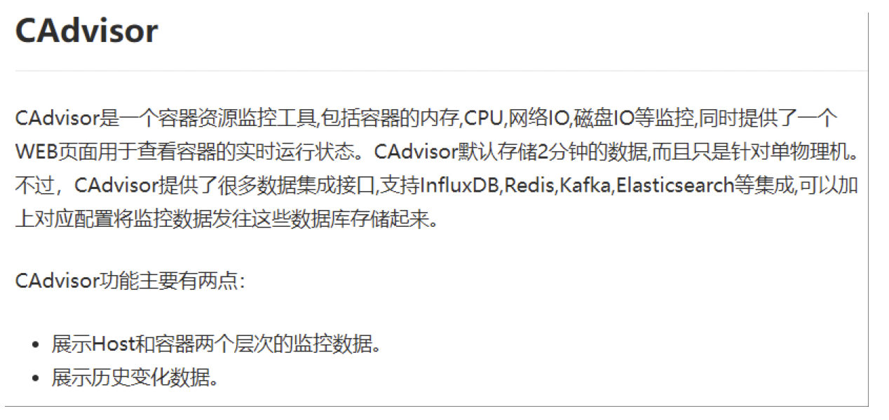
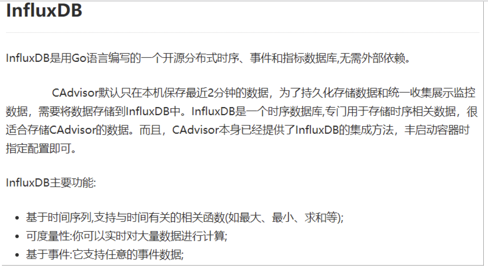
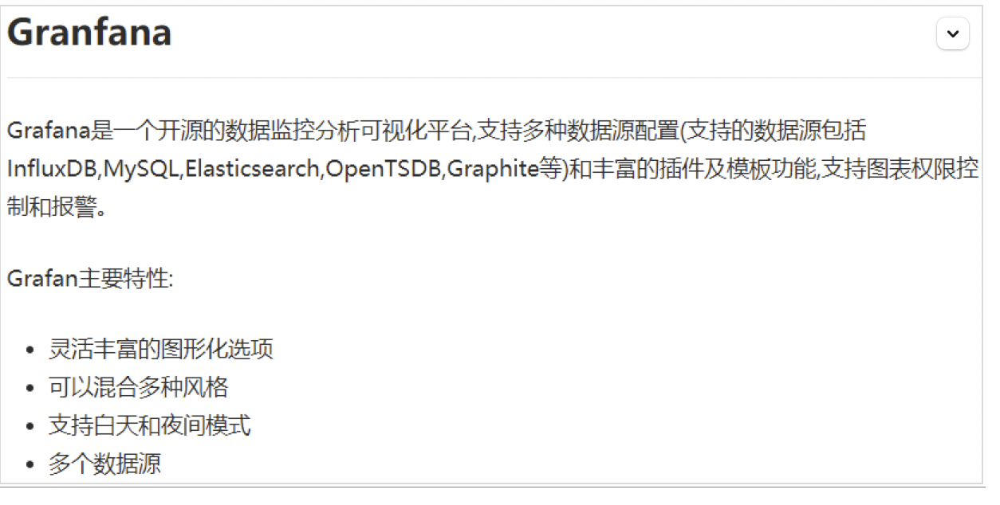

## 七、Docker 容器监控之 CAdvisor+InfluxDB+Granfana

### 7.1 原生命令

docker stats 命令的结果

问题

通过 docker stats 命令可以很方便的看到当前宿主机上所有容器的 CPU,内存以及网络流量等数据， 一般小公司够用了。。。。

但是

docker stats 统计结果只能是当前宿主机的全部容器，数据资料是实时的，没有地方存储、没有健康指标过线预警等功能

### 7.2 是什么

容器监控 3 剑客

一句话

CAdvisor 监控收集+InfluxDB 存储数据+Granfana 展示图表

- **CAdvisor**



- **InfluxDB**



Granfana



### 7.3 compose 容器编排，一套带走

一、新建目录

二、新建 3 件套组合的 docker-compose.yml

```yaml
version: '3.1'
 
volumes:
  grafana_data: {}
 
services:
 influxdb:
  image: tutum/influxdb:0.9
  restart: always
  environment:
    - PRE_CREATE_DB=cadvisor
  ports:
    - "8083:8083"
    - "8086:8086"
  volumes:
    - ./data/influxdb:/data
 
 cadvisor:
  image: google/cadvisor
  links:
    - influxdb:influxsrv
  command: -storage_driver=influxdb -storage_driver_db=cadvisor -storage_driver_host=influxsrv:8086
  restart: always
  ports:
    - "8080:8080"
  volumes:
    - /:/rootfs:ro
    - /var/run:/var/run:rw
    - /sys:/sys:ro
    - /var/lib/docker/:/var/lib/docker:ro
 
 grafana:
  user: "104"
  image: grafana/grafana
  user: "104"
  restart: always
  links:
    - influxdb:influxsrv
  ports:
    - "3000:3000"
  volumes:
    - grafana_data:/var/lib/grafana
  environment:
    - HTTP_USER=admin
    - HTTP_PASS=admin
    - INFLUXDB_HOST=influxsrv
    - INFLUXDB_PORT=8086
    - INFLUXDB_NAME=cadvisor
    - INFLUXDB_USER=root
    - INFLUXDB_PASS=root

```

三、启动 docker-compose 文件

```bash
docker-compose up
```

四、查看三个服务容器是否启动

```bash
docker ps
```

五、测试

- 1. 浏览 cAdvisor 收集服务，<http://ip:8080/>

第一次访问慢，请稍等

advisor 也有基础的图形展现功能，这里主要用它来作数据采集

- 2. 浏览 influxdb 存储服务，<http://ip:8083/>

- 3. 浏览 grafana 展现服务，<http://ip:3000/>

ip+3000 端口的方式访问,默认帐户密码（admin/admin）
<https://gitee.com/yooome/golang/tree/main/Docker>详细教程

配置步骤

[1] 配置数据源

[2] 选择 influxdb 数据源

[3] 配置细节

[4] 配置面板 panel

[5] 到这里 cAdvisor+InfluxDB+Grafana 容器监控系统就部署完成了
