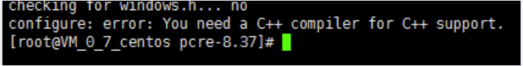
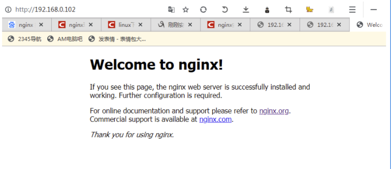

## 二、Nginx 安装

### 2.1 [进入官网下载](http://nginx.org)

### 2.2 安装相关依赖

#### 2.2.1 第一步

1、 安装 pcre

```bash
wget http://downloads.sourceforge.net/project/pcre/pcre/8.37/pcre-8.37.tar.gz
```

2、解压文件 tar -zxvf 路径

3、pcre 主目录执行命令 :

```bash
./configure
```

​ 可能遇到的情况：没有 c++支持



安装 c++支持：

```bash
yum install -y gcc gcc-c++
```

4、完成后、回到 pcre 目录下执行

```bash
make && make install
```

5、查看版本 :

```bash
pcre-config --version
```

#### 2.2.2 第二步，安装其他依赖

zlib openssl

```bash
yum -y install make zlib zlib-devel gcc-c++ libtool openssl openssl-devel
```

### 2.3 安装 nginx

1. 解压 nginx-xx.tar.gz 包

   ```bash
   tar -zxvf nginx-xxx.tar.gz
   ```

2. 进入解压目录，执行./configure

   ```bash
   ./configure
   ```

3. make&&make install

   ```bash
   make && make install
   ```

### 2.3 开放端口

```bash
#查看开放的端口号
firewall-cmd --list-all
#设置开放的端口号
firewall-cmd --add-service=http –permanent
sudo firewall-cmd --add-port=80/tcp --permanent
#重启防火墙
firewall-cmd –reload
```

### 2.4 访问


