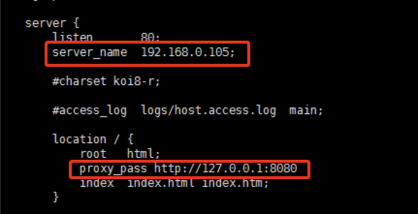

### 四、反向代理

#### 4.1 单端口反向代理

实现效果：打开浏览器，在浏览器地址栏输入 www.123.com ，跳转到 linux 系统的 tomcat 主页

##### 4.1.1 安装 tomcat

- 1. 将 Tomcat 安装包复制到 linux 中

- 2. 进入 tomcat 的 bin 目录中，./startup.sh 启动 tomcat 服务器

- 3. 对外开放访问的端口号

```bash
firewall-cmd --add-port=8080/tcp --permanent
firewall-cmd -reload
```

- 4. 修改本机端口映射

```bash
#1.修改本机 hosts 文件
增加：192.168.0.105 www.123.com
```

- 5. 修改 nginx 配置文件



- 6. 访问测试


#### 4.2 多端口反向代理

##### 4.2.1 实现效果

```bash
访问 http://192.168.0.105:9001/edu/ 直接跳转到 127.0.0.1:8080
访问 http://192.168.0.105:9001/vod/ 直接跳转到 127.0.0.1:8081
```

##### 4.2.2 安装两个 Tomcat 分别定义端口为 8001,8002


##### 4.2.3 创建文件夹和测试页面


##### 4.2.4 配置 nginx 配置文件


##### 4.2.5 开放端口号

```bash
firewall-cmd --add-port=8001/tcp --permanent

firewall-cmd --add-port=8002/tcp --permanent

firewall-cmd --add-port=9001/tcp --permanent

firewall-cmd --reload
```


##### 4.2.6 测试

> 1、访问：<http://192.168.0.105:9001/edu/a.html>
>
> 
>
> 2、访问：http:// 192.168.0.105:9001/vod/a.html
>
> 

#### 4.3 负载均衡

1、准备两台 tomcat 服务器，一台 8001，一台 8002

2、 在两台 tomcat 里面 webapps 目录中，创建名称是 edu 文件夹，在 edu 文件夹中创建页面 a.html，用于测试

3、配置 nginx 配置文件

```bash
# 在http模块中配置
upstream myserver{
         server  192.168.0.105:8001 weight=1;
         server  192.168.0.105:8002 weight=2;
    }

# 在server模块配置
         listen       80;
         server_name  192.168.0.105;
         location / {
            proxy_pass http://myserver;
            root   html;
            index  index.html index.htm;
        }
```

4、nginx 提供了几种分配方式(策略)

```bash
#1.轮询（默认）
每个请求按时间顺序逐一分配到不同的后端服务器，如果后端服务器 down 掉，能自动剔除。
#2.weight
weight 代表权重，默认是1，权重越高被分配的客户端越多。
指定轮询几率，weight和访问比率成正比，用于后端服务器性能不均的情况。例如：

upstream server_pool{
  server 192.168.5.21 weight=10;
  server 192.168.5.22 weight=10;
}
#3. ip_hash
每个请求按访问 ip 的 hash 结果分配，这样每个访客固定一个后端服务器，可以解决session的问题。例如：
upstream server_pool{
  ip_hash
  server 192.168.5.21:80;
  server 192.168.5.22:80;
}
#4.fair(第三方，需要安装第三方模块)
按后端服务器的响应时间来分配请求，响应时间短的优先分配。
upstream server_pool{
  server 192.168.5.21:80;
  server 192.168.5.22:80;
  fair;
}
```

5、测试


