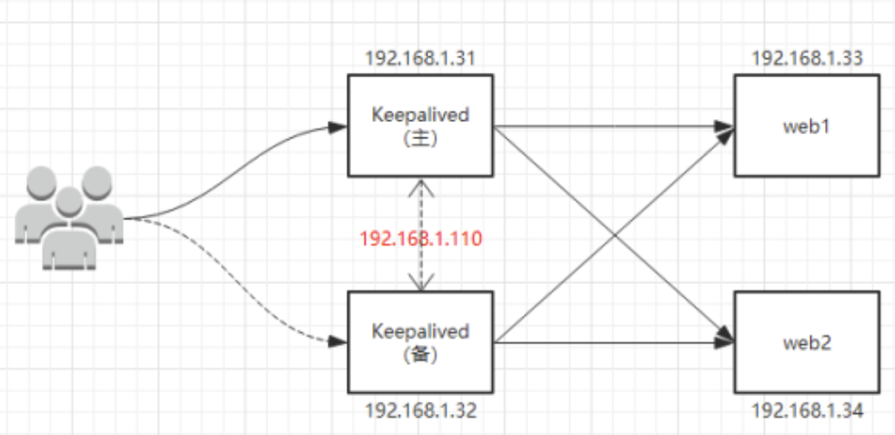
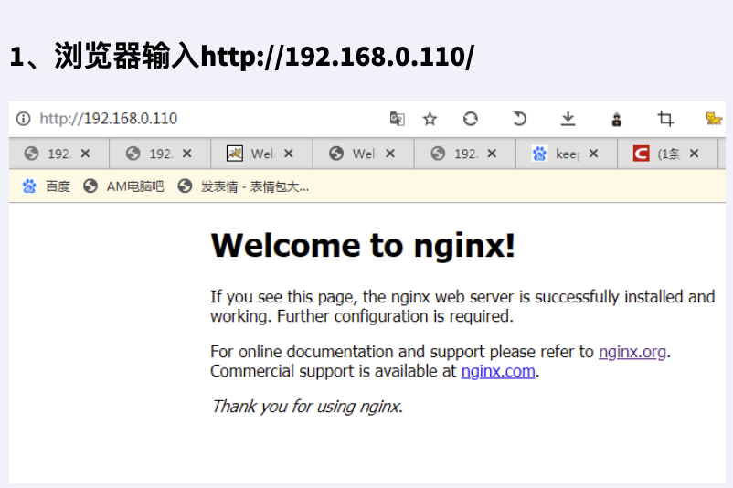

### 六、高可用

#### 6.1 Keeplived+Nginx 高可用集群（主从模式）

1、需要两台服务器 192.168.0.105 和 192.168.0.102

2、在两台服务器上安装 nginx 和 keeplived

> #1.安装 keepalived
> yum install keepalived -y
> #2.keepalived.conf 文件
> 安装之后，在 etc 里面生成目录 keepalived，有文件 keepalived.conf
> #3.修改配置文件
>
> 105 主服务器
>
> 
>
> 102 副服务器
>
> 
>
> #4. 启动 keepalived
>
> 
>
> #5.测试
>
> 
>
> 

#### 6.2 Keeplived+Nginx 高可用集群（双主模式）

修改配置

配置 LB-02 节点

