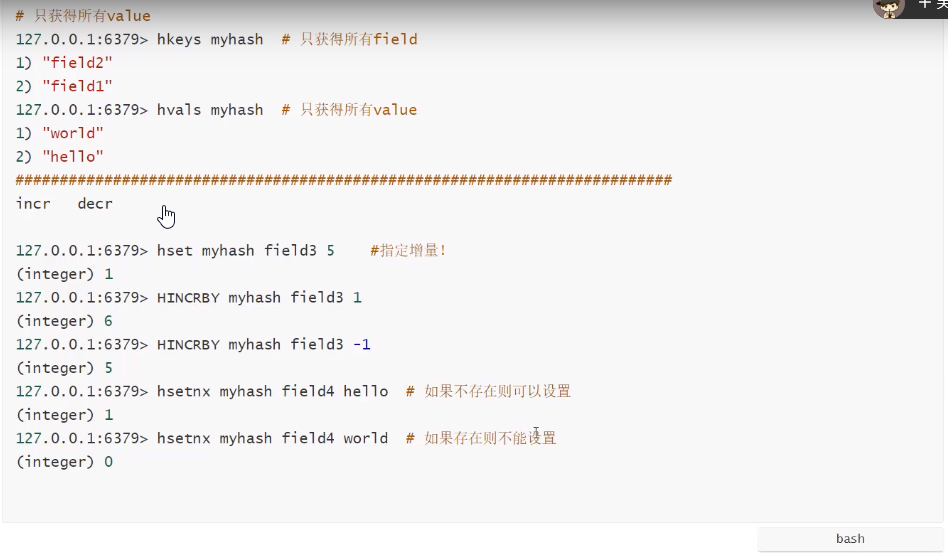
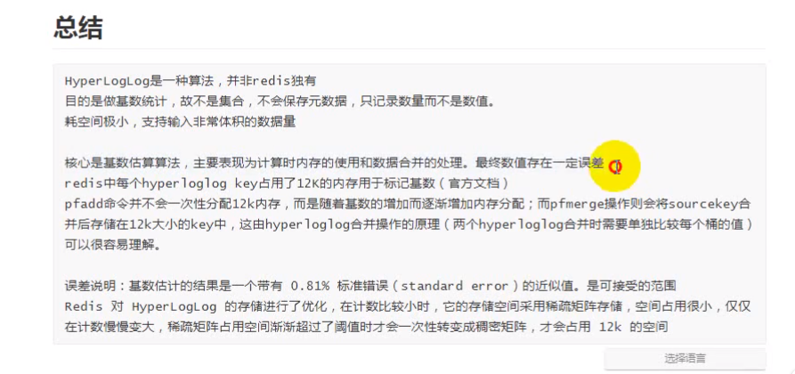
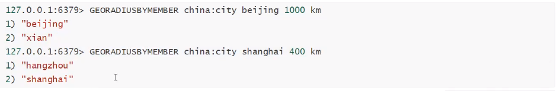

## 十 、Redis 数据类型

### 10.1 String 类型

String 类型是 Redis 最基本的数据类型，一个键最大能存储 512MB。

String 数据结构最贱但的 key-value 类型，value 其不仅是 string，也可以是数字，是包含很多种类型的特殊类型，

String 类型是二进制安全的。意思是 redis 的 string 可以包含任何数据。

比如序列化的对象进行存储，比如一张图片进行二进制存储，比如一个简单的字符串，数值等等。

### String 命令

1. 赋值语法:
   SET KEY_NAME VALUE : (说明: 多次设置 name 会覆盖)(Redis SET 命令用于设置给定 key 的值。如果 key 已经存储值，SET 就要写旧值，且无视类型)。

2. 命令:
   SETNX key1 value: (not exist) 如果 key1 不存在，则设置 并返回 1。如果 key1 存在，则不设置并返回 0;(解决分布式锁 方案之一，只有在 key 不存在时设置 key 的值。setnx (SET if not exits)命令在指定的 key 不存在时，为 key 设置指定的值)。
   SETEX key1 10 lx :(expired) 设置 key1 的值为 lx，过期时间为 10 秒，10 秒后 key1 清除(key 也清除)
   SETRANG STRING range value : 替换字符串

3. 取值语法:
   GET KEY_NAME : Redis GET 命令用于获取指定 key 的值。如果 key 不存在，返回 nil。如果 key 存储的值不是字符串类型，返回一个错误。
   GETRANGE key start end : 用于获取存储在指定 key 中字符串的子字符串。字符串的截取范围由 start 和 end 两个偏移量来决定(包括 start 和 end 在内)
   GETBIT key offset: 对 key 所存储的字符串值，获取指定偏移量上的为(bit)；
   GETTEST 语法: GETSET KEY_NAME VALUE : GETSET 命令用于设置指定 key 的值，并返回 key 的旧值。当 key 不存在是，返回 nil
   STRLEN key :返回 key 所存储的字符串值的长度

4. 删除语法:
   DEL KEY_NAME : 删除指定的 key，如果存在，返回数字类型。

5. 批量写: MSET K1 V1 K2 V2 ... (一次性写入多个值)

6. 批量读: MGET K1 K2 K3

7. GETSET NAME VALUE : 一次性设置和读取(返回旧值，写上新值)

8. 自增/自减:
   INCR KEY_Name : Incr 命令将 key 中存储的数组值增 1。如果 key 不存在，那么 key 的值会先被初始化为 0，然后在执行 INCR 操作
   自增: INCRBY KEY_Name : 增量值 Incrby 命令将 key 中存储的数字加上指定的增量值
   自减: DECR KEY_Name 或 DECYBY KEY_NAME 减值: DECR 命令将 key 中存储的数字减少 1
   (注意这些 key 对应的必须是数字类型字符串，否则会出错。)

9. 字符串拼接: APPEND KEY_NAME VALUE
   :Append 命令用于为指定的 key 追加至末尾，如果不存在，为其赋值

10. 字符串长度: STRLEN key

11. setex (set with expire) #设置过期时间

12. setnx (set if not exist) #不存在设置 在分布式锁中会常常使用！

### 10.2 应用场景

- **1、String 通常用于保存单个字符串或 JSON 字符串数据**
- **2、因 String 是二进制安全的，所以你完全可以把一个图片文件的内容作为字符串来存储**
- **3、计数器(常规 key-value 缓存应用。常规计数: 微博数，粉丝数)**

```bash
INCR 等指令本身就具有原子操作的特定，所以我们完全可以利用redis的INCR，INCRBY,DECR,DECRBY等指令来实现原子计数的效果。假如，在某种场景下有3个客户端同时读取了mynum的值(值为2)，然后对其同时进行了加1的操作，那么，最后mynum的值一定是5。
不少网站都利用redis的这个特性来实现业务上的统计计数需求。
```

### 10.3 Hash 类型

Hash 类型是 String 类型的 field 和 value 的映射表，或者说是一个 String 集合。hash 特别适合用于存储对象，相比较而言，将一个对象类型存储在 Hash 类型要存储在 String 类型里占用更少的内存空间，并对整个对象的存取。可以看成具有 KEY 和 VALUE 的 MAP 容器，该类型非常适合于存储值对象的信息。

如: uname，upass，age 等。该类型的数据仅占用很少的磁盘空间(相比于 JSON).

Redis 中每一个 hash 可以存储 2 的 32 次方 -1 键值对(40 多亿)

### 10.4 Hash 命令

常用命令

1. 赋值语法:
   HSET KEY FIELD VALUE: 为指定的 KEY,设定 FILD/VALUE
   HMSET KEY FIELD VALUE [FIELD1，VALUE]...: 同时将多个 field-value(域-值)对设置到哈希表 key 中。

2. 取值语法:
   HGET KEY FIELD: 获取存储在 HASH 中的值，根据 FIELD 得到 VALUE
   HMGET KEY FIELD [FIELD1]: 获取 key 所有给定字段的值
   HGETALL KEY: 返回 HASH 表中所有的字段和值
   HKEYS KEY: 获取所有哈希表中的字段
   HLEN KEY: 获取哈希表中字段的数量

3. 删除语法:
   HDEL KEY FIELD[FIELD2] :删除一个或多个 HASH 表字段

4. 其它语法:
   HSETNX KEY FIELD VALUE: 只有在字段 field 不存在时，设置哈希表字段的值
   HINCRBY KEY FIELD INCREMENT: 为哈希 key 中的指定字段的整数值加上增量 increment。
   HINCRBYFLOAT KEY FIELD INCREMENT: 为哈希表 key 中的指定字段的浮点数值加上增量 increment
   HEXISTS KEY FIELD: 查看哈希表中 key 中，指定的字段是否存在



### 10.5 应用场景

#### Hash 的应用场景: (存储一个用户信息对象数据)

- **常用于存储一个对象**
- **为什么不用 string 存储一个对象**

  hash 值最接近关系数据库结构的数据类型，可以将数据库一条记录或程序中一个对象转换成 hashmap 存放在 redis 中。

  用户 ID 为查找的 key，存储的 value 用户对象包含姓名，年龄，生日等信息，如果用普通的 key/value 结构来存储，主要有一下两种存储方式:

  第一种方式将用户 ID 作为查找 key，把其他信息封装成为一个对象以序列化的方式存储，这种方式的确不错，但是，增加了序列化/反序列化的开销，并且在需要修改其中一项信息时，需要把整个对象取回，并且修改操作需要对并发进行保护，引入 CAS 等复杂问题。

  第二种方法是这个用户信息对象有多少成员就存成多少个 key-value 对儿，用用户 ID+对应属性的名称作为唯一标识来取的对应属性的值，虽然省去了序列化开销和并发问题，但是用户 ID 重复存储，如果存在大量这样的数据，内存浪费还是非常可观的。

### 10.6 总结

Redis 提供的 Hash 很好的解决了这个问题，Redis 的 Hash 实际内部存储的 Value 为一个 HashMap，

### 10.6 List 类型

- **简介**

List 类型是一个链表结构的集合，其主要功能有 push、pop、获取元素等。更详细的说，List 类型是一个双端链表的节后，我们可以通过相关的操作进行集合的头部或者尾部添加和删除元素，List 的设计是非常简单精巧，即可以最为栈，有可以最为队列，满足绝大多数的需求。

- **常用命令**

1. 赋值语法:
   LPUSH KEY VALUE1 [VALUE2]: 将一个或多个值插入到列表头部（从左侧添加）
   RPUSH KEY VALUE1 [VALUE2]: 在列表中添加一个或多个值（从有侧添加）
   LPUSHX KEY VAKUE: 将一个值插入到已存在的列表头部。如果列表不在，操作无效
   RPUSHX KEY VALUE: 一个值插入已经在的列表尾部（最右边）。如果列表不在，操作无效

2. 取值语法:
   LLEN KEY: 获取列表长度
   LINDEX KEY INDEX: 通过索引获取列表中的元素
   LRANGE KEY START STOP: 获取列表指定范围内的元素

   描述: 返回列表中指定区间的元素，区间以偏移量 START 和 END 指定。

   其中 0 表示列表的第一个元素，1 表示列表的第二个元素，以此类推。。。

   也可以使用负数下标，以-1 表示列表的最后一个元素，-2 表示列表的倒数第二个元素，一次类推。。。

   start: 页大小（页数-1）

   stop: （页大小页数）-1

3. 删除语法:
   LPOP KEY: 移除并获取列表的第一个元素（从左侧删除）
   RPOP KEY: 移除列表的最后一个元素，返回值为移除的元素（从右侧删除）

   BLPOP key1 [key2]timeout :移除并获取列表的第一个元素，如果列表没有元素会阻塞列表知道等待超时或发现可弹出元素为止。

4. 修改语法:
   LSET KEY INDEX VALUE :通过索引设置列表元素的值
   LINSERT KEY BEFORE|AFTER WORIL VALUE :在列表的元素前或者后 插入元素 描述: 将值 value 插入到列表 key 当中，位于值 world 之前或之后。

- **高级命令**

RPOPLPUSH source destiation : 移除列表的最后一个元素，并将该元素添加到另外一个列表并返回

示例描述:

```bash
RPOPLPUSH a1 a2 # a1 的最后元素移到 a2 的左侧
RPOPLPUSH a1 a1 # 循环列表，将最后元素移到最左侧
BRPOPLPUSH source destination timeout # 从列表中弹出一个值，将弹出的元素插入到另外一个列表中并返回它；如果列表没有元素会阻塞列表知道等待超时或发现可弹出的元素为止。
```

### 10.7 List 的应用场景

- **1. 对数据量大的集合数据删除**

  列表数据显示，关注列表，粉丝列表，留言评论等.....分页，热点新闻等

  利用 LRANG 还可以很方便的实现分页的功能，在博客系统中，每片博文的评论也可以存入一个单独的 list 中。

- **2. 任务队列**

  (list 通常用来实现一个消息队列，而且可以却表先后顺序，不必像 MySQL 那样还需要通过 ORDER BY 来进行排序)

  任务队列介绍(生产者和消费者模式)
  在处理 web 客户端发送的命令请求是，某些操作的执行时间可能会比我们预期的更长一些，通过将待执行任务的相关信息放入队列里面，并在之后队列进行处理，用户可以推迟执行那些需要一段时间才能完成的操作，这种将工作交个任务处理器来执行的做法被称为任务队列（task queue）。

  RPOPLPUSH source destination
  移除列表的最后一个元素，并将该元素添加到另一个列表并返回

### 10.8 Set 类型

- **简介**

​Redis 的 Set 是 String 类型的无需集合。集合成员是唯一的，这就意味着集合中不能出现重复的数据。Redis 中集合是通过哈希表实现的，set 是通过 hashtable 实现的

集合中最大的成员数为 2^32 -1,类似于 JAVA 中的 Hashtable 集合。

- **命令**

1. 赋值语法:
   SADD KEY member1 [member2]:向集合添加一个或多个成员

2. 取值语法:
   SCARD KEY :获取集合的成员数
   SMEMBERS KEY: 返回集合中的所有成员
   SISMEMBER KEY MEMBER :判断 member 元素是否是集合 key 的成员(开发中: 验证是否存在判断)
   SRANDMEMBER KEY [COUNT] :返回集合中一个或对个随机数

3. 删除语法:
   SREM key member1 [member2] : 移除集合中一个或多个成员
   SPOP key [count] : 移除并返回集合中的一个随机元素
   SMOVE source destination member :将 member 元素从 Source 集合移动到 destination 集合中

4. 差集语言:
   SDIFF key1 [key2] :返回给定所有集合的差集
   SDIFFSTORE destination key1 [key2] :返回给定所有集合的茶几并存储在 destination 中

5. 交集语言:
   SUNION key1 [key2] : 返回所有给定集合的并集
   SUNIONSTORE destination key1 [key2] :所有给定集合的并集存储在 destinatiion 集合中

### 10.9 ZSet 类型

有序集合(sorted set)

- **简介**

1. Redis 有序集合和集合一样也是 string 类型元素的集合，且不允许重复的成员。

2. 不同的是每个元素都会关联一个 double 类型的分数。redis 正是通过分数来为集合中的成员进行从小到大的排序。

3. 有序集合的成员是唯一的，但分数（score）却可以重复。

4. 集合是通过哈希表实现的。集合中最大的成员数为 2^32 -1。Redis 的 ZSet 是有序，且不重复。

（很多时候，我们都将 redis 中的有序结合叫做 zsets，这是因为在 redis 中，有序集合相关的操作指令都是以 z 开头的）

- **命令**

1. 赋值语法:
   ZADD KEY score1 member1 【score2 member2】: 向有序集合添加一个或多个成员，或者更新已经存在成员的分数

2. 取值语法:
   ZCARD key: 获取有序结合的成员数
   ZCOUNT key min max: 计算在有序结合中指定区间分数的成员数

   ```bash
   127.0.0.1:6379> ZADD kim 1 tian
   (integer) 0
   127.0.0.1:6379> zadd kim 2 yuan 3 xing
   (integer) 2
   127.0.0.1:6379> zcount kim 1 2
   (integer) 2
   127.0.0.1:6379>
   ```

   ZRANK key member: 返回有序集合中指定成员的所有
   ZRANGE KEY START STOP [WITHSCORES]: 通过索引区间返回有序集合成指定区间内的成员(低到高)
   ZRANGEBYSCORE KEY MIN MAX [WITHSCORES] [LIMIT]: 通过分数返回有序集合指定区间内的成员
   ZREVRANGE KEY START STOP [WITHSCORES]: 返回有序集中是定区间内的成员，通过索引，分数从高到底
   ZREVERANGEBYSCORE KEY MAX MIN [WITHSCORES]: 返回有序集中指定分数区间的成员，分数从高到低排序

3. 删除语法:
   DEL KEY: 移除集合
   ZREM key member [member...] 移除有序集合中的一个或多个成员
   ZREMRANGEBYSCORE KEY MIN MAX: 移除有序集合中给定的分数区间的所有成员。
   ZREMRANGEBYSCORE KEY MIN MAX: 移除有序集合中给定的分数区间的所有成员。

ZINCRBY KEY INCREMENT MEMBER :增加 member 元素的分数 increment，返回值是更改后的分数

### 10.10 HyperLogLog

- **常用命令**

```bash
PFADD key element [element ...] # 添加指定元素到HyperLoglog中
PFCOUNT KEY [key ...] # 返回给定 HyperLogLog的基数估算值
PFMERGE destkey sourcekey [sourcekey ...] # 将过个HyperLogLog 合并为一个HyperLoglog
```

- **应用场景**

基数不大，数据量不大就用不上，会有点大材小用浪费空间

有局限性，就是指能统计基数数量，而没办法去知道具体的内容是什么

1. 统计注册 IP 数
2. 统计每日访问 IP 数
3. 统计页面实时 UV 数
4. 统计在线用户数
5. 统计用户每天搜索不同词条的个数
6. 统计真实文章阅读数



### 10.11 geospatial 地理位置

GEORANDIUSBYMEMBER 找出指定元素周围的其他元素


