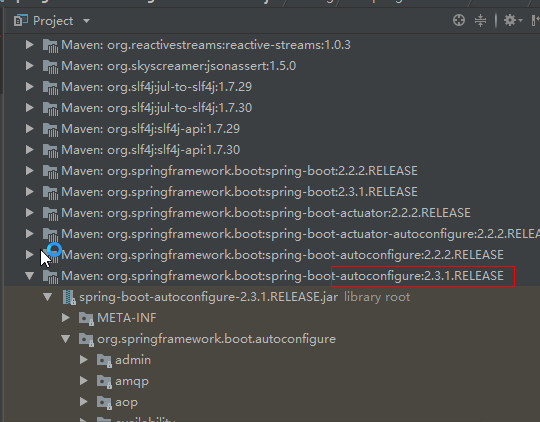
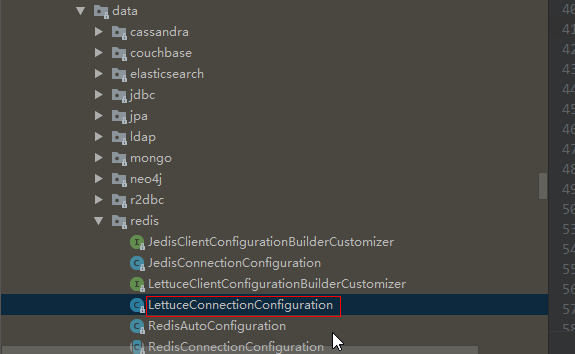

## 十二、SpringBoot2.x 中 redis 使用

java 代码操作 Redis，需要使用 Jedis，也就是 redis 支持 java 的第三方类库

注意: Jedis2.7 以上的版本才支持集群操作

### 12.1 maven 配置

新建 SpringBoot2.0.3 的 WEB 工程，在 MAVEN 的 pom.xml 文件中加入如下依赖

```xml
<?xml version="1.0" encoding="UTF-8"?>
<project xmlns="http://maven.apache.org/POM/4.0.0" xmlns:xsi="http://www.w3.org/2001/XMLSchema-instance"
         xsi:schemaLocation="http://maven.apache.org/POM/4.0.0 https://maven.apache.org/xsd/maven-4.0.0.xsd">
    <modelVersion>4.0.0</modelVersion>
    <parent>
        <groupId>org.springframework.boot</groupId>
        <artifactId>spring-boot-starter-parent</artifactId>
        <version>2.3.1.RELEASE</version>
        <relativePath/> <!-- lookup parent from repository -->
    </parent>
    <groupId>com.tyx</groupId>
    <artifactId>lettuce-demo</artifactId>
    <version>0.0.1-SNAPSHOT</version>
    <name>lettuce-demo</name>
    <description>Demo project for Spring Boot</description>

    <properties>
        <java.version>1.8</java.version>
    </properties>

    <dependencies>
        <dependency>
            <groupId>org.springframework.boot</groupId>
            <artifactId>spring-boot-starter-web</artifactId>
        </dependency>
        <!-- 默认是lettuce客户端 -->
        <dependency>
            <groupId>org.springframework.boot</groupId>
            <artifactId>spring-boot-starter-data-redis</artifactId>
        </dependency>

        <!-- redis依赖common-pool 这个依赖一定要添加 -->
        <dependency>
            <groupId>org.apache.commons</groupId>
            <artifactId>commons-pool2</artifactId>
            <version>2.8.0</version>
        </dependency>

        <dependency>
            <groupId>org.springframework.boot</groupId>
            <artifactId>spring-boot-devtools</artifactId>
            <scope>runtime</scope>
            <optional>true</optional>
        </dependency>
        <dependency>
            <groupId>org.projectlombok</groupId>
            <artifactId>lombok</artifactId>
            <optional>true</optional>
        </dependency>
        <dependency>
            <groupId>org.springframework.boot</groupId>
            <artifactId>spring-boot-starter-test</artifactId>
            <scope>test</scope>
            <exclusions>
                <exclusion>
                    <groupId>org.junit.vintage</groupId>
                    <artifactId>junit-vintage-engine</artifactId>
                </exclusion>
            </exclusions>
        </dependency>
    </dependencies>

    <build>
        <plugins>
            <plugin>
                <groupId>org.springframework.boot</groupId>
                <artifactId>spring-boot-maven-plugin</artifactId>
            </plugin>
        </plugins>
    </build>

</project>
```





### 12.2 视频中的代码

- **POM 文件**

```xml
<?xml version="1.0" encoding="UTF-8"?>
<project xmlns="http://maven.apache.org/POM/4.0.0" xmlns:xsi="http://www.w3.org/2001/XMLSchema-instance"
         xsi:schemaLocation="http://maven.apache.org/POM/4.0.0 https://maven.apache.org/xsd/maven-4.0.0.xsd">
    <modelVersion>4.0.0</modelVersion>
    <parent>
        <groupId>org.springframework.boot</groupId>
        <artifactId>spring-boot-starter-parent</artifactId>
        <version>2.3.1.RELEASE</version>
        <relativePath/> <!-- lookup parent from repository -->
    </parent>
    <groupId>com.tyx</groupId>
    <artifactId>lettuce-demo</artifactId>
    <version>0.0.1-SNAPSHOT</version>
    <name>lettuce-demo</name>
    <description>Demo project for Spring Boot</description>

    <properties>
        <java.version>1.8</java.version>
    </properties>

    <dependencies>
        <dependency>
            <groupId>org.springframework.boot</groupId>
            <artifactId>spring-boot-starter-web</artifactId>
        </dependency>
        <!-- 默认是lettuce客户端 -->
        <dependency>
            <groupId>org.springframework.boot</groupId>
            <artifactId>spring-boot-starter-data-redis</artifactId>
        </dependency>

        <!-- redis依赖common-pool 这个依赖一定要添加 -->
        <dependency>
            <groupId>org.apache.commons</groupId>
            <artifactId>commons-pool2</artifactId>
            <version>2.8.0</version>
        </dependency>

        <dependency>
            <groupId>org.springframework.boot</groupId>
            <artifactId>spring-boot-devtools</artifactId>
            <scope>runtime</scope>
            <optional>true</optional>
        </dependency>
        <dependency>
            <groupId>org.projectlombok</groupId>
            <artifactId>lombok</artifactId>
            <optional>true</optional>
        </dependency>
        <dependency>
            <groupId>org.springframework.boot</groupId>
            <artifactId>spring-boot-starter-test</artifactId>
            <scope>test</scope>
            <exclusions>
                <exclusion>
                    <groupId>org.junit.vintage</groupId>
                    <artifactId>junit-vintage-engine</artifactId>
                </exclusion>
            </exclusions>
        </dependency>
    </dependencies>

    <build>
        <plugins>
            <plugin>
                <groupId>org.springframework.boot</groupId>
                <artifactId>spring-boot-maven-plugin</artifactId>
            </plugin>
        </plugins>
    </build>
</project>
```

- **RedisConfig**

```java
package com.tyx.config;

import org.springframework.cache.annotation.CachingConfigurerSupport;
import org.springframework.context.annotation.Bean;
import org.springframework.context.annotation.Configuration;
import org.springframework.data.redis.connection.lettuce.LettuceConnectionFactory;
import org.springframework.data.redis.core.RedisTemplate;
import org.springframework.data.redis.serializer.GenericJackson2JsonRedisSerializer;
import org.springframework.data.redis.serializer.StringRedisSerializer;
import org.springframework.stereotype.Component;

import java.io.Serializable;

/**
 * @author papi
 * @data 2020/7/15
 */
@Configuration
public class RedisConfig  {
    @Bean
    public RedisTemplate<String, Object> redisTemplate(LettuceConnectionFactory factory){
        RedisTemplate<String, Object> redisTemplate = new RedisTemplate<>();
        redisTemplate.setKeySerializer(new StringRedisSerializer());
        redisTemplate.setValueSerializer(new GenericJackson2JsonRedisSerializer());
        redisTemplate.setConnectionFactory(factory);
        return redisTemplate;
    }
}
```

- **User**

```java

package com.tyx.po;

import lombok.Data;

import java.io.Serializable;

/**
 * @author papi
 * @data 2020/7/15
 */

/**
 * Java常用编码规范
 * Java规范
 */
@Data
public class User implements Serializable {
    private String name;
    private int age;
    private String id;
}
```

- **UserServiceImpl**

```java
package com.tyx.service.impl;

import com.tyx.po.User;
import lombok.extern.slf4j.Slf4j;
import org.springframework.beans.factory.annotation.Autowired;
import org.springframework.data.redis.core.RedisTemplate;
import org.springframework.stereotype.Service;

import java.io.Serializable;
import java.util.concurrent.TimeUnit;

/**
 * @author papi
 * @data 2020/7/15
 */
@Service
@Slf4j
public class UserServiceImpl {
    @Autowired
    private RedisTemplate<String, Object> redisTemplate;
    /**
     * Redis有什么命令，Jedis有什么方法
     * Lettuce-----》RedisTemplate进一步的封装
     *RedisTemplate 方法和命令是肯定不一样的
     * Redis 和 String类型
     * 需求输入一个key
     * 先判断该key是否存在如果不存在则在mysql中进行查询，写入到redis中。并返回值。
     */
    public String getRedisValueByKey(String key){
        if (redisTemplate.hasKey(key)) {
            //表示存在值，进行获取
            log.info("-------> redis中查询的数据");
            Object o = redisTemplate.opsForValue().get(key);
            return (String) o;
        }else {
            //不存在去mysql中查并且赋值给reids
            String val = "redis中不存在的key";
            log.info("------>mysql中查询出来的: "+val);
            redisTemplate.opsForValue().set(key,val);
            log.info("------>mysql中查出的数据存入redis中");
            return val;
        }
    }

    /**
     * 测试String类型
     * 需求: 用户输入一个redis数据。该key的有效期为28小时
     */
    public void expireStr(String key, String val){
        redisTemplate.opsForValue().set(key,val);
        redisTemplate.expire(key,2,TimeUnit.HOURS);
    }
    /**
     * 根据ID查询用户对象信息
     *  先判断redis中是否存在该key
     *  如果不存在，查询数据库中mysql中的值，并将结果添加到redis中。
     *  如果存在，直接将结果在redis查询，并返回。
     */
    public User getHashKey(String id){
        if (redisTemplate.opsForHash().hasKey("user",id)){
            log.info("----->查询redis数据库");
          return (User) redisTemplate.opsForHash().get("user",id);
        }else {
            log.info("----->查询mysql数据库");
            User user = new User();
            user.setId(id);
            user.setAge(18);
            user.setName("速速");
            /*
                @param  h  用户的实体
                @param  hk 用户主键id
                @param  hv 整个对象
             */
            redisTemplate.opsForHash().put("user",id,user);
            return user;

        }
    }
}
```

- **测试类**

```java
package com.tyx;

import com.tyx.po.User;
import com.tyx.service.impl.UserServiceImpl;
import lombok.AllArgsConstructor;
import org.junit.jupiter.api.Test;
import org.springframework.beans.factory.annotation.Autowired;
import org.springframework.boot.test.context.SpringBootTest;

@SpringBootTest
class LettuceDemoApplicationTests {
    @Autowired
    private UserServiceImpl userService;
    @Test
    void contextLoads() {
    }

    @Test
    void T1 (){
        String tyx = userService.getRedisValueByKey("tyx");
        System.out.println("返回redis中的值为: " + tyx);
    }
    @Test
    void T2(){
        User hashKey = userService.getHashKey("1003");
        System.out.println(hashKey);
    }
}

```

### 12.3 查看 Redis 客户端信息

原因: 把任何数据保存到 redis 中时，**都需要进行序列化**，默认使用 JdkSerializationRedisSerializer 进行数据序列化。所有的 key 和 value 还有 hashkey 和 hashvalue 的原始字符前，都加了一串字符。
