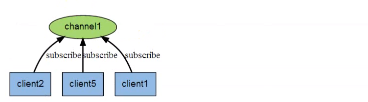
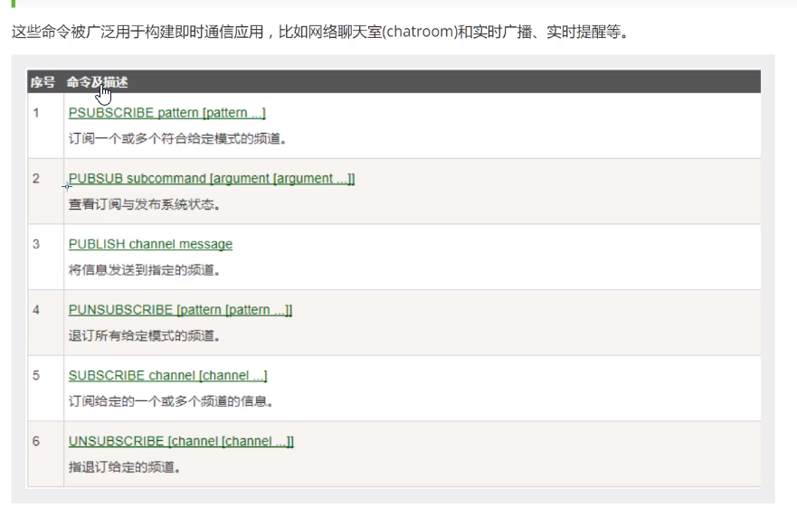

## 十三、Redis 的发布订阅

### 13.1 redis 发布订阅简介

Redis 发布订阅(pub/sub)是一种消息通信模式: 发送者（pub）发送消息，订阅者（sub)接受消息。

Redis 客户端可以订阅任意数量的频道

Redis 发布订阅(pub/sub)是一种消息通信模式: 发送者（pub）发送消息，订阅者（sub)接受消息。
Redis 客户端可以订阅任意数量的频道。
下图展示了频道 channel1，以及订阅这个频道的三个客户端---client2，client5 和 client1 之间的关系。





```bash
//订阅端
SUBSCRIBE redischannel
Reading messages ...(press ctrl-c quit)
//发送端
PUBLIC redischannel "redis channel"
```
