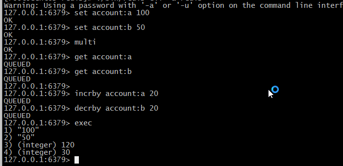
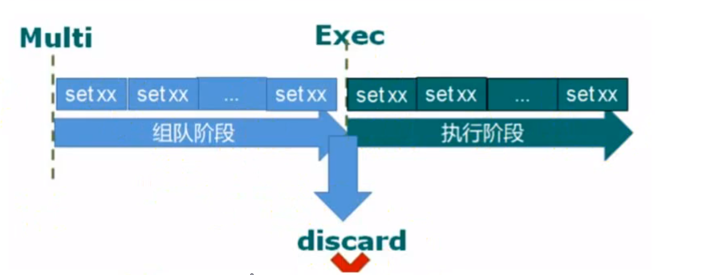
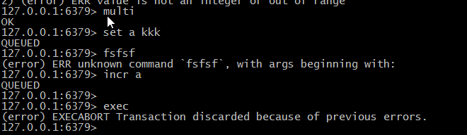
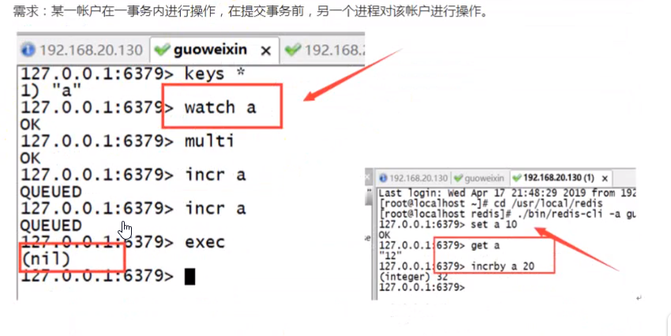

## 十五、Redis 事务

Redis 事务可以一次执行多个命令，（按顺序地串行化执行，执行中不会被其他命令插入，不许加塞）

- **简介**

Redis 事务可以一次指定多个命令（允许在一个单独的步骤中执行一组命令），并且带有一下两个中要的保证:

批量操作在发送 EXEC 命令前被放入队列缓存。

收到 EXEC 命令后进入事务执行，事务中任意命令执行失败，其余命令依然被执行。

在事务执行过程中，其他客户端提交的命令请求不会插入到事务执行命令列中。

1. **Redis 会将一个事务中的所有命令序列化，然后按顺序执行**
2. **执行中不会被其它命令插入，不许出现加赛行为**

- **常用命令**

  - DISCARD: 取消事务，放弃执行事务块内的所有命令。
  - MULTI: 标记一个事务块的开始。
  - EXEC: 执行所有事务块内的命令。
  - UNWATCH: 取消 watch 命令对所有 key 的监视。
  - WATCH KEY [KEY ...]: 监视一个(或多个)key，如果在事务执行之前这个(或这些)key 被其他命令所改动，那么事务将被打断。

一个事务从开始到执行会经历以下三个阶段:

1. 开始事务。

2. 命令入队。

3. 执行事务。

### 15.1 示例 1 MULTI EXEC

转账功能，A 向 B 转账 50 元

一个事务的例子，它先以 MULTI 开始一个事务，然后将多个命令入队到事务中，最后由 EXEC 命令触发事务



1. **输入 Multi 命令开始，输入的命令都会一次进入命令队列中，但不会执行**
2. **知道输入 Exce 后，Redis 会将之前的命令队列中的命令一次执行。**

### 15.2 示例 DISCARD 放弃队列运行



1. **输入 MULTI 命令，输入的命令都会依次进入命令队列中，但不会执行。**
2. **直到输入 Exec 后，Redis 会将之前的命令队列中的命令依次执行。**
3. **命令队列的过程中可以使用命令 DISCARD 来放弃队列运行。**

## 15.3 示例 3 事务的错误处理

事务的错误处理:

如果执行的某个命令报出了错误，则只有报错的命令不会被执行，**而其他的命令都会执行，不会回滚**。

### 15.4 示例 4 事务的错误处理

事务的错误处理:

队列中的某个命令出现了 报告错误，执行是整个的所有队列都会被取消。



- **由于之前的错误，事务执行失败**

### 15.5 示例 5 事务的 watch

```bash
WATCH  key [key ...] # 监视一个(或多个)key，如果在事务执行前这个(或这些)key被其他命令所改动，那么事务将被打断。
```

需求: 某一账户在一事务内进行操作，在提交事务前，另一个进程对该账户进行操作。



### 15.6 应用场景

一组命令必须同时都执行，或者都不执行。

我们想要保证一组命令在执行的过程之中不被其他命令插入。

**案例**: 秒杀

### 15.7 Redis 事务的总结

Redis 事务本质: 一组命令的集合！一个事务中的所有命令都会被序列化，在事务执行过程中，会按照顺序执行！一次性，顺序性，排他性！执行一些列的命令！

**Redis 事务没有隔离级别的概念！**

所有的命令在事务中，并没有直接被执行！只有发起执行命令的时候才会执行！Exec

**Redis 单条命令保存原子性，但是事务不保证原子性！**

Redis 事务其实是支持原子性的！即使 Redis 不支持事务回滚机制，但是它会检查每一个事务中的命令是否错误。
