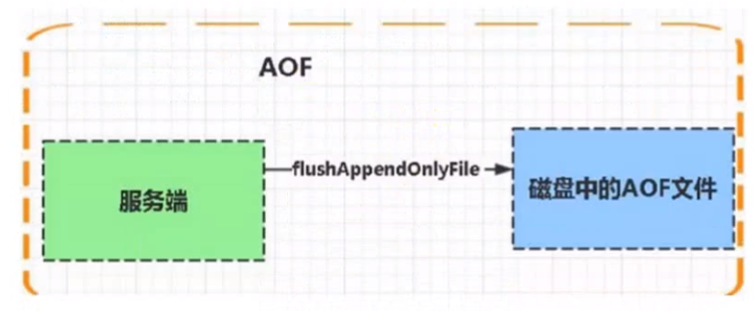
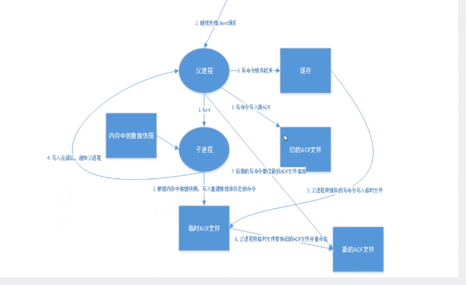

## 十六、Redis 持久化

### 16.1 什么是 Redis 持久化？

持久化就是把内存的数据写到磁盘中去，防止府服务宕机内存数据丢失。

Redis 提供了两种持久化方式: **RDB(默认)和 AOF**

- **简介**

数据存放于:

- **内存: 高效，断电（关机）内存数据会丢失**

- **硬盘: 读写速度慢于内存，断电数据不会丢失**

**Redis 持久化存储支持两种方式: RDB 和 AOF。RDB 一定时间取存储文件，AOF 默认每秒去存储历史命令，**

**Redis 是支持持久化的内存数据库，也就是说 redis 需要经常将内存中的数据同步到硬盘来保证持久化。**

### 16.2 RDB

RDB 是 Redis DataBase 缩写

Redis 是内存数据库，如果不将内存中的数据库状态保存到磁盘中，那么一旦服务器进程退出，服务器中的数据库的状态也会消失。造成数据的丢失，所以 redis 提供了持久化的功能。

在指定的时间间隔内将内存中的数据集快照写入磁盘，也就是所说的 snapshot 快照，它恢复是将卡 UN 关照文件爱你直接读到内存里。

Redis 会单独创建（fock）一个子进程来进行持久化，会先将数据写入到一个临时文件中，待持久化过程都结束了，在用这个临时文件替换上次持久化好的文件。整个过程中，主进程是不进行任何 IO 操作的。这就确保了极高的性能。如果需要进行大规模的数据的恢复，且对于数据恢复的完整性不死非常敏感，那 RDB 方式要比 AOF 方式更加的高效。RDB 的缺点是最后一次持久化的数据可能丢失。

功能核心函数 rdbSave（生成 RDB 文件）和 rdbLoad（从文件加载内存）两个函数

- **rdbSave: 生成 RDB 文件**
- **rdbLoad: 从文件夹杂内存**


RDB : 是 redis 默认的持久化机制

快照是默认的持久化方式。这种方式就是将内存中数据以快照的方式写入到二进制文件中，默认的文件名为**dump.rdb**。

- **优点**

  - 快照保存数据极快，还原数据极快
  - 适用于灾难备份

- **缺点**

  - 小内存机器不适合使用，RDB 机制符合要求就会照快照

- **快照条件**

  ```bash
  # 1. 服务器正常关闭: ./bin/redis-cli shutdown
  # 2. key满足一定条件，会进行快照
  vim redis.config # 搜索save
  save   900  1      //每秒900秒（15分钟）至少1个key发生变化，产生快照
  save   300  10     //每300秒  （5分钟）至少10个key发生变化，产生快照
  save   60   10000  //每60秒（1分钟）至少10000个key发生变化，产生快照
  ```

### 16.3 AOF

由于快照方式是在一定间隔时间做一次的，所以如果 redis 意外 down 掉的话，就会丢失最后一个快照后的所有修改。如果应用要求不能丢失任何修改的话，可以采用 aof 持久化方式。

Append-only file: aof 比 rdb 有更好的持久化性，是由于在使用 aof 持久化方式是，redis 会将每一个收到的命令都通过 write 函数追加到文件中（默认是 appendonly.aof)。当 redis 重启是会通过重新执行文件中保存的写命令来在内存冲重建整个数据库的内容。





每当执行服务器（定时）任务或者函数时 flushAppendOnlyFile 函数都会被调用，这个函数执行以下两个工作 aof 写入保存:

- **WRITE: 根据条件，将 aof_buf 中的缓存写入到 AOF 文件。**

- **SAVE: 根据条件，调用 fsync 或 fdatasync 函数，将 AOF 文件保存到磁盘中。**

- **有下面几种方式如下（默认是: 每秒 fsync 一次）**

  - appendonly yes //启用 aof 持久化方式
  - `#` appendfsync always //收到写命令就立即写入磁盘，最慢，但是保证完全的持久化
  - appendfysnceverysec //每秒钟写入磁盘一次，在性能和持久化方面做了很好的折中
  - `#` appendfysnc no //完全依赖 os，性能孔，持久化没保证

- **产生的问题**

aof 的方式也同时带来了另一个问题。持久化文件会变的越来越大。例如我们调用 incr test 命令 100 次，问价中必须保存全部的 1000 条命令，其实有 99 条都是多余的。
