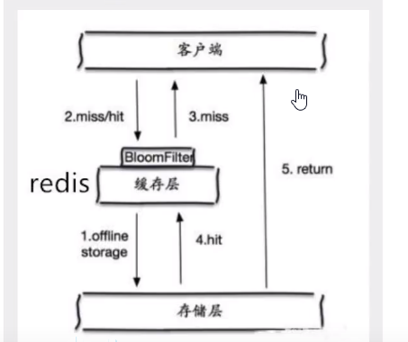
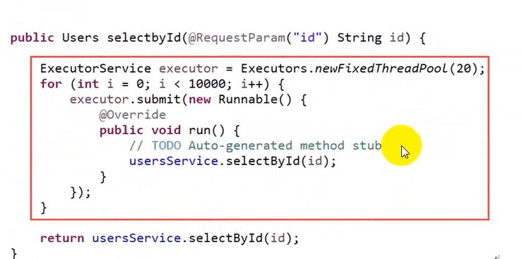
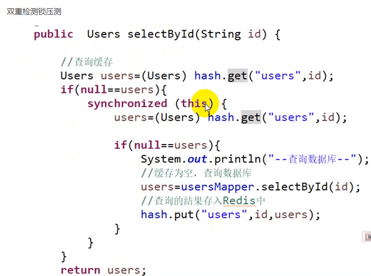
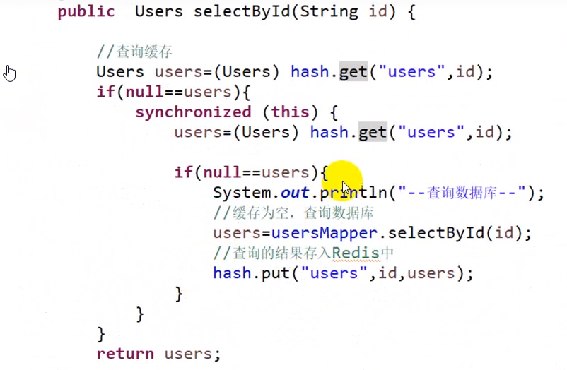

## 十八、总结

### 18.1 缓存穿透

缓存穿透是指查询一个一定不存在的数据，由于缓存时不命中时需要从数据库查询，查不到数据则不写入缓存，这将导致这个不存在的数据每次请求都要到数据库去查询，造成缓存穿透。

**解决办法**: 持久层查询不到就缓存空结果，查询时先判断缓存中是否 exists(key)，如果有直接返回空，没有则查询后返回，

注意 insert 时需要清除查询的 key，否则即便 DB 中有值也查询不到（当然可以设置空缓存的过去时间）

> 概念

缓存穿透的概念很简单，用户想要查询一个数据没法安 redis 内存数据库没有，也就是缓存没有命中，于是向持久层数据量查询。发现也没有，于是本次查询失败。当用户很多的时候，缓存都没有命中，于是都去请求持久层数据库，这会给持久层数据库造成很大的压力，这时候就相当于出现了缓存穿透。

> 解决方案

#### 18.1.1 布隆过滤器

布隆过滤器是一种数据结构，对所有可能查询的参数以 hash 形式存储，在控制层先进行校验，不符合则丢弃，从而避免了对底层存储系统的查询压力；

但是这种方法存在两个问题:

1. 如果空值能够被缓存起来，这就意味着缓存需要更过的空间村粗更过的键，因为这当中可能回有很多的空值的键；

2. 即使对空值设置了过期时间，还是会存在缓存层和存储层的数据会有一段时间窗口的不一致，这对于需要保持一致性的业务会有影响；

### 18.1.2 缓存击穿

> 概念

这里需要主要的是缓存击穿的区别，缓存击穿，是指一个 key 非常热点，在不停的扛着大并发，大并发集中对这一个点进行访问，当这个 key 在失效的瞬间，持续的大并发就穿破缓存，直接请求数据库，就行在一个屏幕上凿开一个洞

当某个 key 在过期的瞬间，有大量的请求并发访问，这类数据一般是热点数据，由于缓存过期，会同时访问数据库来查询最新数据，并且回写缓存，会导致数据库瞬间压力过大。

> 解决方案

- **设置热点数据永不过期**

从缓存层面来看，没有设置过期时间，所有不会出现热点 key 过期后产生的问题。

- **加锁互斥**

分布式锁: 使用分布式锁，保证对于每个 key 同时只有一个线程去查询后盾服务，其他线程没有获得分布式锁的权限，因此只需要等待即可，这种方式将高并发的压力转移到了分布式锁，因此对分布式锁的考验很大。

### 18.2 雪崩

**雪崩: 缓存大量失效的时候，引发大量查询数据库。**

- **解决办法**

用锁/分布式锁或者队列串行访问

缓存失效时间均匀分布

如果缓存集中在一端时间内失效，发生大量的缓存穿透，所有的查询都落在数据库上，造成了缓存雪崩。

这个没有完美解决办法，但是可以分析用户的行为，尽量让失效时间点均匀分布。大所属系统设计者考虑用加锁或者队列的方式保证缓存的单线程写，从而避免失效时大量的并发请求落到底层存储系统上。

1. **加锁排队。限流---限流算法**

   在缓存失效后，通过加锁或者队列来控制读数据库写缓存的线程数量。比如对某个 key 只允许一个线程查询数据和写缓存，其他线程等待。

   简单地来说，就是在缓存失效的时候（判断拿出来的值为空），不是立即去 load db，而是先使用缓存工具的某些带成功操作返回值的操作（比如 Redisde SETNX 或者 Memcache 的 ADD）去 set 一个 mutex key，当操作返回成功是，在进行 koad db 的操作应设缓存；否则，就重试整个 get 缓存的方法。

   SETNX ,是【SET IF NOT EXISTS]的缩写，也就是只有不存在的时候才设置，可以利用它来实现锁的效果。

2. **数据预热**

   可以通过缓存 reload 机制，预选去更新缓存，再即将发生大并发访问前手动触发加载缓存不同的 key，设置不同的过期时间，让缓存失效的时间点尽量均匀。

### 18.3 热点 key

​ 热点 key: 某个 key 访问非常频繁。当 key 失效的时候有大量线程来构建缓存，导致负载增加，系统崩溃。

解决办法:

1. 使用锁，单机用 synchronized ， lock 等，分布式使用分布式锁
2. 缓存过期时间不设置，而是设置在 key 对应的 value 里。如果检测到存的时间超过过期时间则 异步跟新缓存。
3. 在 value 设置一个比过去时间 t0 小的过期时间值 t1,当 t1 过期的时候，延长 t1 并做更新缓存操作。
4. 设置标签缓存，标签缓存设置过期时间，标签缓存过期后，需异步地跟新实际缓存。

- **案例**

假设并发有 10000 个请求，想达到对个请求从数据库中获取，其他 9999 个请求冲 redis 中获取这种效果

双重检测锁测压:

