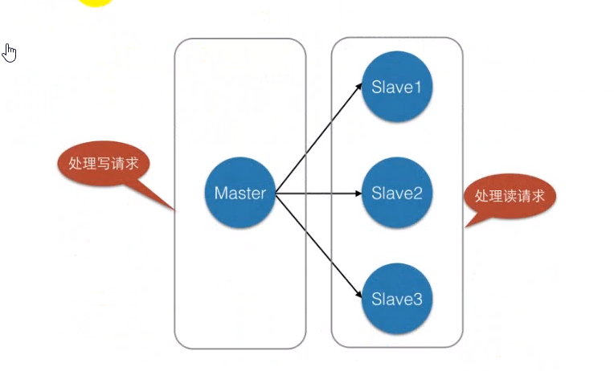
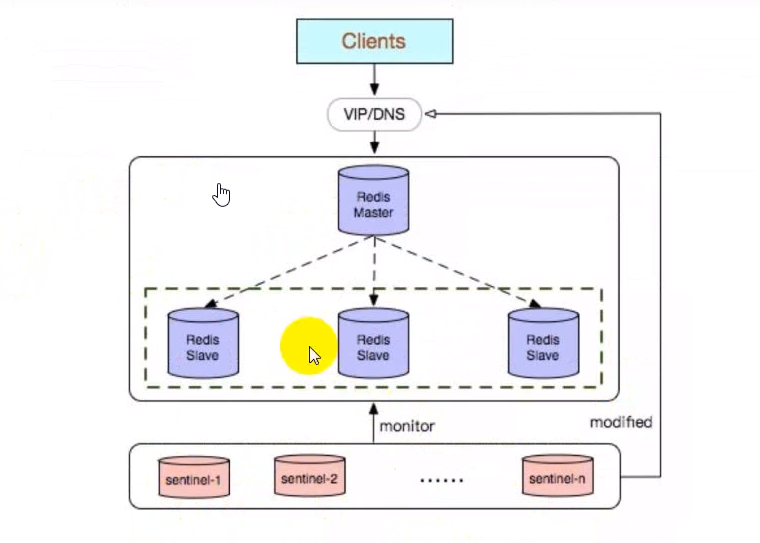
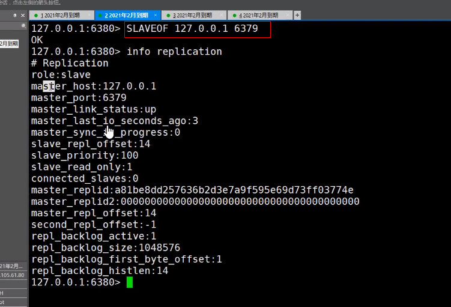
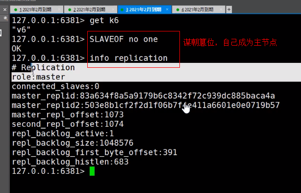

## 二十、主从复制

- **简介**

电子商务网站上的商品，一般都是一次上传，无数次的浏览的，说专业点的也就是“多读少些”。

### 20.1 主从复制

一个 Redis 服务可以有多个该服务的复制品，这个 Redis 服务成为 Master，其他的复制成为 Slaves



如图中所示: 我们将一台 Redis 服务器作为主库（master），其他的三台作为（salve），主库负责写数据，每次有数据跟新都更新的数据同步到它的所有的从库，而从库只负责读数据。这样一来，就有了两个好处:

1、读写分离: 不仅可以提高服务器的负载能力，并且可以根据读请求的规模自由增加或者减少从库的数据。

2、数据被复制成了好几份，就算一台机器出现故障，也可以使用其它机器的数据快速的恢复。

需要注意的是: Redis 主从复制模式中，一台主库可以用用多个从库，一个从库只能属于一个主库。

### 20.2 Redis 主从复制配置

在 Redis 中，要实现主从复制架构非常的简单，只需要在从数据库的配置文件中加上如下命令即可:

1、主数据库不需要任务配置，创建爱哪一个从数据库:

redis.config（配置文件信息）

```bash
-- port 6380 # 从服务的端口号
--slaveof 127.0.0.1 6379 # 指定主服务器
```

2、启动从数据库:

```bash
./bin/redis-server ./redis.conf --port 6380 --slaveof 127.0.0.1 6379
```

3、登录到从服务客户端

```bash
./bin/redis-cli -p 6380 -a redis
```

4、哨兵模式

- **简介**

Redis-Sentinel(哨兵模式)是高可用解决方案，当 redis 在做 master-slave 的高可用方案时，假如 master 宕机了，redis 本身（以及其很多客户端）都没有实现自动进行主备切换，而 redis-sentinel 本身是独立运行的进程，可以部署在其他的与 redis 集群可通讯的机器中监控 redis 集群。

有了主从复制的实现之后，我们如果想从服务器进行监控，那么在 redis2.6 以后提供了有个“哨兵”机制，并在 2.8 版本以后功能稳定起来。

哨兵: 顾名思义，就是监控 Redis 系统的运行状况。



哨兵模式的特点

1. 不时地监控 redis 是否按照预期良好地运行；

2. 如果发现某个 redis 节点运行出现状况，能够通知另外一个进程（例如它的客户端）；

3. 能够进行自动切换。当一个 master 节点不可用时，能够选举出 master 的多个 slave(如果有超过一个 slave 的话)中的一个来作为新的 master，其他的 slave 节点会将它所追随的 master 地址改为被提升为 master 的 salve 的新地址。

4. 哨兵为客户端提供服务发现，客户端连接哨兵，哨兵提供当前 master 的地址然后提供服务，如果出现切换，也就是 master 挂了，哨兵会提供客户端一个新地址。

### 20.3 基本概述

- **高可用**

"高可用性（High Availability）"通常用来描述一个系统经过专门的设计，从而减少停工时间，而保证器服务的高可用性。（一直都能用）

高可用: 6 个 99.9999% 全年停机不超过 32 秒。

- **高并发**

**高并发** （High Concurrentcy）是互联网分布式系统架构设计中必须考虑的因素之一，它通常是指，通过设计在保证系统能够同时并行处理的很多请求。

高并发相关商用的一些指标有如下:

- 响应时间（Response Time）
- 吞吐量（Throughput）
- 每秒查询率 QPS（Query Pre Second），并发用户数等。

**响应时间**: 系统对请求做出响应的时间，例如系统处理一个 HTTP 请求需要 200ms，这个 200ms 就是系统的响应时间。

**吞吐量**: 单位时间内处理的请求数量。

**QPS**: 每秒响应请求数。在互联网领域，这个指标和吞吐量区分的没有那么明显。

并发用户: 同时承载正常使用系统功能的用户数量。例如一个即使通讯系统，同时在线量一定程度上代表

### 20.4 主从复制的主要作用包括

**1、数据冗余**: 主从复制实现了数据热备份，是持久化之外的一种数据冗余的方式。

**2、故障恢复**: 当主节点出现 问题时，可以由从节点提供服务，实现快速的故障恢复；世界上是以一种服务的冗余。

**3、负载均衡**: 在主从复制的基础上，配合读写分离，可以由节点提供写的服务，由从节点提供提供读服务（即写 redis 数据时应用及连接主节点，读 redis 数据时应该用从节点），人丹服务器的负载；尤其在写少读多的场景下，通过多个从节点分担读负载，可以大大提高 redis 服务器的并发量。

**4、高可用的基石**: 除了上述作用以外，主从复制还是哨兵和集群能够实施的基础，因此说主从复制是 redis 高可用的基础。



### 20.5 主从复制的原理

Slave 启动成功连接到 master 后会发送一个 sync 命令

Master 接收到名，启动后台的存盘进程，同时收集所有接受到的用于修改数据集命令，在后台进程执行完毕后，master 将传送的数据文件到 slave，并完成一次完全同步

全量复制: 而 slave 服务在接受到数据库文件数据后，将其存盘并加载内存中。

增量文件: Master 继续将新的所有收集的修改命令一次传给 slave，完成同步

但是只要是重新连接 master，一次完全同步（全量复制）将别自动执行。


