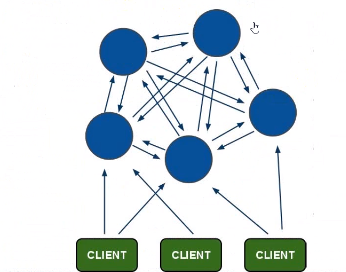
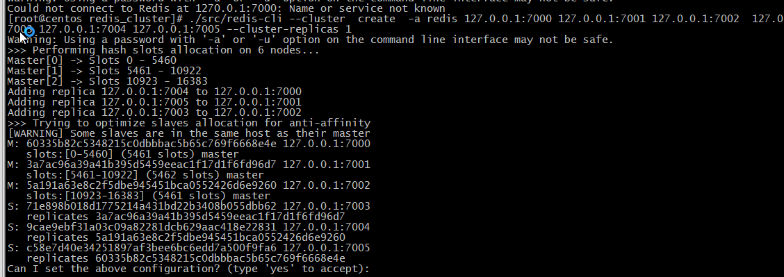
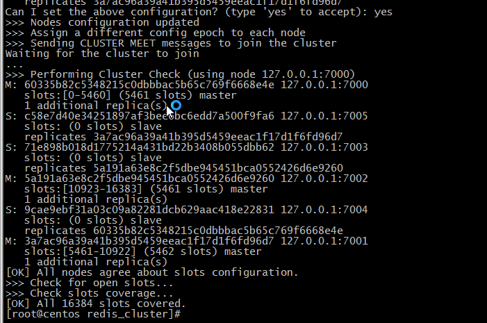

## 二十一、Redis Cluster 集群

- **简介**

### 21.1 集群模式是实际使用最多的模式

Redis Cluster 是社区版推出的 Redis 分布式集群解决方案，主要解决 Redis 分布式方面的需求，比如，当遇到单机内存，并发和流量等瓶颈的时候，Redis Cluster 能起到很好的的负载均衡的目的。

**为什么使用 redis-cluster？**

为了在大流量访问下提供稳定的业务，集群化时存储的必然形态

未来的发展趋势可定是云计算和大数据的紧密结合

只有分布式架构能满足需求

### 21.2 集群描述

Redis 集群搭建方案:

1. Twitter 开发的 twemproxy
2. 豌豆荚开发的 codis
3. redis 观法的 redis-cluster

Redis 集群搭建的方式有很多种，但从 redis 3.0 之后变动表呢支持 redis-cluster 集群，志超需要 3（master）+3（Slave）才能简历集群。Redis——Cluster 采用无中心结构，没个节点保存数据和整个集群状态，每个节点都和其他所有 节点连接。其 redis-cluster 架构图如下所示:



Redis Cluster 集群几点最小配置 6 个节点以上（3 主 3 从），其中主节点提供读写操作，从节点作为备用节点，不提供请求，只作为故障转移使用。

- **Redis Cluster 集群特点**


1、所有的 redis 节点彼此互联（PING-PONG)，内部使用二进制协议优化传输速度和带宽。

2、节点的 fail 是通过集群中超过半数的节点检测失效时才生效。

3、客户端与 redis 节点直连，不需要中间 proxy 层。客户端不需要连接集群所有节点，连接集群中任何一个可用节点即可。

4、redis-cluster 把所有的物理节点映射到[0-16383]slot 上（不一定是平均分配），cluster 负责维护

5、redis 集群预先分好 16384 个哈希槽，当需要在 redis 集群中放置一个 key-value 时，redis 先对 key 使用 crc16 算法算出一个结果，然后把结果对 16384 求余数，这样对每个 key 都会对应一个编号在 0-16383 之间的哈希槽，redis 会根据节点数量大致均等的将哈希槽映射到不同的节点。

### 21.3 Redis Cluster 集群搭建

集群搭建参考官网: <https://redis.io/topic/cluster-tutorial>

redis 集群需要至少三个 master 节点，我们这里搭建三个 master 节点，并且给每个 master 在搭建一个 slave 节点，总共 6 个节点，这里用一台机器（可以多台机器部署，修改一下 ip 地址就可以了）部署 6 个 redis 实例，三主三从。搭建集群的步骤如下:

- 1. 创建 Redis 节点安装目录

  ```bash
  mkdir /root/apps/redis_cluster # 指定目录下创建 redis_cluster
  ```

- 2. 在 redis_cluster 目录，创建 7000-7005 6 个文件夹下

  ```bash
  mkdir 70000 70001 70002 70003 70004 70005
  ```

- 3. 并将 redis-conf 分别拷贝到 70000-70005 文件夹下

  ```bash
  cp /opt/redis-5.0.8/redis.conf ./70000
  ```

- 4. 修改 Redis 配置文件

  ```bash
  /root/apps/redis_cluster/70000
  # 关闭保护模式 用于公网访问
      protected-mode  no
      port  70000
  # 开启集群模式
      cluster-enabled  yes
      cluster-config-file nodes-70000.config
      cluster-node-timeout  5000
  # 后台启动
      daemonize  yes
      pidfile  /var/run/redis_70000.pid
      logfile  "70000.log"
  # dir /redis/data
  # 此处绑定ip,可以是阿里内网ip和本地ip也可以直接注释掉该项
  # bind 127.0.0.1
  # 用于连接主节点密码
      masterauth redis
  #设置redis密码 各个几点请保持密码一致
      requirepass  redis
  ```

- 5. 依次复制并修改 6 个 redis.conf

  ```bash
  cp ./70000/redis.conf ./70001 # 依次进行复制
  vim ./70001/redis.conf # 执行 %s/old/new/g 全部替换 :wq 保存并退出即可
  ```

- 6. 依次启动 6 个节点

  将安装的 redis 目录下的 src 复制到 cluster 下，方便启动服务端

  ```bash
  cd /opt/redis-5.0.8 # 进入redis安装目录
  cp -r ./src/ /usr/local/redis_cluster/ # 将src文件复制到redis——cluster目录中
  ```

  ```bash
  ./src/redis-server ./7000/redis.conf
  ./src/redis-server ./7001/redis.conf
  ./src/redis-server ./7002/redis.conf
  ./src/redis-server ./7003/redis.conf
  ./src/redis-server ./7004/redis.conf
  ./src/redis-server ./7005/redis.conf
  ```

  启动后，可以用 PS 查看进程:

  ```bash
  ps -ef | grep -i redis
  ```

- 7. 创建集群

  Redis 5 版本后 通过 redis-cli 客户端命令来创建集群。

  ```bash
  ./src/redis-cli --cluster create -a redis 127.0.0.1:7000 127.0.0.1:7001 127.0.0.1:7002 127.0.0.1:7003 127.0.0.1:7004 127.0.0.1:7005 --cluster-replicas 1
  ```

  

  ```bash
  Performing hash slots allocation on 6 nodes

  Trying to optimize slaves allocation for anti-affinity
  ```

  

  ```bash
  [OK] All 16384 slots covered.
  ```

- 8. Redis Cluster 集群验证

  在某台机器上（或）连接集群的 7001 端口的几点:

  ```bash
  redis-cli -h 127.0.0.1  -c -p 7000 -a redis   :加参数 -c 可以连接到集群
  ```

  redis cluster 在设计的时候，就考虑了去中心化，去中间件，也就是说集群中的每个节点都是平等的关系，都是对等的，每个几点都保存各自的数据和整个集群的状态。每个节点都和其他所有节点连接，而且这些连接保持活跃，这样就保证了我们只需要连接集群中的任意一个节点，就可以获取到其他节点的数据。

  基本命令

  **info replication** 通过 Cluster Nodes 命令和 Cluster Info 命令来看看集群的效果

  ```bash
  127.0.0.1:7000> info replication
  # Replication
  role:master
  connected_slaves:1
  slave0:ip=127.0.0.1,port=7004,state=online,offset=1026,lag=1
  master_replid:2c2851db4bea0ea2f9d93d60a065e868112c47d7
  master_replid2:0000000000000000000000000000000000000000
  master_repl_offset:1026
  second_repl_offset:-1
  repl_backlog_active:1
  repl_backlog_size:1048576
  repl_backlog_first_byte_offset:1
  repl_backlog_histlen:1026
  127.0.0.1:7000>
  ```

- **输入命令 cluster nodes**

  ```bash
  127.0.0.1:7000> cluster nodes
  c58e7d40e34251897af3bee6bc6edd7a500f9fa6 127.0.0.1:7005@17005 slave 3a7ac96a39a41b395d5459eeac1f17d1f6fd96d7 0 1596391181092 6 connected
  71e898b018d1775214a431bd22b3408b055dbb62 127.0.0.1:7003@17003 slave 5a191a63e8c2f5dbe945451bca0552426d6e9260 0 1596391182096 4 connected
  60335b82c5348215c0dbbbac5b65c769f6668e4e 127.0.0.1:7000@17000 myself,master - 0 1596391181000 1 connected 0-5460
  5a191a63e8c2f5dbe945451bca0552426d6e9260 127.0.0.1:7002@17002 master - 0 1596391183102 3 connected 10923-16383
  9cae9ebf31a03c09a82281dcb629aac418e22831 127.0.0.1:7004@17004 slave 60335b82c5348215c0dbbbac5b65c769f6668e4e 0 1596391182000 5 connected
  3a7ac96a39a41b395d5459eeac1f17d1f6fd96d7 127.0.0.1:7001@17001 master - 0 1596391182598 2 connected 5461-10922
  ```

  每个 Redis 的节点都有一个 ID 值，此 ID 将被此特定 redis 实例永久使用，以便实例在集群上下文中具有唯一的名称。每个节点都都会记住使用此 ID 的每个其他节点，而不是通过 IP 或端口号。IP 地址和端口可能会发生变化，但唯一的节点标识符在节点的整个生命周期内都不会改变。我们简单称这个标识符为节点 ID。

### 21.4 Redis 总结

- **简介**

​redis cluster 为了保证数据的高可用性，加入了主从模式，一个节点对应一个或多个从节点，主节点提供数据存取，从节点则是从主节点拉去数据备份，当这个主节点挂掉后，就会有这个从节点选取一个来充当主节点，从而保证集群不会挂掉。

集群有 ABC 三个主节点，如果这 3 个几点都没有加入从节点，如果 B 挂掉了，我们就无法访问整个集群了。A 和 C 的 slot 也无法访问。

所以我们集群建立的时候，一定腰围每个主节点都添加一个从节点，比如像这样，集群包含主节点 A,B,C 以及从节点 A1,B1,C1，那么及时 B 挂掉系统也可以继续正确工作。

B1 节点代替了 B 节点，所有 Redis 集群将会选择 B1 节点作为新的主节点，集群将会继续正确的提供服务。当 B 重新开启后，它就变成 B1 的从节点。

不过需要注意，如果几点 B 和 B1 同时挂掉，Redis 集群就无法继续正确的提供服务了。

### 21.5 关闭集群

在/root/apps/redis_cluster 目录下编写脚本文件: vim shutdowm.sh

内容如下:

```bash
/root/apps/redis_cluster/src/redis-cli -c -h 127.0.0.1 -p 7000 -a redis shutdown
/root/apps/redis_cluster/src/redis-cli -c -h 127.0.0.1 -p 7001 -a redis shutdown
/root/apps/redis_cluster/src/redis-cli -c -h 127.0.0.1 -p 7002 -a redis shutdown
/root/apps/redis_cluster/src/redis-cli -c -h 127.0.0.1 -p 7003 -a redis shutdown
/root/apps/redis_cluster/src/redis-cli -c -h 127.0.0.1 -p 7004 -a redis shutdown
/root/apps/redis_cluster/src/redis-cli -c -h 127.0.0.1 -p 7005 -a redis shutdown

```

```bash
chmod u+x shutdown.sh # 然后执行将shutdown.sh变成可执行文件
./shutdown.sh # 在当前目录下启动
ps aux | grep redis
/usr/local/redis_cluster/redis-cli -a xxx -c -h 192.168.5.100 -p 8001
-a # 访问服务端密码， -c表示集群模式， -h指定ip地址，-p指定端口号
```

```bash
/root/apps/redis_cluster/src/redis-service ./70000/redis.conf
/root/apps/redis_cluster/src/redis-service ./70001/redis.conf
/root/apps/redis_cluster/src/redis-service ./70002/redis.conf
/root/apps/redis_cluster/src/redis-service ./70003/redis.conf
/root/apps/redis_cluster/src/redis-service ./70004/redis.conf
/root/apps/redis_cluster/src/redis-service ./70005/redis.conf
```

```bash
chmod u+x redisinstall.sh # 然后执行将redisinstall.sh变成可执行文件
./redisinstall.sh
```
