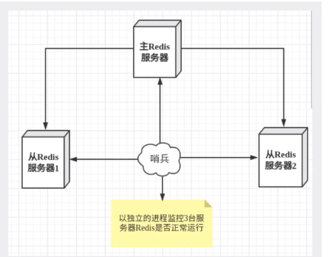
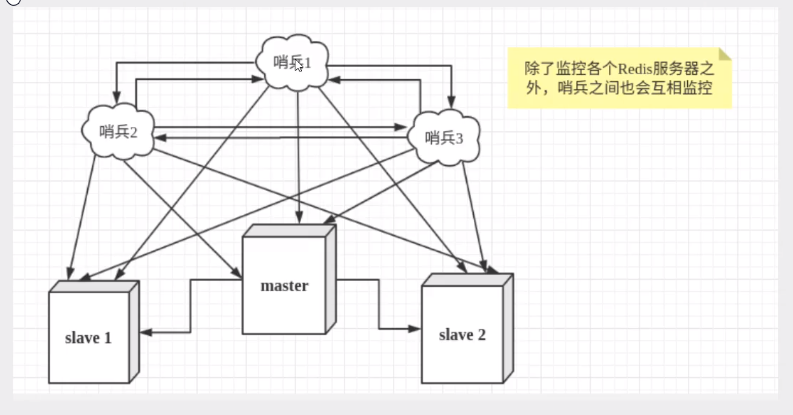

## 二十五、哨兵模式

### 25.1 自动选举 master 的模式

主从切换的技术方式是: 当主机宕机之后，需要手动把一台服务器切换为主机服务器，这就需要人工干预，费时费力，还会造成一段时间内服务器不可用，这是一种不推荐的方式，更多的时候，我们在考虑使用哨兵模式。redis 中 2.8 之后提供了哨兵模式来解决这个问题。

哨兵模式是一种特殊的模式，首先 redis 提供哨兵命令，哨兵是一个独立的进程，作为进程，它会独立运行。其原理是**哨兵同过发送命令，等待 redis 服务器响应，从而监控运行的多个 redis 实例。**



这里的哨兵有两个作用:

- 通过发送命令，让 redis 服务器返回监控其运行状态，包括主服务器和从服务器。

- 当哨兵检测到 master 宕机，会自动将 slave 切换成为 master，然后通过发布订阅模式通知其他的服务器，修改配置文件，让她们切换主机。

然而一个哨兵进程对 Redis 服务器进行监控可能会出现问题，为此，我们可以使用多个哨兵进行监控。各个哨兵之间还会进行监控，这样就形成了多哨兵模式。



假设主服务宕机，哨兵 1 先检测到这个结果，系统并不会马上进行 failover 过程，仅仅是哨兵 1 主管的认为服务器不可用，这个现象称为主观下线。当后面的哨兵也检测到主服务器不可用，并且数量达到一定值时，那么哨兵之间就会进行一侧投票，投票的结果由一个哨兵发起，进行 failover[故障转移]操作。切换成功后，就会通过发布订阅模式，让哥哥哨兵把自己监控的服务器实现切换主机，这个过程称为可观下线。

我们目前的装填是一主二从！

1、配置哨兵配置文件 sentinel.conf

```bash
# sentinel monitor 被监控的名称host port 1
sentinel monitor myredis 127.0.0.1 6379 1
```

候命的这个数字 1，代表主机挂了，slave 投票看让谁阶梯称为主机，票数最多的，就会称为主机！

```/bash
redis-sentinel  bin/sentinel.conf
```

- **优点**

  - 哨兵集群，基于主从复制模式，所有的主从配置优点，它全有
  - 主从可以切换，故障可以转移，系统的可用性就会更好
  - 哨兵模式就是主从模式的升级买手动到自动，更加健壮！

- **缺点**

  - redis 不好在线扩容，集群容量一旦达到上限，在向扩容就十分麻烦！
  - 实现哨兵模式的配置其实是很麻烦的，里面有很多选择！
