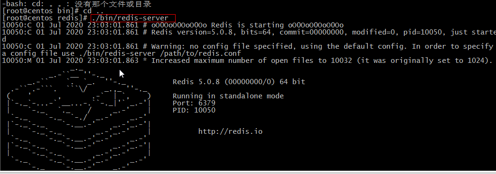

## 三 、Redis 启动

### 3.1 启动 Redis 服务端，进入到 Redis 的安装目录

```bash
cd /usr/local/redis
```

### 3.2 执行命令

```bash
./bin/redis-server
```



### 3.3 Redis 的客户端进行启动

```bash
./bin/redis-cli
```

### 3.4 启动 Redis 客户端命令语法

```bash
redis-cli -h IP地址 -p 端口   //默认IP本机  端口号6379
```

### 3.5 检测是否服务端启动

启动 redis 客户端，打开终端并输入命令 redis-cli。该命令连接本地的 redis 服务。

```bash
127.0.0.1:6379>
127.0.0.1:6379> ping
PONG
127.0.0.1:6379>
```

在以上实例中我们连接到本地的 redis 服务并执行**PING** 命令，该命令用于检测 redis 服务是否启动

### 3.6 检查 redis 的进程

```bash
#执行 ps -ef | grep -i redis 来查看进程
ps -ef | grep -i redis
root      10050   5728  0 23:03 pts/0    00:00:03 ./bin/redis-server *:6379
root      10077  10056  0 23:10 pts/1    00:00:00 ./bin/redis-cli
root      10100  10081  0 23:22 pts/2    00:00:00 grep --color=auto -i redis
```
