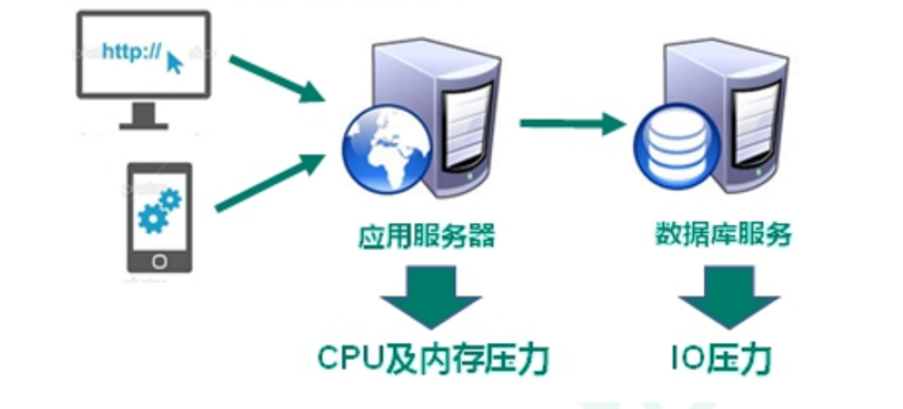
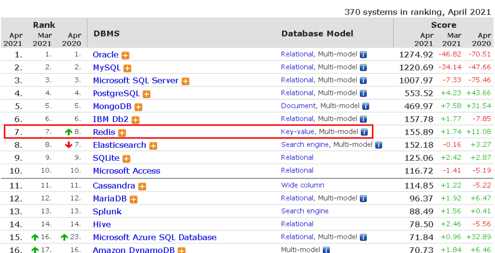

## 一、NoSQL 数据库简介

### 1.1 技术发展

技术的分类

1、解决功能性的问题: Java、Jsp、RDBMS、Tomcat、HTML、Linux、JDBC、SVN

2、解决扩展性的问题: Struts、Spring、SpringMVC、Hibernate、Mybatis

3、解决性能的问题: NoSQL、Java 线程、Hadoop、Nginx、MQ、ElasticSearch

## 1.1.1 Web1.0 时代

Web1.0 的时代，数据访问量很有限，用一夫当关的高性能的单点服务器可以解决大部分问题。

## 1.1.2 Web2.0 时代

随着 Web2.0 的时代的到来，用户访问量大幅度提升，同时产生了大量的用户数据。加上后来的智能移动设备的普及，所有的互联网平台都面临了巨大的性能挑战。

## 1.1.3 解决 CPU 及内存压力

## 1.1.4 解决 IO 压力

### 1.2 NoSQL 数据库

## 1.2.1 NoSQL 数据库概述

NoSQL(NoSQL = **Not Only SQL**)，意即“不仅仅是 SQL”，泛指**非关系型的数据库**。

NoSQL 不依赖业务逻辑方式存储，而以简单的 key-value 模式存储。因此大大的增加了数据库的扩展能力。

- 不遵循 SQL 标准。

- 不支持 ACID。
- 远超于 SQL 的性能。

## 1.2.2 NoSQL 适用场景

- 对数据高并发的读写

- 海量数据的读写

- 对数据高可扩展性的

## 1.2.3 NoSQL 不适用场景

- 需要事务支持

- 基于 sql 的结构化查询存储，处理复杂的关系,需要即席查询。

- 用不着 sql 的和用了 sql 也不行的情况，请考虑用 NoSql）

## 1.2.4 Memcache

|  | ü 很早出现的 NoSql 数据库 ü 数据都在内存中，一般不持久化 ü 支持简单的 key-value 模式，支持类型单一 ü 一般是作为缓存数据库辅助持久化的数据库 |
| ----------------------------------------------- | ------------------------------------------------------------------------------------------------------------------------------------------- |
|                                                 |                                                                                                                                             |

## 1.2.5 Redis

|  | 几乎覆盖了 Memcached 的绝大部分功能数据都在内存中，支持持久化，主要用作备份恢复除了支持简单的 key-value 模式，还支持多种数据结构的存储，比如 list、set、hash、zset 等。一般是作为缓存数据库辅助持久化的数据库 |
| ---------------------------------------- | ------------------------------------------------------------------------------------------------------------------------------------------------------------------------------------------------------------- |
|                                          |                                                                                                                                                                                                               |

## 1.2.6 MongoDB

|  | ü 高性能、开源、模式自由(schema free)的文档型数据库 ü 数据都在内存中， 如果内存不足，把不常用的数据保存到硬盘 ü 虽然是 key-value 模式，但是对 value（尤其是 json）提供了丰富的查询功能 ü 支持二进制数据及大型对象 ü 可以根据数据的特点替代 RDBMS ，成为独立的数据库。或者配合 RDBMS，存储特定的数据。 |
| ---------------------------------------- | ----------------------------------------------------------------------------------------------------------------------------------------------------------------------------------------------------------------------------------------------------------------------------------------------------- |
|                                          |                                                                                                                                                                                                                                                                                                       |

### 1.3 行式存储数据库（大数据时代）

## 1.3.2 行式数据库

## 1.3.3 列式数据库

Hbase

HBase 是 Hadoop 项目中的数据库。它用于需要对大量的数据进行随机、实时的读写操作的场景中。

HBase 的目标就是处理数据量非常庞大的表，可以用普通的计算机处理超过 10 亿行数据，还可处理有数百万列元素的数据表。

Cassandra[kəˈsændrə]

Apache Cassandra 是一款免费的开源 NoSQL 数据库，其设计目的在于管理由大量商用服务器构建起来的庞大集群上的海量数据集(数据量通常达到 PB 级别)。在众多显著特性当中，Cassandra 最为卓越的长处是对写入及读取操作进行规模调整，而且其不强调主集群的设计思路能够以相对直观的方式简化各集群的创建与扩展流程。

> 计算机存储单位 计算机存储单位一般用 B，KB，MB，GB，TB，EB，ZB，YB，BB 来表示，它们之间的关系是:
>
> 位 bit (比特)(Binary Digits): 存放一位二进制数，即 0 或 1，最小的存储单位。
>
> 字节 byte: 8 个二进制位为一个字节(B)，最常用的单位。
>
> 1KB (Kilobyte 千字节)=1024B，
>
> 1MB (Megabyte 兆字节 简称“兆”)=1024KB，
>
> 1GB (Gigabyte 吉字节 又称“千兆”)=1024MB，
>
> 1TB (Trillionbyte 万亿字节 太字节)=1024GB，其中 1024=2^10 ( 2 的 10 次方)，
>
> 1PB（Petabyte 千万亿字节 拍字节）=1024TB，
>
> 1EB（Exabyte 百亿亿字节 艾字节）=1024PB，
>
> 1ZB (Zettabyte 十万亿亿字节 泽字节)= 1024 EB,
>
> 1YB (Jottabyte 一亿亿亿字节 尧字节)= 1024 ZB,
>
> 1BB (Brontobyte 一千亿亿亿字节)= 1024 YB.
>
> 注: "兆"为百万级数量单位。

### 1.4 图关系型数据库

主要应用: 社会关系，公共交通网络，地图及网络拓谱(n\*(n-1)/2)

### 1.5 DB-Engines 数据库排名

[http://db-engines.com/en/ranking](http://db-engines.com/en/ranking)

