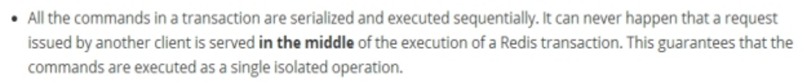
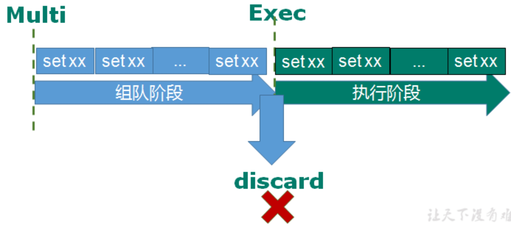

## 十、Redis*事务*锁机制\_秒杀

### 10.1 Redis 的事务定义

Redis 事务是一个单独的隔离操作: 事务中的所有命令都会序列化、按顺序地执行。事务在执行的过程中，不会被其他客户端发送来的命令请求所打断。

Redis 事务的主要作用就是串联多个命令防止别的命令插队。

### 10.2 Multi、Exec、discard

从输入 Multi 命令开始，输入的命令都会依次进入命令队列中，但不会执行，直到输入 Exec 后，Redis 会将之前的命令队列中的命令依次执行。

组队的过程中可以通过 discard 来放弃组队。

案例:

|  组队成功，提交成功             |
| ----------------------------------------------------------------------- |
|  组队阶段报错，提交失败         |
|  组队成功，提交有成功有失败情况 |

### 10.3 事务的错误处理

组队中某个命令出现了报告错误，执行时整个的所有队列都会被取消。

如果执行阶段某个命令报出了错误，则只有报错的命令不会被执行，而其他的命令都会执行，不会回滚。

### 10.4 为什么要做成事务

想想一个场景: 有很多人有你的账户,同时去参加双十一抢购

### 10.5 事务冲突的问题

#### 10.5.1 例子

一个请求想给金额减 8000

一个请求想给金额减 5000

一个请求想给金额减 1000

#### 10.5.2 悲观锁

**悲观锁(Pessimistic Lock):**顾名思义，就是很悲观，每次去拿数据的时候都认为别人会修改，所以每次在拿数据的时候都会上锁，这样别人想拿这个数据就会 block 直到它拿到锁。传统的关系型数据库里边就用到了很多这种锁机制，比如行锁，表锁等，读锁，写锁等，都是在做操作之前先上锁。

#### 10.5.3 乐观锁

**乐观锁(Optimistic Lock):**顾名思义，就是很乐观，每次去拿数据的时候都认为别人不会修改，所以不会上锁，但是在更新的时候会判断一下在此期间别人有没有去更新这个数据，可以使用版本号等机制。乐观锁适用于多读的应用类型，这样可以提高吞吐量。Redis 就是利用这种 check-and-set 机制实现事务的。

#### 10.5.4 WATCH key [key ...]

在执行 multi 之前，先执行 watch key1 [key2],可以监视一个(或多个) key ，如果在事务执行之前这个(或这些) key 被其他命令所改动，那么事务将被打断。

#### 10.5.6 unwatch

取消 WATCH 命令对所有 key 的监视。

如果在执行 WATCH 命令之后，EXEC 命令或 DISCARD 命令先被执行了的话，那么就不需要再执行 UNWATCH 了。

<http://doc.redisfans.com/transaction/exec.html>

### 10.6 Redis 事务三特性

Ø 单独的隔离操作

n 事务中的所有命令都会序列化、按顺序地执行。事务在执行的过程中，不会被其他客户端发送来的命令请求所打断。

Ø 没有隔离级别的概念

n 队列中的命令没有提交之前都不会实际被执行，因为事务提交前任何指令都不会被实际执行

Ø 不保证原子性

n 事务中如果有一条命令执行失败，其后的命令仍然会被执行，没有回滚
