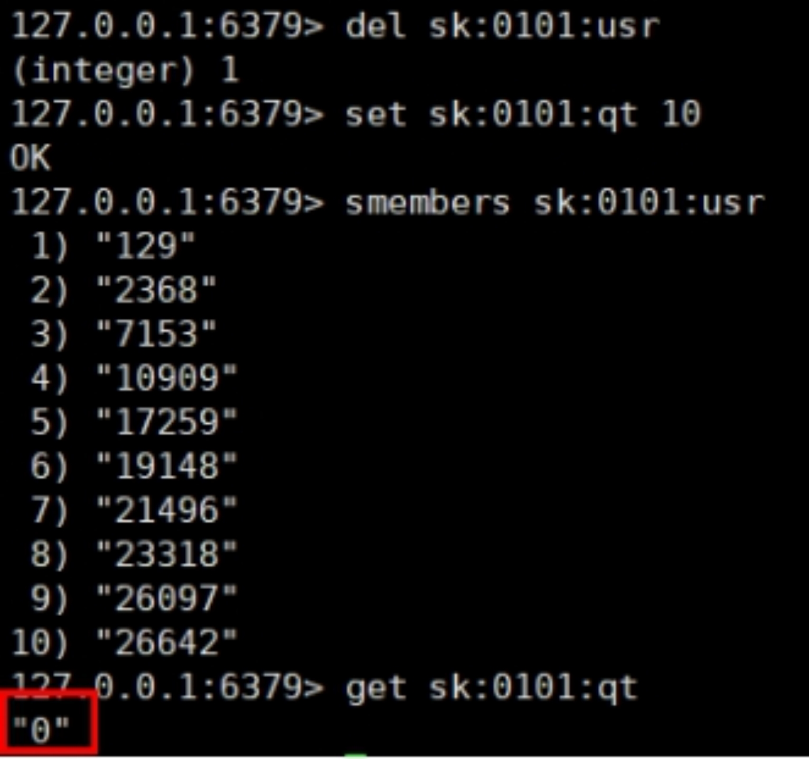
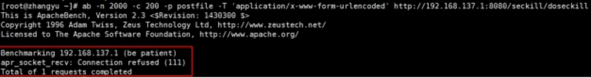
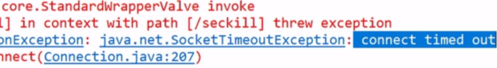
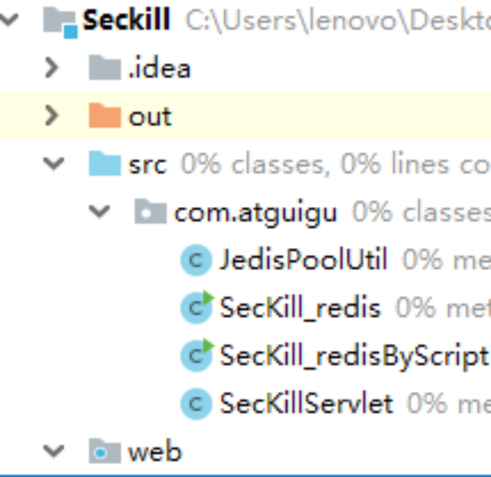

## 十一、Redis*事务*秒杀案例

### 11.1 解决计数器和人员记录的事务操作


### 11.2 Redis 事务--秒杀并发模拟

使用工具 ab 模拟测试

CentOS6 默认安装

CentOS7 需要手动安装

#### 11.2.1 联网: yum install httpd-tools

#### 11.2.2 无网络

（1） 进入 cd /run/media/root/CentOS 7 x86_64/Packages（路径跟 centos6 不同）

（2） 顺序安装

apr-1.4.8-3.el7.x86_64.rpm

apr-util-1.5.2-6.el7.x86_64.rpm

httpd-tools-2.4.6-67.el7.centos.x86_64.rpm

#### 11.2.3 测试及结果

- 通过 ab 测试

vim postfile 模拟表单提交参数,以&符号结尾;存放当前目录。

内容: prodid=0101&

```bash
ab -n 2000 -c 200 -k -p ~/postfile -T application/x-www-form-urlencoded <http://192.168.2.115:8081/Seckill/doseckill>
```

- 超卖

|  |  |
| ---------------------------------------- | ---------------------------------------- |
|                                          |                                          |

### 11.3 超卖问题


### 11.4 利用乐观锁淘汰用户，解决超卖问题


```java
//增加乐观锁
jedis.watch(qtkey);
 
//3.判断库存
String qtkeystr = jedis.get(qtkey);
if(qtkeystr==null || "".equals(qtkeystr.trim())) {
System.out.println("未初始化库存");
jedis.close();
return false ;
}
 
int qt = Integer.parseInt(qtkeystr);
if(qt<=0) {
System.err.println("已经秒光");
jedis.close();
return false;
}
 
//增加事务
Transaction multi = jedis.multi();
 
//4.减少库存
//jedis.decr(qtkey);
multi.decr(qtkey);
 
//5.加人
//jedis.sadd(usrkey, uid);
multi.sadd(usrkey, uid);
 
//执行事务
List<Object> list = multi.exec();
 
//判断事务提交是否失败
if(list==null || list.size()==0) {
System.out.println("秒杀失败");
jedis.close();
return false;
}
System.err.println("秒杀成功");
jedis.close();
```




### 11.5 继续增加并发测试

#### 11.5.1 连接有限制

ab -n 2000 -c 200 -k -p postfile -T 'application/x-www-form-urlencoded' <http://192.168.140.1:8080/seckill/doseckill>



增加-r 参数，-r Don't exit on socket receive errors.

ab -n 2000 -c 100 -r -p postfile -T 'application/x-www-form-urlencoded' [http://192.168.140.1:8080/seckill/doseckill](http://192.168.140.1:8080/seckill/doseckill)

#### 11.5.2 已经秒光，可是还有库存

ab -n 2000 -c 100 -p postfile -T 'application/x-www-form-urlencoded' <http://192.168.137.1:8080/seckill/doseckill>

已经秒光，可是还有库存。原因，就是乐观锁导致很多请求都失败。先点的没秒到，后点的可能秒到了。


#### 11.5.3 连接超时，通过连接池解决



#### 11.5.4 连接池

节省每次连接 redis 服务带来的消耗，把连接好的实例反复利用。

通过参数管理连接的行为

代码见项目中

- 链接池参数

  1. MaxTotal: 控制一个 pool 可分配多少个 jedis 实例，通过 pool.getResource()来获取；如果赋值为-1，则表示不限制；如果 pool 已经分配了 MaxTotal 个 jedis 实例，则此时 pool 的状态为 exhausted。

  2. maxIdle: 控制一个 pool 最多有多少个状态为 idle(空闲)的 jedis 实例；

  3. MaxWaitMillis: 表示当 borrow 一个 jedis 实例时，最大的等待毫秒数，如果超过等待时间，则直接抛 JedisConnectionException；

  4. testOnBorrow: 获得一个 jedis 实例的时候是否检查连接可用性（ping()）；如果为 true，则得到的 jedis 实例均是可用的；

### 11.6 解决库存遗留问题

#### 11.6.1 LUA 脚本


Lua 是一个小巧的[脚本语言](http://baike.baidu.com/item/脚本语言)，Lua 脚本可以很容易的被 C/C++ 代码调用，也可以反过来调用 C/C++的函数，Lua 并没有提供强大的库，一个完整的 Lua 解释器不过 200k，所以 Lua 不适合作为开发独立应用程序的语言，而是作为嵌入式脚本语言。

很多应用程序、游戏使用 LUA 作为自己的嵌入式脚本语言，以此来实现可配置性、可扩展性。

这其中包括魔兽争霸地图、魔兽世界、博德之门、愤怒的小鸟等众多游戏插件或外挂。

<https://www.w3cschool.cn/lua/>

#### 11.6.2 LUA 脚本在 Redis 中的优势

将复杂的或者多步的 redis 操作，写为一个脚本，一次提交给 redis 执行，减少反复连接 redis 的次数。提升性能。

LUA 脚本是类似 redis 事务，有一定的原子性，不会被其他命令插队，可以完成一些 redis 事务性的操作。

但是注意 redis 的 lua 脚本功能，只有在 Redis 2.6 以上的版本才可以使用。

利用 lua 脚本淘汰用户，解决超卖问题。

redis 2.6 版本以后，通过 lua 脚本解决争抢问题，实际上是 redis 利用其单线程的特性，用任务队列的方式解决多任务并发问题。


### 11.7 Redis*事务*秒杀案例\_代码

#### 11.7.1 项目结构



#### 11.7.2 第一版: 简单版

老师点 10 次，正常秒杀

同学一起点试一试，秒杀也是正常的。这是因为还达不到并发的效果。

使用工具 ab 模拟并发测试，会出现超卖情况。查看库存会出现负数。

#### 11.7.3 第二版: 加事务-乐观锁(解决超卖),但出现遗留库存和连接超时

#### 11.7.4 第三版: 连接池解决超时问题

#### 11.7.5 第四版: 解决库存依赖问题，LUA 脚本

```lua
local userid=KEYS[1];
local prodid=KEYS[2];
local qtkey="sk:"..prodid..":qt";
local usersKey="sk:"..prodid.":usr';
local userExists=redis.call("sismember",usersKey,userid);
if tonumber(userExists)==1 then
  return 2;
end
local num= redis.call("get" ,qtkey);
if tonumber(num)<=0 then
  return 0;
else
  redis.call("decr",qtkey);
  redis.call("sadd",usersKey,userid);
end
return 1;
```
