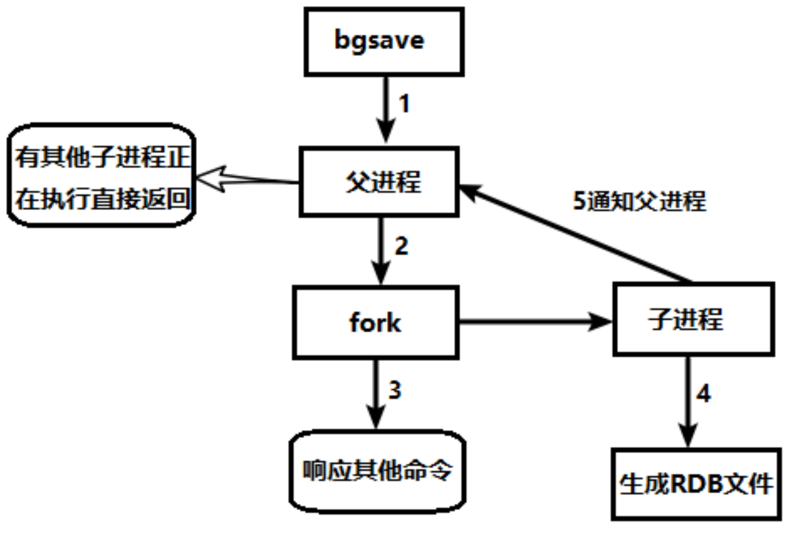
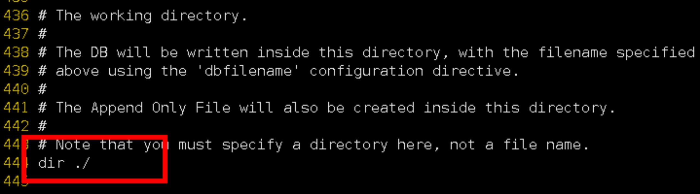
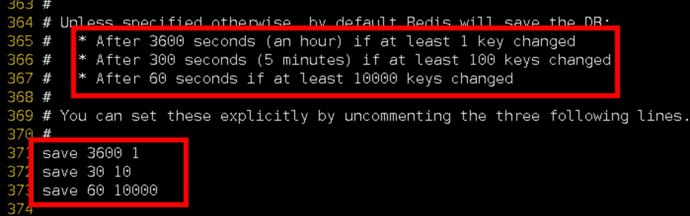
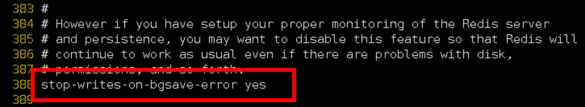
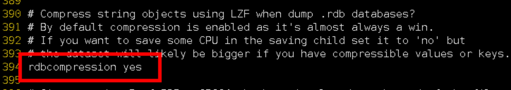
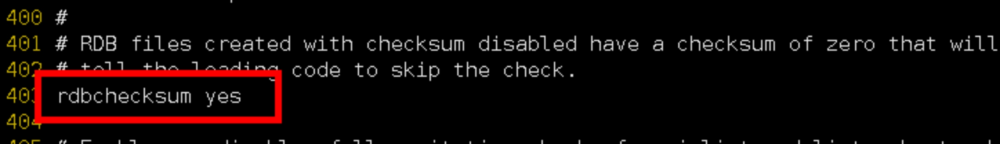

## 十二、Redis 持久化之 RDB

### 12.1 总体介绍

官网介绍: <http://www.redis.io>

Redis 提供了 2 个不同形式的持久化方式。

- RDB（Redis DataBase）

- AOF（Append Of File）

### 12.2 RDB（Redis DataBase）

#### 12.2.1 官网介绍

#### 12.2.2 是什么

在指定的时间间隔内将内存中的数据集快照写入磁盘， 也就是行话讲的 Snapshot 快照，它恢复时是将快照文件直接读到内存里

#### 12.2.3 备份是如何执行的

Redis 会单独创建（fork）一个子进程来进行持久化，会先将数据写入到 一个临时文件中，待持久化过程都结束了，再用这个临时文件替换上次持久化好的文件。 整个过程中，主进程是不进行任何 IO 操作的，这就确保了极高的性能 如果需要进行大规模数据的恢复，且对于数据恢复的完整性不是非常敏感，那 RDB 方式要比 AOF 方式更加的高效。RDB 的缺点是最后一次持久化后的数据可能丢失。

#### 12.2.4 Fork

- Fork 的作用是复制一个与当前进程一样的进程。新进程的所有数据（变量、环境变量、程序计数器等） 数值都和原进程一致，但是是一个全新的进程，并作为原进程的子进程

- 在 Linux 程序中，fork()会产生一个和父进程完全相同的子进程，但子进程在此后多会 exec 系统调用，出于效率考虑，Linux 中引入了“写时复制技术”

- 一般情况父进程和子进程会共用同一段物理内存，只有进程空间的各段的内容要发生变化时，才会将父进程的内容复制一份给子进程。

#### 12.2.5 RDB 持久化流程

#### 12.2.6 dump.rdb 文件

在 redis.conf 中配置文件名称，默认为 dump.rdb

#### 12.2.7 配置位置

rdb 文件的保存路径，也可以修改。默认为 Redis 启动时命令行所在的目录下

dir "/myredis/"

#### 12.2.8 如何触发 RDB 快照；保持策略

- 配置文件中默认的快照配置

- 命令 save VS bgsave

  save: save 时只管保存，其它不管，全部阻塞。手动保存。不建议。

  bgsave: Redis 会在后台异步进行快照操作， 快照同时还可以响应客户端请求。

  可以通过 lastsave 命令获取最后一次成功执行快照的时间

- flushall 命令

  执行 flushall 命令，也会产生 dump.rdb 文件，但里面是空的，无意义

- SNAPSHOTTING 快照

- Save

  格式: save 秒钟 写操作次数

  RDB 是整个内存的压缩过的 Snapshot，RDB 的数据结构，可以配置复合的快照触发条件，

  默认是 1 分钟内改了 1 万次，或 5 分钟内改了 10 次，或 15 分钟内改了 1 次。

  禁用

  不设置 save 指令，或者给 save 传入空字符串

- stop-writes-on-bgsave-error

​ 当 Redis 无法写入磁盘的话，直接关掉 Redis 的写操作。推荐 yes.

- rdbcompression 压缩文件

​ 对于存储到磁盘中的快照，可以设置是否进行压缩存储。如果是的话，redis 会采用 LZF 算法进行压缩。

如果你不想消耗 CPU 来进行压缩的话，可以设置为关闭此功能。推荐 yes.

- rdbchecksum 检查完整性

在存储快照后，还可以让 redis 使用 CRC64 算法来进行数据校验，

但是这样做会增加大约 10%的性能消耗，如果希望获取到最大的性能提升，可以关闭此功能

推荐 yes.

- rdb 的备份

  先通过 config get dir 查询 rdb 文件的目录

  将\*.rdb 的文件拷贝到别的地方

  rdb 的恢复

  关闭 Redis

  先把备份的文件拷贝到工作目录下 cp dump2.rdb dump.rdb

  启动 Redis, 备份数据会直接加载

#### 12.2.9 优势

- 适合大规模的数据恢复

- 对数据完整性和一致性要求不高更适合使用

- 节省磁盘空间

- 恢复速度快

#### 12.2.10 劣势

l Fork 的时候，内存中的数据被克隆了一份，大致 2 倍的膨胀性需要考虑

l 虽然 Redis 在 fork 时使用了写时拷贝技术,但是如果数据庞大时还是比较消耗性能。

l 在备份周期在一定间隔时间做一次备份，所以如果 Redis 意外 down 掉的话，就会丢失最后一次快照后的所有修改。

#### 12.2.11 如何停止

动态停止 RDB: redis-cli config set save ""#save 后给空值，表示禁用保存策略

#### 12.2.12 小总结

