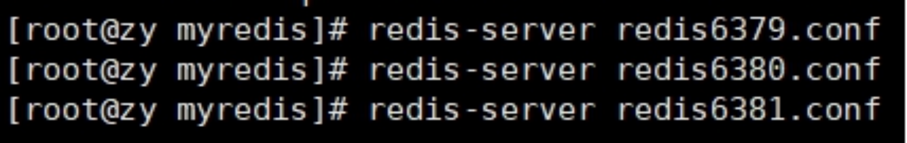
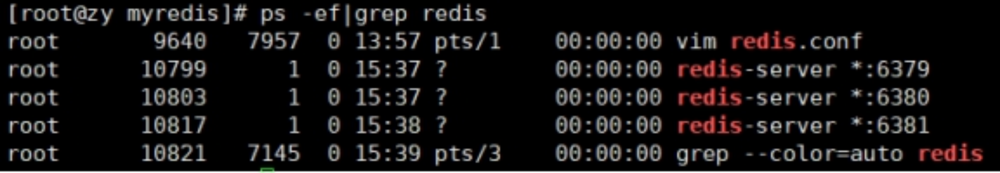
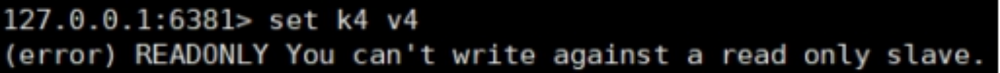

## 十四、Redis\_主从复制

### 14.1 是什么

主机数据更新后根据配置和策略， 自动同步到备机的 master/slaver 机制，Master 以写为主，Slave 以读为主

### 14.2 能干嘛

- 读写分离，性能扩展
- 容灾快速恢复


### 14.3 怎么玩: 主从复制

拷贝多个 redis.conf 文件 include(写绝对路径)

开启 daemonize yes

Pid 文件名字 pidfile

指定端口 port

Log 文件名字

dump.rdb 名字 dbfilename

Appendonly 关掉或者换名字

#### 14.3.1 新建 redis6379.conf，填写以下内容

include /myredis/redis.conf

pidfile /var/run/redis_6379.pid

port 6379

dbfilename dump6379.rdb


#### 14.3.2 新建 redis6380.conf，填写以下内容


#### 14.3.3 新建 redis6381.conf，填写以下内容


- **slave-priority 10**

设置从机的优先级，值越小，优先级越高，用于选举主机时使用。默认 100

#### 14.3.4 启动三台 redis 服务器



#### 14.3.5 查看系统进程，看看三台服务器是否启动



#### 14.3.6 查看三台主机运行情况

info replication

打印主从复制的相关信息


#### 14.3.7 配从(库)不配主(库)

slaveof \<ip\> \<port\>

成为某个实例的从服务器

1、在 6380 和 6381 上执行: slaveof 127.0.0.1 6379


2、在主机上写，在从机上可以读取数据

在从机上写数据报错



3、主机挂掉，重启就行，一切如初

4、从机重启需重设: slaveof 127.0.0.1 6379

可以将配置增加到文件中。永久生效。


### 14.4 常用 3 招

#### 14.4.1 一主二仆

切入点问题？slave1、slave2 是从头开始复制还是从切入点开始复制?比如从 k4 进来，那之前的 k1,k2,k3 是否也可以复制？

从机是否可以写？set 可否？

主机 shutdown 后情况如何？从机是上位还是原地待命？

主机又回来了后，主机新增记录，从机还能否顺利复制？

其中一台从机 down 后情况如何？依照原有它能跟上大部队吗？


#### 14.4.2 薪火相传

上一个 Slave 可以是下一个 slave 的 Master，Slave 同样可以接收其他 slaves 的连接和同步请求，那么该 slave 作为了链条中下一个的 master, 可以有效减轻 master 的写压力,去中心化降低风险。

用 slaveof \<ip\> \<port\>

中途变更转向:会清除之前的数据，重新建立拷贝最新的

风险是一旦某个 slave 宕机，后面的 slave 都没法备份

主机挂了，从机还是从机，无法写数据了


#### 14.4.3 反客为主

当一个 master 宕机后，后面的 slave 可以立刻升为 master，其后面的 slave 不用做任何修改。

用 slaveof no one 将从机变为主机。


### 14.5 复制原理

- Slave 启动成功连接到 master 后会发送一个 sync 命令
- Master 接到命令启动后台的存盘进程，同时收集所有接收到的用于修改数据集命令， 在后台进程执行完毕之后，master 将传送整个数据文件到 slave,以完成一次完全同步
- 全量复制: 而 slave 服务在接收到数据库文件数据后，将其存盘并加载到内存中。
- 增量复制: Master 继续将新的所有收集到的修改命令依次传给 slave,完成同步
- 但是只要是重新连接 master,一次完全同步（全量复制)将被自动执行


### 14.6 哨兵模式(sentinel)

#### 14.6.1 是什么

反客为主的自动版，能够后台监控主机是否故障，如果故障了根据投票数自动将从库转换为主库


#### 14.6.2 怎么玩(使用步骤)

- 调整为一主二仆模式，6379 带着 6380、6381


- 自定义的/myredis 目录下新建 sentinel.conf 文件，名字绝不能错

- 配置哨兵,填写内容

  sentinel monitor mymaster 127.0.0.1 6379 1

  其中 mymaster 为监控对象起的服务器名称， 1 为至少有多少个哨兵同意迁移的数量。

- 启动哨兵

  /usr/local/bin

  redis 做压测可以用自带的 redis-benchmark 工具

  执行 redis-sentinel /myredis/sentinel.conf


- 当主机挂掉，从机选举中产生新的主机

(大概 10 秒左右可以看到哨兵窗口日志，切换了新的主机)

哪个从机会被选举为主机呢？根据优先级别: slave-priority

原主机重启后会变为从机。


- 复制延时

由于所有的写操作都是先在 Master 上操作，然后同步更新到 Slave 上，所以从 Master 同步到 Slave 机器有一定的延迟，当系统很繁忙的时候，延迟问题会更加严重，Slave 机器数量的增加也会使这个问题更加严重。

#### 14.6.3 故障恢复


优先级在 redis.conf 中默认: slave-priority 100，值越小优先级越高

偏移量是指获得原主机数据最全的

每个 redis 实例启动后都会随机生成一个 40 位的 runid

#### 14.6.4 主从复制

```java
private static JedisSentinelPool jedisSentinelPool = null;

public static Jedis getJedisFromSentinel() {
    if(jedisSentinelPool==null){
        Set<String> sentinelSet=new HashSet<>();
        sentinelSet.add("192.168.11.103:26379");
        JedisPoolConfig jedisPoolConfig =new JedisPoolConfig();
        jedisPoolConfig.setMaxTotal(10); //最大可用连接数
        jedisPoolConfig.setMaxIdle(5); //最大闲置连接数
        jedisPoolConfig.setMinIdle(5); //最小闲置连接数
        jedisPoolConfig.setBlockWhenExhausted(true); //连接耗尽是否等待
        jedisPoolConfig.setMaxWaitMillis(2000); //等待时间
        jedisPoolConfig.setTestOnBorrow(true); //取连接的时候进行一下测试 ping pong

        jedisSentinelPool=new JedisSentinelPool("mymaster",sentinelSet,jedisPoolConfig);
        return jedisSentinelPool.getResource();
    }else{
        return jedisSentinelPool.getResource();
    }
}
```
