## 十六、Redis 应用问题解决

### 16.1 缓存穿透

### 16.1.1 问题描述

key 对应的数据在数据源并不存在，每次针对此 key 的请求从缓存获取不到，请求都会压到数据源，从而可能压垮数据源。比如用一个不存在的用户 id 获取用户信息，不论缓存还是数据库都没有，若黑客利用此漏洞进行攻击可能压垮数据库。

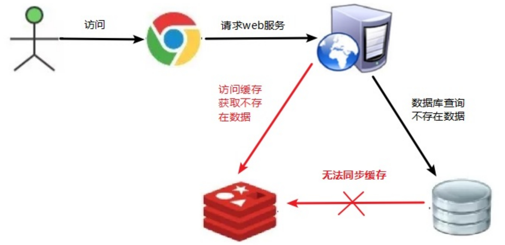

### 16.1.2 解决方案

一个一定不存在缓存及查询不到的数据，由于缓存是不命中时被动写的，并且出于容错考虑，如果从存储层查不到数据则不写入缓存，这将导致这个不存在的数据每次请求都要到存储层去查询，失去了缓存的意义。

解决方案:

**（1）** 对空值缓存: 如果一个查询返回的数据为空（不管是数据是否不存在），我们仍然把这个空结果（null）进行缓存，设置空结果的过期时间会很短，最长不超过五分钟

**（2）** 设置可访问的名单（白名单）:

使用 bitmaps 类型定义一个可以访问的名单，名单 id 作为 bitmaps 的偏移量，每次访问和 bitmap 里面的 id 进行比较，如果访问 id 不在 bitmaps 里面，进行拦截，不允许访问。

**（3）** 采用布隆过滤器: (布隆过滤器（Bloom Filter）是 1970 年由布隆提出的。它实际上是一个很长的二进制向量(位图)和一系列随机映射函数（哈希函数）。

布隆过滤器可以用于检索一个元素是否在一个集合中。它的优点是空间效率和查询时间都远远超过一般的算法，缺点是有一定的误识别率和删除困难。)

将所有可能存在的数据哈希到一个足够大的 bitmaps 中，一个一定不存在的数据会被 这个 bitmaps 拦截掉，从而避免了对底层存储系统的查询压力。

**（4）** 进行实时监控: 当发现 Redis 的命中率开始急速降低，需要排查访问对象和访问的数据，和运维人员配合，可以设置黑名单限制服务

### 16.2 缓存击穿

#### 16.2.1 问题描述

key 对应的数据存在，但在 redis 中过期，此时若有大量并发请求过来，这些请求发现缓存过期一般都会从后端 DB 加载数据并回设到缓存，这个时候大并发的请求可能会瞬间把后端 DB 压垮。

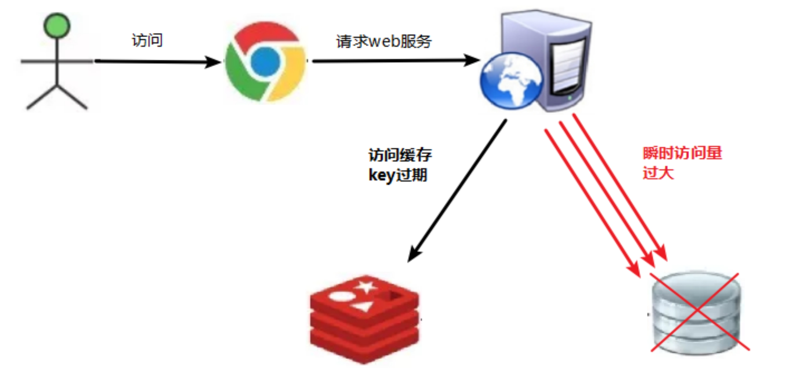

#### 16.2.2 解决方案

key 可能会在某些时间点被超高并发地访问，是一种非常“热点”的数据。这个时候，需要考虑一个问题: 缓存被“击穿”的问题。

解决问题:

（1）预先设置热门数据: 在 redis 高峰访问之前，把一些热门数据提前存入到 redis 里面，加大这些热门数据 key 的时长

（2）实时调整: 现场监控哪些数据热门，实时调整 key 的过期时长

（3）使用锁:

（1） 就是在缓存失效的时候（判断拿出来的值为空），不是立即去 load db。

（2） 先使用缓存工具的某些带成功操作返回值的操作（比如 Redis 的 SETNX）去 set 一个 mutex key

（3） 当操作返回成功时，再进行 load db 的操作，并回设缓存,最后删除 mutex key；

（4） 当操作返回失败，证明有线程在 load db，当前线程睡眠一段时间再重试整个 get 缓存的方法。

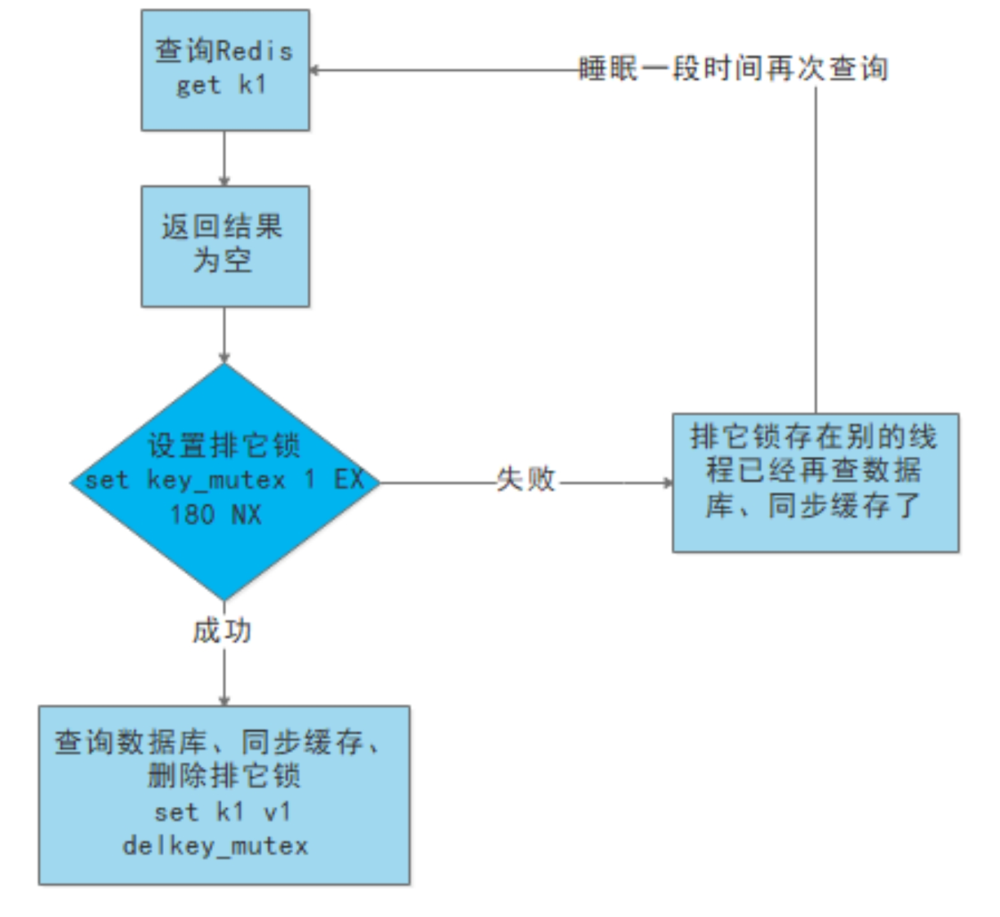

### 16.3 缓存雪崩

#### 16.3.1 问题描述

key 对应的数据存在，但在 redis 中过期，此时若有大量并发请求过来，这些请求发现缓存过期一般都会从后端 DB 加载数据并回设到缓存，这个时候大并发的请求可能会瞬间把后端 DB 压垮。

缓存雪崩与缓存击穿的区别在于这里针对很多 key 缓存，前者则是某一个 key

正常访问

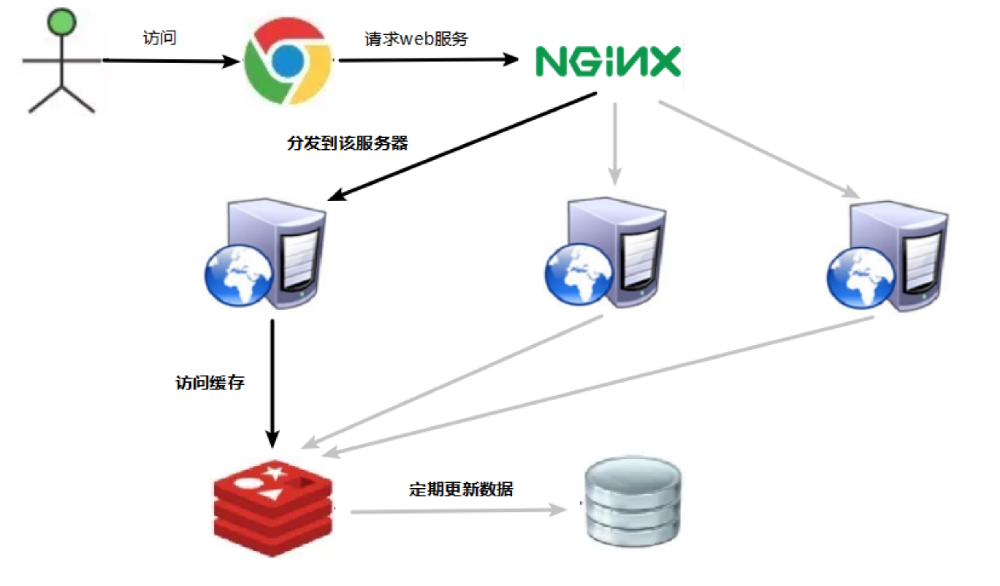

缓存失效瞬间

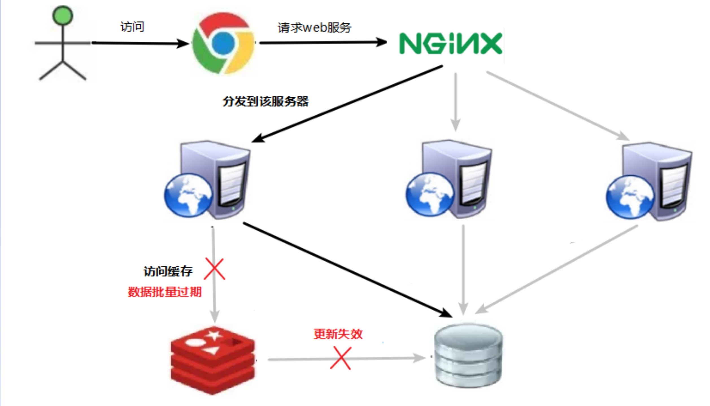

#### 16.3.2 解决方案

缓存失效时的雪崩效应对底层系统的冲击非常可怕！

解决方案:

**（1）** 构建多级缓存架构: nginx 缓存 + redis 缓存 +其他缓存（ehcache 等）

**（2）** 使用锁或队列:

用加锁或者队列的方式保证来保证不会有大量的线程对数据库一次性进行读写，从而避免失效时大量的并发请求落到底层存储系统上。不适用高并发情况

**（3）** 设置过期标志更新缓存:

记录缓存数据是否过期（设置提前量），如果过期会触发通知另外的线程在后台去更新实际 key 的缓存。

**（4）** 将缓存失效时间分散开:

比如我们可以在原有的失效时间基础上增加一个随机值，比如 1-5 分钟随机，这样每一个缓存的过期时间的重复率就会降低，就很难引发集体失效的事件。

### 16.4 分布式锁

#### 16.4.1 问题描述

随着业务发展的需要，原单体单机部署的系统被演化成分布式集群系统后，由于分布式系统多线程、多进程并且分布在不同机器上，这将使原单机部署情况下的并发控制锁策略失效，单纯的 Java API 并不能提供分布式锁的能力。为了解决这个问题就需要一种跨 JVM 的互斥机制来控制共享资源的访问，这就是分布式锁要解决的问题！

分布式锁主流的实现方案:

1. 基于数据库实现分布式锁

2. 基于缓存（Redis 等）

3. 基于 Zookeeper

每一种分布式锁解决方案都有各自的优缺点:

1. 性能: redis 最高

2. 可靠性: zookeeper 最高

这里，我们就基于 redis 实现分布式锁。

#### 16.4.2 解决方案: 使用 redis 实现分布式锁

redis:命令

\# set sku:1:info “OK” NX PX 10000

EX second: 设置键的过期时间为 second 秒。 SET key value EX second 效果等同于 SETEX key second value 。

PX millisecond: 设置键的过期时间为 millisecond 毫秒。 SET key value PX millisecond 效果等同于 PSETEX key millisecond value 。

NX:只在键不存在时，才对键进行设置操作。 SET key value NX 效果等同于 SETNX key value 。

XX: 只在键已经存在时，才对键进行设置操作。

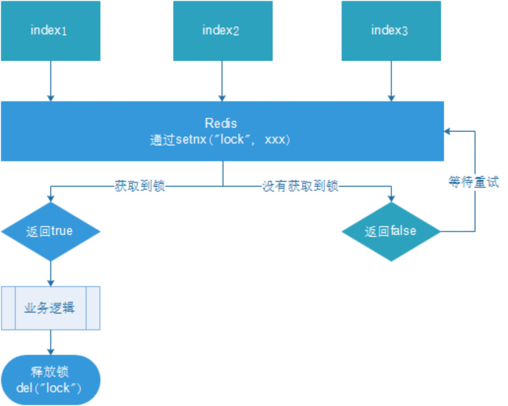

1. 多个客户端同时获取锁（setnx）

2. 获取成功，执行业务逻辑{从 db 获取数据，放入缓存}，执行完成释放锁（del）

3. 其他客户端等待重试

编写代码

Redis: set num 0

```java
@GetMapping("testLock")
public void testLock(){
    //1获取锁，setne
    Boolean lock = redisTemplate.opsForValue().setIfAbsent("lock", "111");
    //2获取锁成功、查询num的值
    if(lock){
        Object value = redisTemplate.opsForValue().get("num");
        //2.1判断num为空return
        if(StringUtils.isEmpty(value)){
            return;
        }
        //2.2有值就转成成int
        int num = Integer.parseInt(value+"");
        //2.3把redis的num加1
        redisTemplate.opsForValue().set("num", ++num);
        //2.4释放锁，del
        redisTemplate.delete("lock");

    }else{
        //3获取锁失败、每隔0.1秒再获取
        try {
            Thread.sleep(100);
            testLock();
        } catch (InterruptedException e) {
            e.printStackTrace();
        }
    }
}
```

重启，服务集群，通过网关压力测试:

```bash
ab -n 1000 -c 100 <http://192.168.140.1:8080/test/testLock>
```

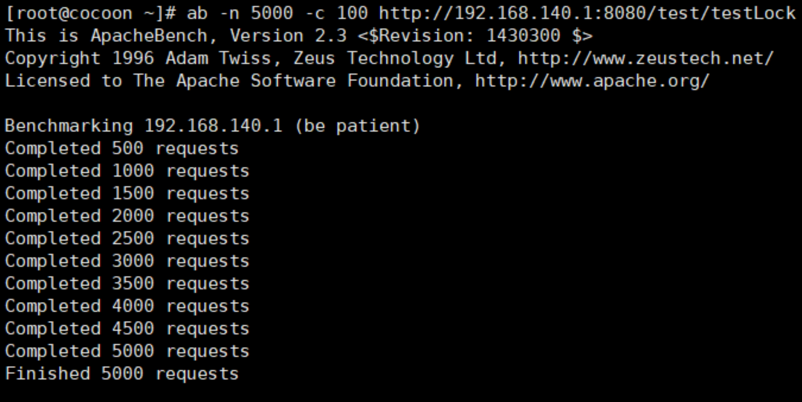

查看 redis 中 num 的值:


基本实现。

问题: setnx 刚好获取到锁，业务逻辑出现异常，导致锁无法释放

解决: 设置过期时间，自动释放锁。

#### 16.4.4 优化之设置锁的过期时间

设置过期时间有两种方式:

1. 首先想到通过 expire 设置过期时间（缺乏原子性: 如果在 setnx 和 expire 之间出现异常，锁也无法释放）

2. 在 set 时指定过期时间（推荐）

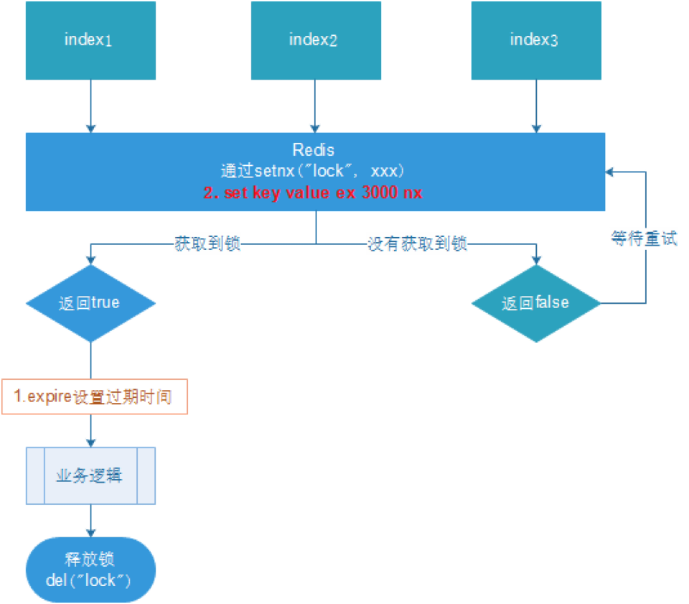

设置过期时间:

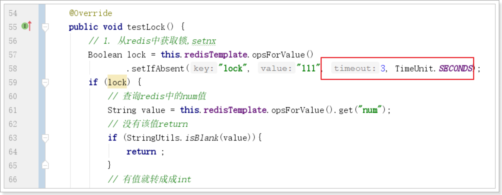

压力测试肯定也没有问题。自行测试

问题: 可能会释放其他服务器的锁。

场景: 如果业务逻辑的执行时间是 7s。执行流程如下

1. index1 业务逻辑没执行完，3 秒后锁被自动释放。

2. index2 获取到锁，执行业务逻辑，3 秒后锁被自动释放。

3. index3 获取到锁，执行业务逻辑

4. index1 业务逻辑执行完成，开始调用 del 释放锁，这时释放的是 index3 的锁，导致 index3 的业务只执行 1s 就被别人释放。

最终等于没锁的情况。

解决: setnx 获取锁时，设置一个指定的唯一值（例如: uuid）；释放前获取这个值，判断是否自己的锁

#### 16.4.5 优化之 UUID 防误删

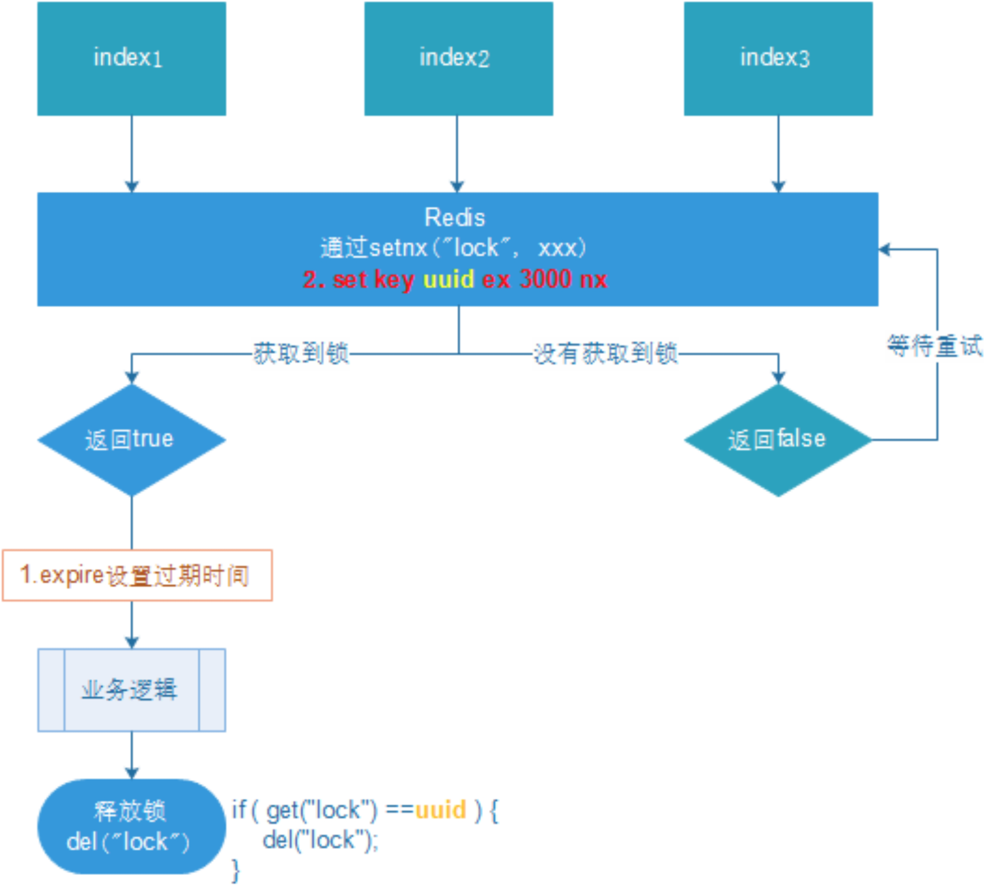

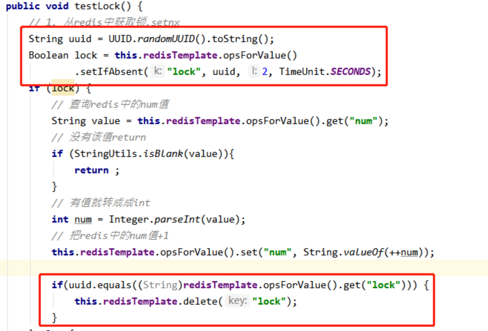

问题: 删除操作缺乏原子性。

场景:

- 1. index1 执行删除时，查询到的 lock 值确实和 uuid 相等

uuid=v1

set(lock,uuid)；


- 2. index1 执行删除前，lock 刚好过期时间已到，被 redis 自动释放

在 redis 中没有了 lock，没有了锁。


- 3. index2 获取了 lock

index2 线程获取到了 cpu 的资源，开始执行方法

uuid=v2

set(lock,uuid)；

- 4. index1 执行删除，此时会把 index2 的 lock 删除

index1 因为已经在方法中了，所以不需要重新上锁。index1 有执行的权限。index1 已经比较完成了，这个时候，开始执行


删除的 index2 的锁！

#### 16.4.6 优化之 LUA 脚本保证删除的原子性

```java
@GetMapping("testLockLua")
public void testLockLua() {
    //1 声明一个uuid ,将做为一个value 放入我们的key所对应的值中
    String uuid = UUID.randomUUID().toString();
    //2 定义一个锁: lua 脚本可以使用同一把锁，来实现删除！
    String skuId = "25"; // 访问skuId 为25号的商品 100008348542
    String locKey = "lock:" + skuId; // 锁住的是每个商品的数据

    // 3 获取锁
    Boolean lock = redisTemplate.opsForValue().setIfAbsent(locKey, uuid, 3, TimeUnit.SECONDS);

    // 第一种: lock 与过期时间中间不写任何的代码。
    // redisTemplate.expire("lock",10, TimeUnit.SECONDS);//设置过期时间
    // 如果true
    if (lock) {
        // 执行的业务逻辑开始
        // 获取缓存中的num 数据
        Object value = redisTemplate.opsForValue().get("num");
        // 如果是空直接返回
        if (StringUtils.isEmpty(value)) {
            return;
        }
        // 不是空 如果说在这出现了异常！ 那么delete 就删除失败！ 也就是说锁永远存在！
        int num = Integer.parseInt(value + "");
        // 使num 每次+1 放入缓存
        redisTemplate.opsForValue().set("num", String.valueOf(++num));
        /*使用lua脚本来锁*/
        // 定义lua 脚本
        String script = "if redis.call('get', KEYS[1]) == ARGV[1] then return redis.call('del', KEYS[1]) else return 0 end";
        // 使用redis执行lua执行
        DefaultRedisScript<Long> redisScript = new DefaultRedisScript<>();
        redisScript.setScriptText(script);
        // 设置一下返回值类型 为Long
        // 因为删除判断的时候，返回的0,给其封装为数据类型。如果不封装那么默认返回String 类型，
        // 那么返回字符串与0 会有发生错误。
        redisScript.setResultType(Long.class);
        // 第一个要是script 脚本 ，第二个需要判断的key，第三个就是key所对应的值。
        redisTemplate.execute(redisScript, Arrays.asList(locKey), uuid);
    } else {
        // 其他线程等待
        try {
            // 睡眠
            Thread.sleep(1000);
            // 睡醒了之后，调用方法。
            testLockLua();
        } catch (InterruptedException e) {
            e.printStackTrace();
        }
    }
}
```

Lua 脚本详解:

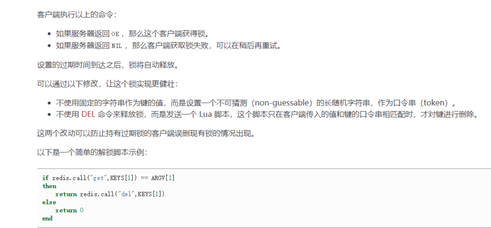

项目中正确使用:

```java
1. 定义key，key应该是为每个sku定义的，也就是每个sku有一把锁。
String locKey ="lock:"+skuId; // 锁住的是每个商品的数据
Boolean lock = redisTemplate.opsForValue().setIfAbsent(locKey, uuid,3,TimeUnit.SECONDS);
```

总结

1、加锁

```java
// 1. 从redis中获取锁,set k1 v1 px 20000 nx
String uuid = UUID.randomUUID().toString();
Boolean lock = this.redisTemplate.opsForValue().setIfAbsent("lock", uuid, 2, TimeUnit.SECONDS);
```

2、使用 lua 释放锁

```java
// 2. 释放锁 del
String script = "if redis.call('get', KEYS[1]) == ARGV[1] then return redis.call('del', KEYS[1]) else return 0 end";
// 设置lua脚本返回的数据类型
DefaultRedisScript<Long> redisScript = new DefaultRedisScript<>();
// 设置lua脚本返回类型为Long
redisScript.setResultType(Long.class);
redisScript.setScriptText(script);
redisTemplate.execute(redisScript, Arrays.asList("lock"),uuid);
```

3、重试

```java
Thread.sleep(500);
testLock();
```

为了确保分布式锁可用，我们至少要确保锁的实现同时满足以下四个条件:

- 互斥性。在任意时刻，只有一个客户端能持有锁。

- 不会发生死锁。即使有一个客户端在持有锁的期间崩溃而没有主动解锁，也能保证后续其他客户端能加锁。

- 解铃还须系铃人。加锁和解锁必须是同一个客户端，客户端自己不能把别人加的锁给解了。

- 加锁和解锁必须具有原子性。
