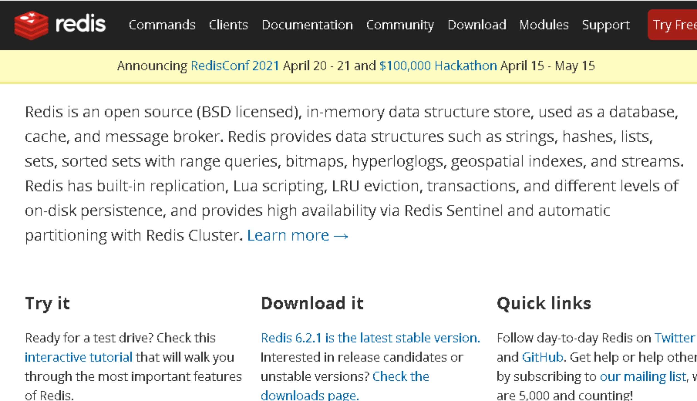
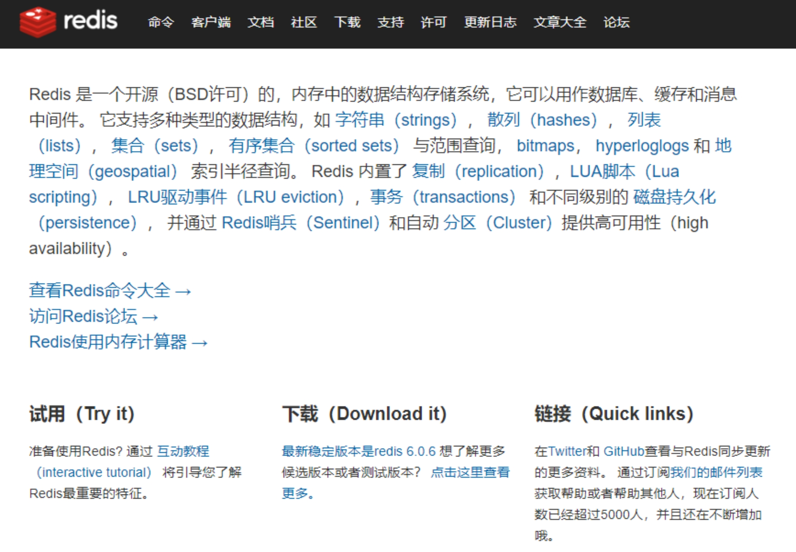
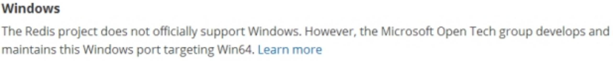
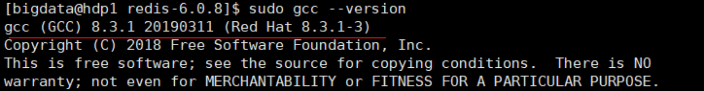
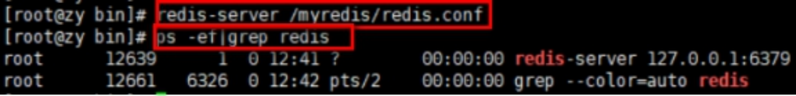
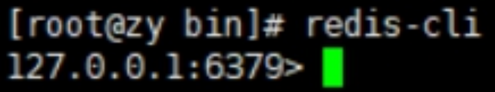
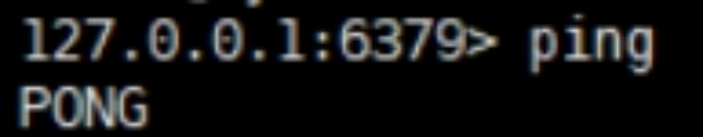
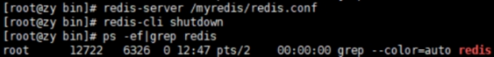
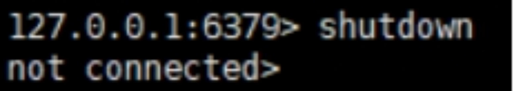

## 二、Redis 概述安装

Ø Redis 是一个开源的 key-value 存储系统。

Ø 和 Memcached 类似，它支持存储的 value 类型相对更多，包括 string(字符串)、list(链表)、set(集合)、zset(sorted set --有序集合)和 hash（哈希类型）。

Ø 这些数据类型都支持 push/pop、add/remove 及取交集并集和差集及更丰富的操作，而且这些操作都是原子性的。

Ø 在此基础上，Redis 支持各种不同方式的排序。

Ø 与 memcached 一样，为了保证效率，数据都是缓存在内存中。

Ø 区别的是 Redis 会周期性的把更新的数据写入磁盘或者把修改操作写入追加的记录文件。

Ø 并且在此基础上实现了 master-slave(主从)同步。

### 2.1 应用场景

#### 2.1.1 配合关系型数据库做高速缓存

Ø 高频次，热门访问的数据，降低数据库 IO

Ø 分布式架构，做 session 共享

#### 2.1.2 多样的数据结构存储持久化数据

### 2.2 Redis 安装

| Redis 官方网站    | Redis 中文官方网站 |
| ----------------- | ------------------ |
| <http://redis.io> | <http://redis.cn/> |

#### 2.2.1 安装版本

Ø 6.2.1 for Linux（redis-6.2.1.tar.gz）

Ø 不用考虑在 windows 环境下对 Redis 的支持

#### 2.2.2 安装步骤

准备工作: 下载安装最新版的 gcc 编译器

#### 2.2.3 安装 C 语言的编译环境

- yum install centos-release-scl scl-utils-build

- yum install -y devtoolset-8-toolchain

- scl enable devtoolset-8 bash

测试 gcc 版本

- gcc --version

- 下载 redis-6.2.1.tar.gz 放/opt 目录

- 解压命令: tar -zxvf redis-6.2.1.tar.gz

- 解压完成后进入目录: cd redis-6.2.1

- 在 redis-6.2.1 目录下再次执行 make 命令（只是编译好）

- 如果没有准备好 C 语言编译环境，make 会报错—Jemalloc/jemalloc.h: 没有那个文件

- 解决方案: 运行 make distclean

- 在 redis-6.2.1 目录下再次执行 make 命令（只是编译好）

- 跳过 make test 继续执行: make install

#### 2.2.4 安装目录: /usr/local/bin

​ 查看默认安装目录:

​ redis-benchmark:性能测试工具，可以在自己本子运行，看看自己本子性能如何

​ redis-check-aof: 修复有问题的 AOF 文件，rdb 和 aof 后面讲

​ redis-check-dump: 修复有问题的 dump.rdb 文件

​ redis-sentinel: Redis 集群使用

​ redis-server: Redis 服务器启动命令

​ redis-cli: 客户端，操作入口

#### 2.2.5 前台启动（不推荐）

前台启动，命令行窗口不能关闭，否则服务器停止

#### 2.2.6 后台启动（推荐）

- 1. **备份 redis.conf**

  拷贝一份 redis.conf 到其他目录

  cp /opt/redis-3.2.5/redis.conf /myredis

- 2. **后台启动设置 daemonize no 改成 yes**

  修改 redis.conf(128 行)文件将里面的 daemonize no 改成 yes，让服务在后台启动

- 3. **Redis 启动**

  redis-server/myredis/redis.conf

- 4. 用客户端访问: redis-cli

- 5. 多个端口可以: redis-cli -p6379

- 6. 测试验证: ping

- 7. Redis 关闭

  单实例关闭: redis-cli shutdown

也可以进入终端后再关闭

多实例关闭，指定端口关闭: redis-cli -p 6379 shutdown

#### 2.2.7 Redis 介绍相关知识

| 端口 6379 从何而来 Alessia Merz | 默认 16 个数据库，类似数组下标从 0 开始，初始默认使用 0 号库使用命令 select \<dbid\> 来切换数据库。如: select 8 统一密码管理，所有库同样密码。dbsize 查看当前数据库的 key 的数量 flushdb 清空当前库 flushall 通杀全部库 |
| ----------------------------------------------------------------------- | ----------------------------------------------------------------------------------------------------------------------------------------------------------------------------------------------------------------------- |
|                                                                         |                                                                                                                                                                                                                         |

Redis 是单线程+多路 IO 复用技术

多路复用是指使用一个线程来检查多个文件描述符（Socket）的就绪状态，比如调用 select 和 poll 函数，传入多个文件描述符，如果有一个文件描述符就绪，则返回，否则阻塞直到超时。得到就绪状态后进行真正的操作可以在同一个线程里执行，也可以启动线程执行（比如使用线程池）

串行 vs 多线程+锁（memcached） vs 单线程+多路 IO 复用(Redis)

（与 Memcache 三点不同: 支持多数据类型，支持持久化，单线程+多路 IO 复用）

