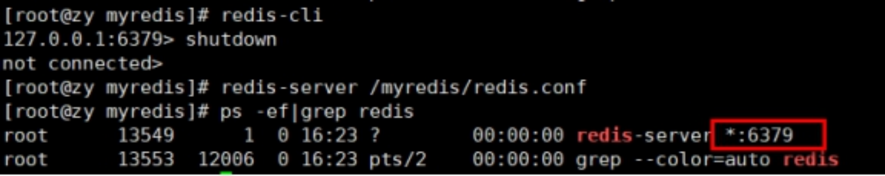
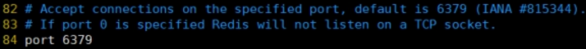
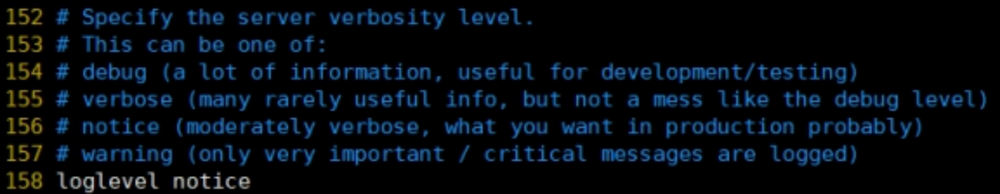
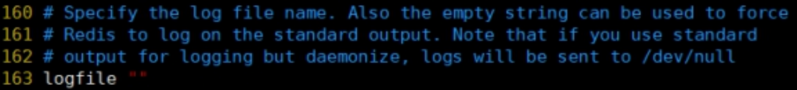
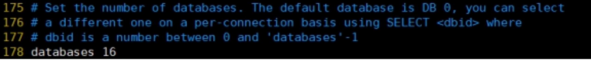

## 四、Redis 配置文件介绍

自定义目录: /myredis/redis.conf

### 4.1 Units 单位

配置大小单位,开头定义了一些基本的度量单位，只支持 bytes，不支持 bit

大小写不敏感

### 4.2 INCLUDES 包含

类似 jsp 中的 include，多实例的情况可以把公用的配置文件提取出来

### 4.3 网络相关配置

#### 4.3.1 bind

默认情况 bind=127.0.0.1 只能接受本机的访问请求

不写的情况下，无限制接受任何 ip 地址的访问

生产环境肯定要写你应用服务器的地址；服务器是需要远程访问的，所以需要将其注释掉

如果开启了 protected-mode，那么在没有设定 bind ip 且没有设密码的情况下，Redis 只允许接受本机的响应

保存配置，停止服务，重启启动查看进程，不再是本机访问了。

#### 4.3.2 protected-mode

将本机访问保护模式设置 no

#### 4.3.3 Port

端口号，默认 6379

#### 4.3.4 tcp-backlog

设置 tcp 的 backlog，backlog 其实是一个连接队列，backlog 队列总和=未完成三次握手队列 + 已经完成三次握手队列。

在高并发环境下你需要一个高 backlog 值来避免慢客户端连接问题。

注意 Linux 内核会将这个值减小到/proc/sys/net/core/somaxconn 的值（128），所以需要确认增大/proc/sys/net/core/somaxconn 和/proc/sys/net/ipv4/tcp_max_syn_backlog（128）两个值来达到想要的效果

#### 4.3.5 timeout

一个空闲的客户端维持多少秒会关闭，0 表示关闭该功能。即永不关闭。

#### 4.3.6 tcp-keepalive

对访问客户端的一种心跳检测，每个 n 秒检测一次。

单位为秒，如果设置为 0，则不会进行 Keepalive 检测，建议设置成 60

### 4.4 GENERAL 通用

#### 4.4.1 daemonize

是否为后台进程，设置为 yes

守护进程，后台启动

#### 4.4.2 pidfile

存放 pid 文件的位置，每个实例会产生一个不同的 pid 文件

#### 4.4.3 loglevel

指定日志记录级别，Redis 总共支持四个级别: debug、verbose、notice、warning，默认为 notice

四个级别根据使用阶段来选择，生产环境选择 notice 或者 warning

#### 4.4.4 logfile

日志文件名称

#### 4.4.5 databases 16

设定库的数量 默认 16，默认数据库为 0，可以使用 SELECT \<dbid\> 命令在连接上指定数据库 id

### 4.5 SECURITY 安全

#### 4.5.1 设置密码

访问密码的查看、设置和取消

在命令中设置密码，只是临时的。重启 redis 服务器，密码就还原了。

永久设置，需要再配置文件中进行设置。

### 4.6 LIMITS 限制

#### 4.6.1 maxclients

Ø 设置 redis 同时可以与多少个客户端进行连接。

Ø 默认情况下为 10000 个客户端。

Ø 如果达到了此限制，redis 则会拒绝新的连接请求，并且向这些连接请求方发出“max number of clients reached”以作回应。

#### 4.6.2 maxmemory

Ø 建议必须设置，否则，将内存占满，造成服务器宕机

Ø 设置 redis 可以使用的内存量。一旦到达内存使用上限，redis 将会试图移除内部数据，移除规则可以通过 maxmemory-policy 来指定。

Ø 如果 redis 无法根据移除规则来移除内存中的数据，或者设置了“不允许移除”，那么 redis 则会针对那些需要申请内存的指令返回错误信息，比如 SET、LPUSH 等。

Ø 但是对于无内存申请的指令，仍然会正常响应，比如 GET 等。如果你的 redis 是主 redis（说明你的 redis 有从 redis），那么在设置内存使用上限时，需要在系统中留出一些内存空间给同步队列缓存，只有在你设置的是“不移除”的情况下，才不用考虑这个因素。

#### 4.6.3 maxmemory-policy

Ø volatile-lru: 使用 LRU 算法移除 key，只对设置了过期时间的键；（最近最少使用）

Ø allkeys-lru: 在所有集合 key 中，使用 LRU 算法移除 key

Ø volatile-random: 在过期集合中移除随机的 key，只对设置了过期时间的键

Ø allkeys-random: 在所有集合 key 中，移除随机的 key

Ø volatile-ttl: 移除那些 TTL 值最小的 key，即那些最近要过期的 key

Ø noeviction: 不进行移除。针对写操作，只是返回错误信息

#### 4.6.4 maxmemory-samples

Ø 设置样本数量，LRU 算法和最小 TTL 算法都并非是精确的算法，而是估算值，所以你可以设置样本的大小，redis 默认会检查这么多个 key 并选择其中 LRU 的那个。

Ø 一般设置 3 到 7 的数字，数值越小样本越不准确，但性能消耗越小。

