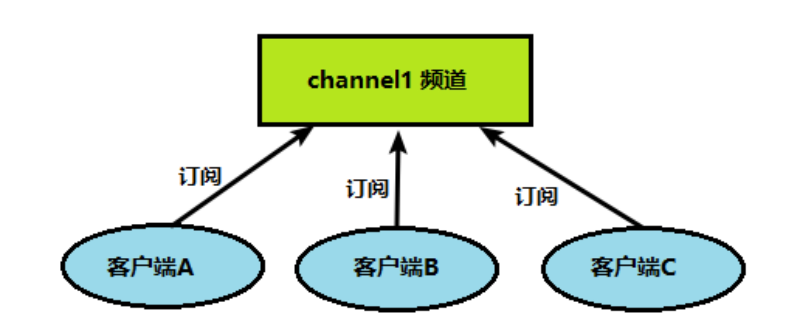
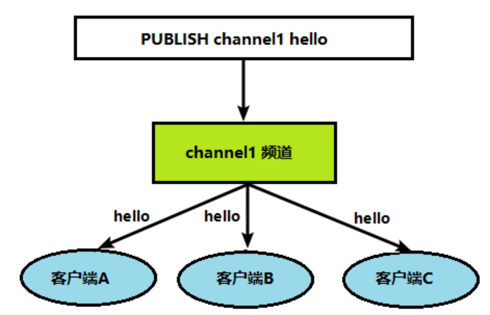
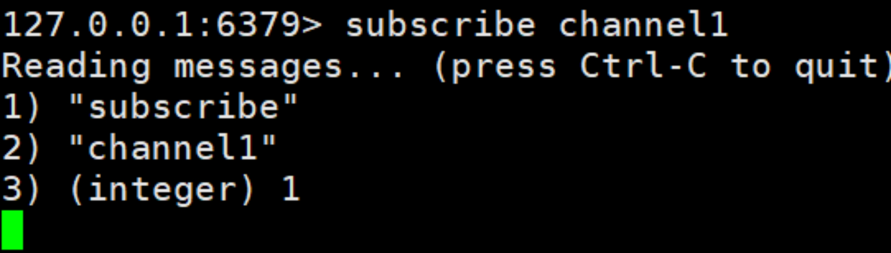
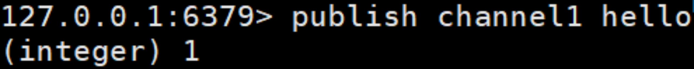
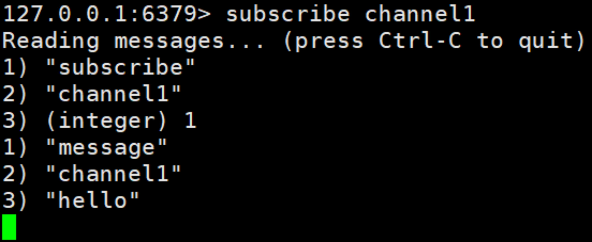

## 五、Redis 的发布和订阅

### 5.1 什么是发布和订阅

Redis 发布订阅 (pub/sub) 是一种消息通信模式: 发送者 (pub) 发送消息，订阅者 (sub) 接收消息。

Redis 客户端可以订阅任意数量的频道。

### 5.2 Redis 的发布和订阅

1、客户端可以订阅频道如下图

2、当给这个频道发布消息后，消息就会发送给订阅的客户端

### 5.3 发布订阅命令行实现

1、 打开一个客户端订阅 channel1

SUBSCRIBE channel1

2、打开另一个客户端，给 channel1 发布消息 hello

publish channel1 hello

返回的 1 是订阅者数量

3、打开第一个客户端可以看到发送的消息

注: 发布的消息没有持久化，如果在订阅的客户端收不到 hello，只能收到订阅后发布的消息
