## 六、Redis 新数据类型

### 6.1 Bitmaps

#### 6.1.1 简介

现代计算机用二进制（位） 作为信息的基础单位， 1 个字节等于 8 位， 例如“abc”字符串是由 3 个字节组成， 但实际在计算机存储时将其用二进制表示， “abc”分别对应的 ASCII 码分别是 97、 98、 99， 对应的二进制分别是 01100001、 01100010 和 01100011，如下图

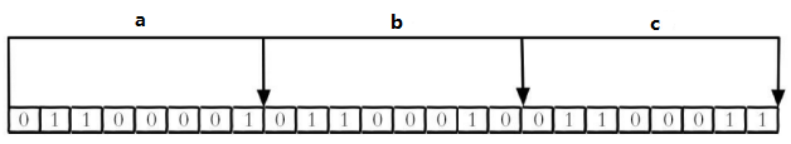

合理地使用操作位能够有效地提高内存使用率和开发效率。

​ Redis 提供了 Bitmaps 这个“数据类型”可以实现对位的操作:

（1） Bitmaps 本身不是一种数据类型， 实际上它就是字符串（key-value） ， 但是它可以对字符串的位进行操作。

（2） Bitmaps 单独提供了一套命令， 所以在 Redis 中使用 Bitmaps 和使用字符串的方法不太相同。 可以把 Bitmaps 想象成一个以位为单位的数组， 数组的每个单元只能存储 0 和 1， 数组的下标在 Bitmaps 中叫做偏移量。

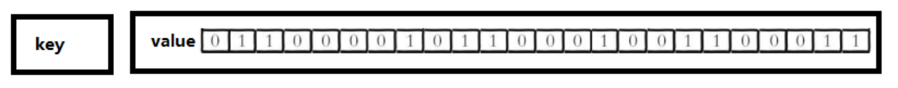

#### 6.1.2 命令

1、setbit

（1）格式

setbit \<key\> \<offset\> \<value\> 设置 Bitmaps 中某个偏移量的值（0 或 1）

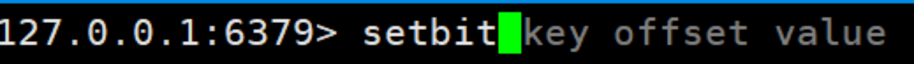

\*offset:偏移量从 0 开始

（2）实例

每个独立用户是否访问过网站存放在 Bitmaps 中， 将访问的用户记做 1， 没有访问的用户记做 0， 用偏移量作为用户的 id。

设置键的第 offset 个位的值（从 0 算起） ， 假设现在有 20 个用户，userid=1， 6， 11， 15， 19 的用户对网站进行了访问， 那么当前 Bitmaps 初始化结果如图

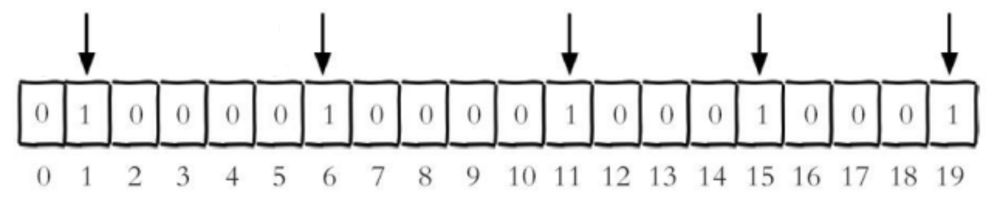

unique:users:20201106 代表 2020-11-06 这天的独立访问用户的 Bitmaps

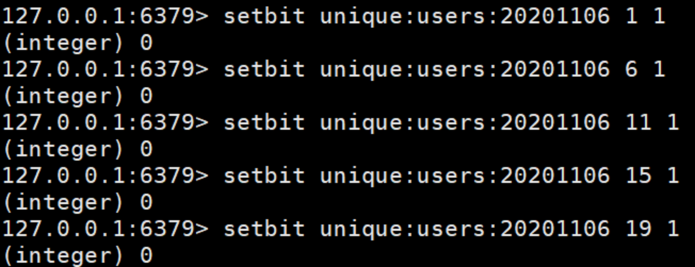

注:

很多应用的用户 id 以一个指定数字（例如 10000） 开头， 直接将用户 id 和 Bitmaps 的偏移量对应势必会造成一定的浪费， 通常的做法是每次做 setbit 操作时将用户 id 减去这个指定数字。

在第一次初始化 Bitmaps 时， 假如偏移量非常大， 那么整个初始化过程执行会比较慢， 可能会造成 Redis 的阻塞。

2、getbit

（1）格式

getbit \<key\> \<offset\> 获取 Bitmaps 中某个偏移量的值

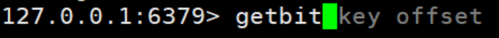

获取键的第 offset 位的值（从 0 开始算）

（2）实例

获取 id=8 的用户是否在 2020-11-06 这天访问过， 返回 0 说明没有访问过:

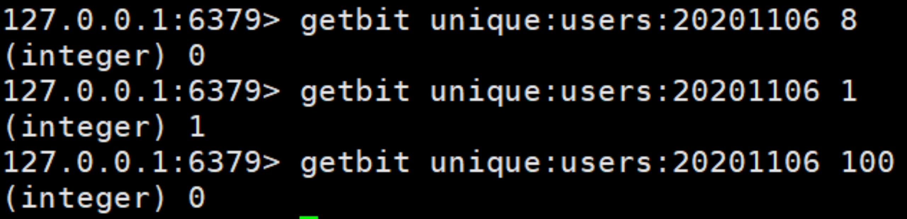

注: 因为 100 根本不存在，所以也是返回 0

3、bitcount

统计字符串被设置为 1 的 bit 数。一般情况下，给定的整个字符串都会被进行计数，通过指定额外的 start 或 end 参数，可以让计数只在特定的位上进行。start 和 end 参数的设置，都可以使用负数值: 比如 -1 表示最后一个位，而 -2 表示倒数第二个位，start、end 是指 bit 组的字节的下标数，二者皆包含。

（1）格式

bitcount \<key\> [start end] 统计字符串从 start 字节到 end 字节比特值为 1 的数量

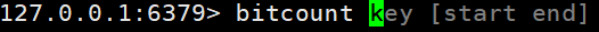

（2）实例

计算 2022-11-06 这天的独立访问用户数量

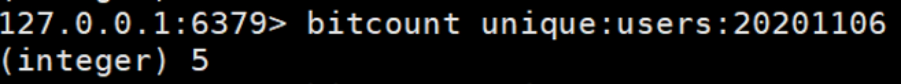

start 和 end 代表起始和结束字节数， 下面操作计算用户 id 在第 1 个字节到第 3 个字节之间的独立访问用户数， 对应的用户 id 是 11， 15， 19。

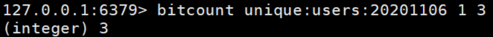

举例: K1 【01000001 01000000 00000000 00100001】，对应【0，1，2，3】

bitcount K1 1 2: 统计下标 1、2 字节组中 bit=1 的个数，即 01000000 00000000

--》bitcount K1 1 2 　　--》1

bitcount K1 1 3: 统计下标 1、2 字节组中 bit=1 的个数，即 01000000 00000000 00100001

--》bitcount K1 1 3 　　--》3

bitcount K1 0 -2: 统计下标 0 到下标倒数第 2，字节组中 bit=1 的个数，即 01000001 01000000 00000000

--》bitcount K1 0 -2 　　--》3

注意: redis 的 setbit 设置或清除的是 bit 位置，而 bitcount 计算的是 byte 位置。

4、bitop

(1)格式

bitop and(or/not/xor) \<destkey\> [key…]

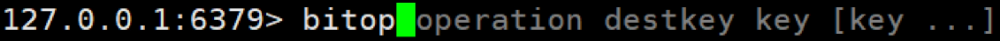

bitop 是一个复合操作， 它可以做多个 Bitmaps 的 and（交集） 、 or（并集） 、 not（非） 、 xor（异或） 操作并将结果保存在 destkey 中。

(2)实例

2020-11-04 日访问网站的 userid=1,2,5,9。

setbit unique:users:20201104 1 1

setbit unique:users:20201104 2 1

setbit unique:users:20201104 5 1

setbit unique:users:20201104 9 1

2020-11-03 日访问网站的 userid=0,1,4,9。

setbit unique:users:20201103 0 1

setbit unique:users:20201103 1 1

setbit unique:users:20201103 4 1

setbit unique:users:20201103 9 1

计算出两天都访问过网站的用户数量

bitop and unique:users:and:20201104_03

unique:users:20201103unique:users:20201104

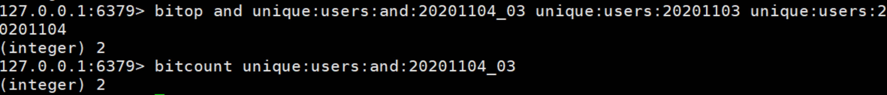

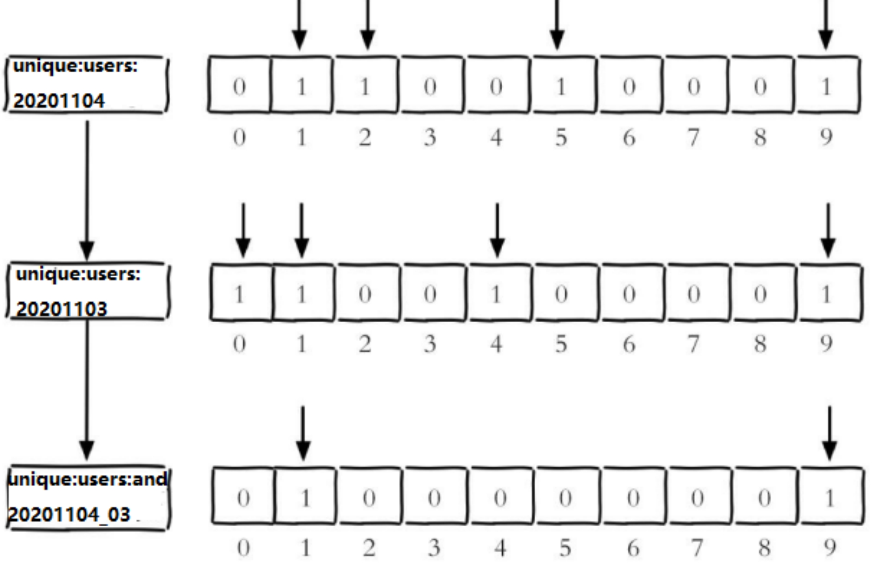

计算出任意一天都访问过网站的用户数量（例如月活跃就是类似这种） ， 可以使用 or 求并集

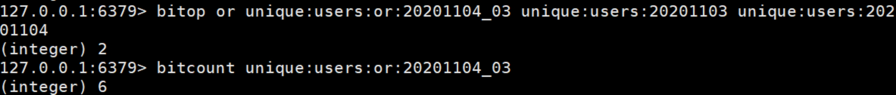

#### 6.1.3 Bitmaps 与 set 对比

假设网站有 1 亿用户， 每天独立访问的用户有 5 千万， 如果每天用集合类型和 Bitmaps 分别存储活跃用户可以得到表

| set 和 Bitmaps 存储一天活跃用户对比 |                      |                  |                          |
| ----------------------------------- | -------------------- | ---------------- | ------------------------ |
| 数据类型                            | 每个用户 id 占用空间 | 需要存储的用户量 | 全部内存量               |
| 集合类型                            | 64 位                | 50000000         | 64 位\*50000000 = 400MB  |
| Bitmaps                             | 1 位                 | 100000000        | 1 位\*100000000 = 12.5MB |

很明显， 这种情况下使用 Bitmaps 能节省很多的内存空间， 尤其是随着时间推移节省的内存还是非常可观的

| set 和 Bitmaps 存储独立用户空间对比 |        |        |       |
| ----------------------------------- | ------ | ------ | ----- |
| 数据类型                            | 一天   | 一个月 | 一年  |
| 集合类型                            | 400MB  | 12GB   | 144GB |
| Bitmaps                             | 12.5MB | 375MB  | 4.5GB |

但 Bitmaps 并不是万金油， 假如该网站每天的独立访问用户很少， 例如只有 10 万（大量的僵尸用户） ， 那么两者的对比如下表所示， 很显然， 这时候使用 Bitmaps 就不太合适了， 因为基本上大部分位都是 0。

| set 和 Bitmaps 存储一天活跃用户对比（独立用户比较少） |                      |                  |                          |
| ----------------------------------------------------- | -------------------- | ---------------- | ------------------------ |
| 数据类型                                              | 每个 userid 占用空间 | 需要存储的用户量 | 全部内存量               |
| 集合类型                                              | 64 位                | 100000           | 64 位\*100000 = 800KB    |
| Bitmaps                                               | 1 位                 | 100000000        | 1 位\*100000000 = 12.5MB |

### 6.2 HyperLogLog

#### 6.2.1 简介

在工作当中，我们经常会遇到与统计相关的功能需求，比如统计网站 PV（PageView 页面访问量）,可以使用 Redis 的 incr、incrby 轻松实现。

但像 UV（UniqueVisitor，独立访客）、独立 IP 数、搜索记录数等需要去重和计数的问题如何解决？这种求集合中不重复元素个数的问题称为基数问题。

解决基数问题有很多种方案:

1. 数据存储在 MySQL 表中，使用 distinct count 计算不重复个数

2. 使用 Redis 提供的 hash、set、bitmaps 等数据结构来处理

以上的方案结果精确，但随着数据不断增加，导致占用空间越来越大，对于非常大的数据集是不切实际的。

能否能够降低一定的精度来平衡存储空间？Redis 推出了 HyperLogLog

Redis HyperLogLog 是用来做基数统计的算法，HyperLogLog 的优点是，在输入元素的数量或者体积非常非常大时，计算基数所需的空间总是固定的、并且是很小的。

在 Redis 里面，每个 HyperLogLog 键只需要花费 12 KB 内存，就可以计算接近 2^64 个不同元素的基数。这和计算基数时，元素越多耗费内存就越多的集合形成鲜明对比。

但是，因为 HyperLogLog 只会根据输入元素来计算基数，而不会储存输入元素本身，所以 HyperLogLog 不能像集合那样，返回输入的各个元素。

什么是基数?

比如数据集 {1, 3, 5, 7, 5, 7, 8}， 那么这个数据集的基数集为 {1, 3, 5 ,7, 8}, 基数(不重复元素)为 5。 基数估计就是在误差可接受的范围内，快速计算基数。

#### 6.2.2 命令

1、pfadd

（1）格式

pfadd \<key\> \<element\> [element ...] 添加指定元素到 HyperLogLog 中

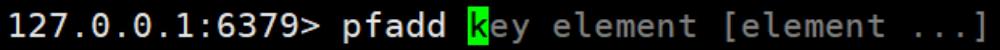

（2）实例

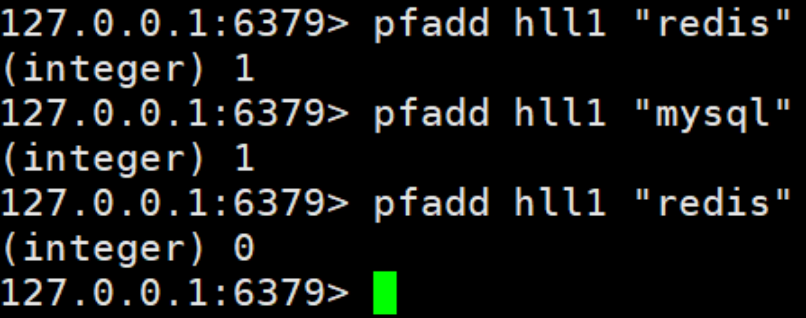

​ 将所有元素添加到指定 HyperLogLog 数据结构中。如果执行命令后 HLL 估计的近似基数发生变化，则返回 1，否则返回 0。

2、pfcount

（1）格式

pfcount \<key\> [key ...] 计算 HLL 的近似基数，可以计算多个 HLL，比如用 HLL 存储每天的 UV，计算一周的 UV 可以使用 7 天的 UV 合并计算即可

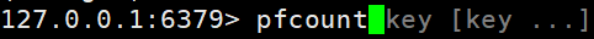

（2）实例

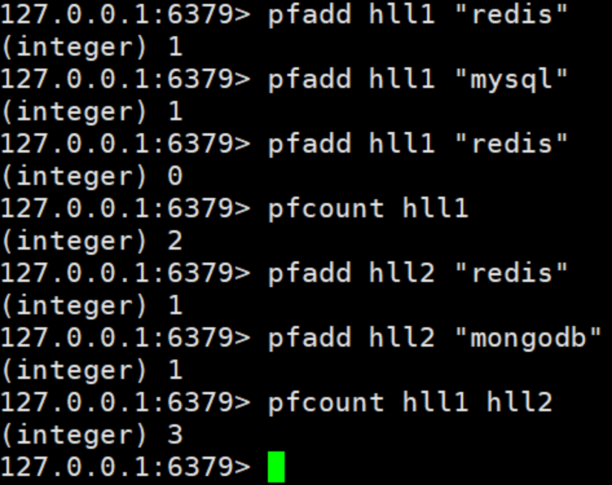

3、pfmerge

（1）格式

pfmerge \<destkey\> \<sourcekey\> [sourcekey ...] 将一个或多个 HLL 合并后的结果存储在另一个 HLL 中，比如每月活跃用户可以使用每天的活跃用户来合并计算可得

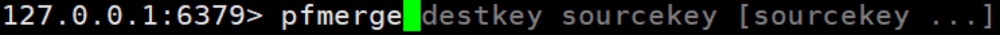

（2）实例

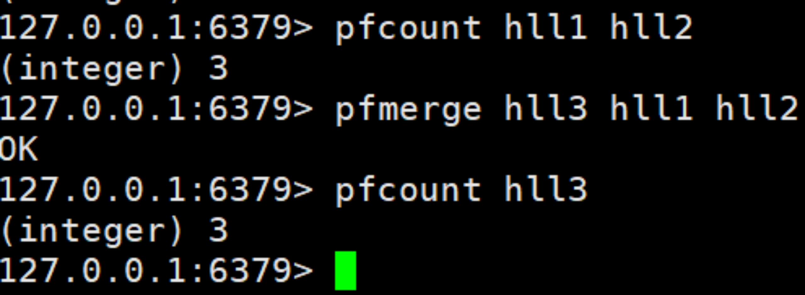

### 6.3 Geospatial

#### 6.3.1 简介

Redis 3.2 中增加了对 GEO 类型的支持。GEO，Geographic，地理信息的缩写。该类型，就是元素的 2 维坐标，在地图上就是经纬度。redis 基于该类型，提供了经纬度设置，查询，范围查询，距离查询，经纬度 Hash 等常见操作。

#### 6.3.2 命令

1、geoadd

（1）格式

geoadd \<key\> \<longitude \> \<latitude\> \<member\> [longitude latitude member...] 添加地理位置（经度，纬度，名称）

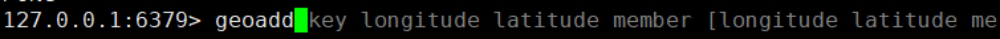

（2）实例

geoadd china:city 121.47 31.23 shanghai

geoadd china:city 106.50 29.53 chongqing 114.05 22.52 shenzhen 116.38 39.90 beijing

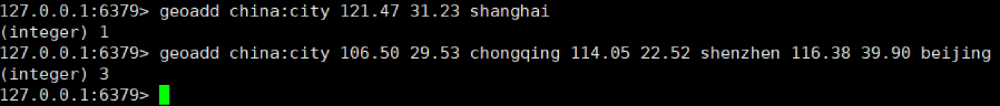

两极无法直接添加，一般会下载城市数据，直接通过 Java 程序一次性导入。

有效的经度从 -180 度到 180 度。有效的纬度从 -85.05112878 度到 85.05112878 度。

当坐标位置超出指定范围时，该命令将会返回一个错误。

已经添加的数据，是无法再次往里面添加的。

2、geopos

（1）格式

geopos \<key\> \<member\> [member...] 获得指定地区的坐标值

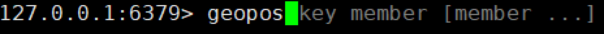

（2）实例

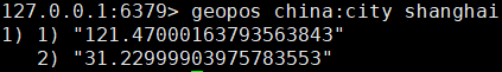

3、geodist

（1）格式

geodist \<key\> \<member1\> \<member2\> [m|km|ft|mi ] 获取两个位置之间的直线距离

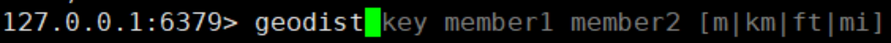

（2）实例

获取两个位置之间的直线距离

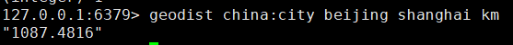

单位:

m 表示单位为米[默认值]。

km 表示单位为千米。

mi 表示单位为英里。

ft 表示单位为英尺。

如果用户没有显式地指定单位参数， 那么 GEODIST 默认使用米作为单位

4、georadius

（1）格式

georadius \<key \> \<longitude\> \<latitude\>radius m|km|ft|mi 以给定的经纬度为中心，找出某一半径内的元素

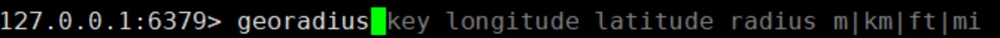

经度 纬度 距离 单位

（2）实例

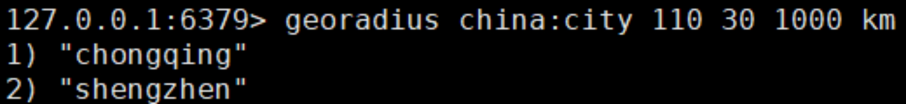
