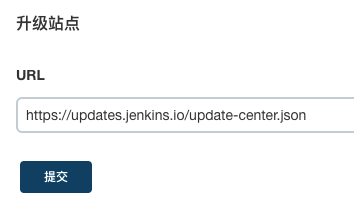

在 jenkins 页面中依次点击系统管理-->插件管理-->高级，找到页面最下方的升级站点。



将下面的地址填入 URL 中并重启 jenkins 即可。

```bash
https://mirror.tuna.tsinghua.edu.cn/jenkins/updates/update-center.json
```

如果想通过配置文件修改，则在终端中执行以下命令并重启 jenkins 即可。

```bash
sed -i 's#https://updates.jenkins.io/download#https://mirrors.tuna.tsinghua.edu.cn/jenkins#g' /var/jenkins_home/updates/default.json && sed -i 's#http://www.google.com#https://www.baidu.com#g' /var/jenkins_home/updates/default.json
```
