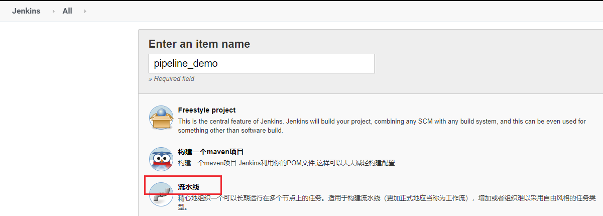
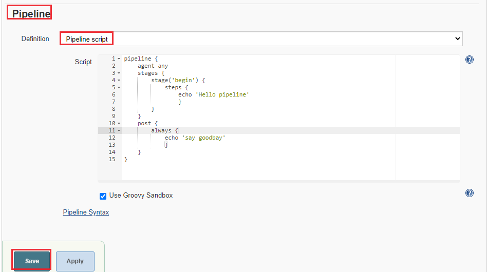
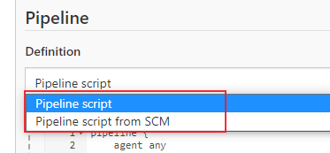
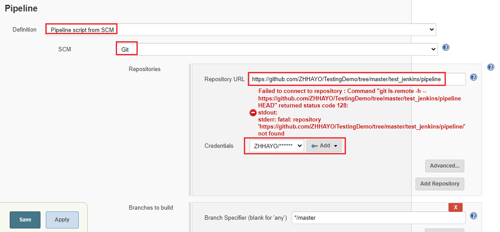
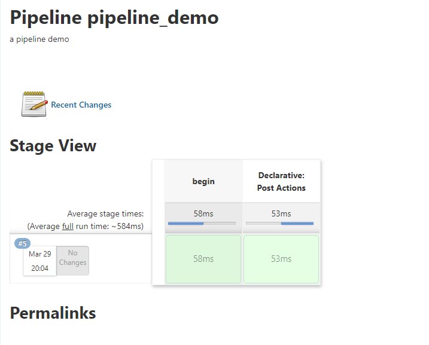

请访问原文链接: [Jenkins的Pipeline语法介绍](https://blog.csdn.net/u010698107/article/details/122913713)，查看最新版。

Pipeline在Unix/Linux系统中经常用到，Pipeline将一个命令/程序/进程的输出发送到另一个命令/程序/进程，以进行进一步处理。比如: cat test.txt | grep test1。Jenkins 中的Pipeline借用了Unix/Linux中的 Pipeline思路，实现像流水线一样来调度Jenkins任务，通过Jenkinsfile来描述整个持续集成流程。

## 一个简单的 Pipeline项目

先来看看如何在Jenkins上创建一个简单的Pipeline。

### 新建一个pipeline任务



可以设置构建触发方式。

接下来开始编写Pipeline脚本，可选择Pipline script或者Pipline script from SCM。

- Pipline script模式是将脚本写在下面的输入框中。
- Pipline script from SCM是将Pipeline script放到Git或者SVN上，执行的时候从上面拉下来执行。

### Pipeline Script

选择 Pipeline Script，编写如下代码:

```bash
pipeline {
    agent any
    stages {
        stage('begin') {
            steps {
                echo 'Hello pipeline'
            }
        }
    }
    post {
        always {
            echo 'say goodbay'
        }
    }
}
```

- stages: 添加执行步骤
- post: 任务执行完成后执行的操作



### Pipeline Script from SCM

Pipeline Script除了写在jenkins界面以外，也可以放入git源码库进行管理。

在 Jenkins Pipeline任务中选择 Pipeline script from SCM。



添加git源码地址，在 Script Path中填写需要运行的Jenkinsfile文件所在的地址。



### 构建

创建完成后保存，点击Build Now，我们可以看到不同构建阶段进度。



构建日志:


## Jenkinsfile语法

Jenkinsfile支持两种语法形式:

- Scripted pipeline - 脚本式流水线语法，基于 Groovy语言构建的通用 DSL（Domain-specific language，领域特定语言）。

- Declarative pipeline - 声明式流水线语法，在v2.5之后引入，支持结构化方式，提供了更丰富的语法特性。

> DSL是专注于某个应用领域的计算机语言。和Python、Java等这种通用语言（General-purpose Language, GPL）不同的是，DSL是一种为了特定领域而设计的开发语言，比如Web 应用使用的HTML、可扩展标记语言XML、SQL语言等。

通常情况下，流水线中声明式和脚本式语法结合使用。

### Declarative pipeline

声明式流水线语法必须包含在一个 pipeline块内:

```bash
pipeline { 
    /* Declarative Pipeline */
}
```

pipeline块中主要由[Sections](https://www.jenkins.io/doc/book/pipeline/syntax/#declarative-sections), [Directives](https://www.jenkins.io/doc/book/pipeline/syntax/#declarative-directives), [Steps](https://www.jenkins.io/doc/book/pipeline/syntax/#declarative-steps), 或者赋值语句组成。

```bash
pipeline {
    agent any
    stages {
        stage('begin') {
            steps {
                echo 'Hello pipeline'
            }
        }
    }
    post {
        always {
            echo 'say goodbay'
        }
    }
}
```

#### Sections

Sections包括agent、stages、steps和post。

##### agent

agent定义 pipeline执行节点，必须在pipeline 块的顶层定义。

主要参数:

- any: 可以在任意可用的 agent上执行pipeline

- none: pipeline将不分配全局agent，每个 stage分配自己的agent

- label: 指定运行节点agent的 Label

- node: 自定义运行节点配置,
  
  - 指定 label
  
  - 指定 customWorkspace

- docker: 使用给定的容器执行流水线。

- dockerfile: 使用源码库中包含的Dockerfile构建的容器来执行Pipeline。

- kubernetes: 在kubernetes集群执行Pipeline
  上述参数也可以用于stage中。

示例脚本:

```bash
pipline {
    agent {
        node {
            label "myslave"
            customWorkspace "myWorkspace"
        }
    }
}
```

##### stages

包含一个或多个 stage, Pipeline的大部分工作在此执行。stages也是必须指定的指令，没有参数。此外，每个 pipeline块中必须只有一个 stages。

stage也必须指定，需要定义stage的名字:

```bash
pipeline {
    agent any
    stages {
        stage('init') {
            steps {
                echo 'Hello World'
            }
        }
    }
}
```

##### steps

steps位于stage块中，也是必须设置的指令，无参数。

steps块中可以包含script块，可用于存放[Scripted Pipeline](https://www.jenkins.io/doc/book/pipeline/syntax/#scripted-pipeline) 脚本:

```bash
pipeline {
    agent any
    stages {
        stage('Example') {
            steps {
                echo 'Hello World'

                script {
                    def browsers = ['chrome', 'firefox']
                    for (int i = 0; i < browsers.size(); ++i) {
                        echo "Testing the ${browsers[i]} browser"
                    }
                }
            }
        }
    }
}
```

##### post

post是在Pipeline或者 stage执行结束后的操作，不是必须出现的指令，可设置以下触发条件:

- always: 无论 Pipeline或者stage运行完成的状态如何都会运行

- changed: 只有当前 Pipeline或者stage运行的状态与先前运行状态不同时才能运行

- fixed: 只有当前一次构建失败或者不稳定，而当前 Pipeline或者stage运行成功时运行

- regression: 前一次运行成功，而当前Pipeline或者stage运行状态为failure, unstable 或者 aborted时运行

- aborted: 只有当前 Pipeline或者stage处于“aborted”状态时才能运行。通常是手动终止。

- failure: 当前 Pipeline或者stage处于“failed”状态时才运行

- success: 当前 Pipeline或者stage具有“success”状态时才运行

- unstable: 当前 Pipeline或者stage具有“unstable”状态才运行

- unsuccessful: 当前 Pipeline或者stage不是“success”状态时运行

- cleanup: 不管Pipeline或stage的状态如何，在每一个post条件被执行之后运行。

示例脚本:

```bash
pipeline {
    agent any
    stages {
        stage('init') {
            steps {
                echo 'Hello World'
            }
        }
    }
    post {
        success {
            echo 'success!'
            sleep 2        
        }

        always {
            echo 'goodbye'
        }
    }
}
```

#### Directives

Declarative pipeline也包含了各种指令，比如environment，options，parameters，triggers等，指令不是必须出现的指令。

##### environment

定义 Pipeline或stage运行时的环境变量，位于pipeline块顶部的 `environment` 定义的环境变量适用于流水线中的所有步骤，`stage` 中定义的 `environment` 只能应用于 `stage` 中的步骤。

```bash
pipeline {
    agent any
    environment { 
        CC = 'clang'
    }
    stages {
        stage('Example') {
            environment { 
                hlw = 'hello world'    
            }
            steps {
                echo hlw
            }
        }
    }
}
```

##### options

options指令允许在Pipeline内部定义 pipeline专有属性。

pipeline可用选项:

- buildDiscarder: 保持构建的最大个数，超过最大构建数后会丢弃以前的构建。

- checkoutToSubdirectory: 在工作区的子目录中执行自动源代码控制checkout 。

- disableConcurrentBuilds: 禁止并行执行 pipeline任务，可用于防止同时访问共享资源。

- disableResume: 如果控制器重启，不允许管道恢复。

- newContainerPerStage: 与docker或dockerfile顶级代理一起使用。指定后，每个阶段将运行在同一节点上的新容器实例中，而不是所有阶段都运行在同一个容器实例中。

- overrideIndexTriggers: 允许重写分支索引触发器的默认处理方法。如果分支索引触发器在多分支或组织标签处被禁用，options { overrideIndexTriggers(true) }将仅为该job启用。否则，options { overrideIndexTriggers(false) }将只禁用该job的分支索引触发器。

- preserveStashes: 保留已完成构建的stashes ，以便在stage 重启时使用。例如: options {preserveStashes()}用于保存最近完成构建的stashes ，或者options {preserveStashes(buildCount: 5)}用于保存最近完成构建的五个堆栈。

- quietPeriod: 为Pipeline设置静默期(以秒为单位)，覆盖全局默认值。例如: options {quietPeriod(30)}

- skipDefaultCheckout: 在agent指令中，默认情况下跳过从源代码Checkout代码。例如: options {skipDefaultCheckout()}

- skipStagesAfterUnstable: 一旦构建状态变为 “Unstable“ 状态，就跳过stages。例如: options {skipstagesafterstable ()}

- retry: 失败后，重试整个 Pipeline的次数例如: options { retry(3) }

- timeout: 为Pipeline的运行设置一个超时时间，在此之后，Jenkins就中止Pipeline。例如: options {timeout(time: 1, unit: 'HOURS')}

- timestamps: 在所有由Pipeline运行生成的控制台输出前加上间。例如: options {timestamp ()}

- parallelsAlwaysFailFast: 将流水线中所有后续并行阶段的failfast设置为true，用于并行执行stage中。例如: options {parallelsAlwaysFailFast()}

stage的options指令类似于Pipeline的options指令。然而，stage选项只能包含retry, timeout, 或 timestamps 的步骤，或者与stage相关的声明性选项，比如skipDefaultCheckout。

在stage中，在进入agent或检查任何 when条件之前调用options指令中的步骤。

stage 可用选项:

- skipDefaultCheckout
- timeout: 为当前stage的运行设置一个超时时间
- retry
- timestamps

示例脚本:

```bash
pipeline {
    agent any
    options {
        timeout (time: 1, unit: 'HOURS')
        buildDiscarder(logRotator(numToKeepStr: '2')
        retry(5)
    }
    stages {
        stage('init') {
            options {
                timeout(time: 30, unit: 'SECONDS') 
            }
            steps {
                echo 'Hello World'
            }
        }
    }
}
```

##### parameters

parameters 指令定义 pipeline的专有参数列表，支持参数类型:

- `string`: 字符串类型
- `text`: 文本, 可包括多行
- `booleanParam`: 布尔参数
- `choice`: choice 参数
- `password`: 密码参数

示例脚本:

```bash
pipeline {
    agent any
    parameters {
        string(name: 'DEPLOY_ENV', defaultValue: 'staging', description: '') 
        text(name: 'DEPLOY_TEXT', defaultValue: 'One\nTwo\nThree\n', description: '') 
        booleanParam(name: 'DEBUG_BUILD', defaultValue: true, description: '')
        choice(name: 'CHOICES', choices: ['one', 'two', 'three'], description: '')
        password(name: 'PASSWORD', defaultValue: 'SECRET', description: 'A secret password')
    }
    stages {
        stage('Example') {
            steps {
                echo "${params.DEPLOY_ENV}"
                echo "${params.PASSWORD}"
            }
        }
    }
}
```

##### triggers

`triggers` 指令定义了 Pipeline自动化触发的方式，主要包括3种触发器:

- cron: 接受一个cron样式的字符串来定义 Pipeline触发的间隔周期，例如: triggers { cron('H \*/4 \* \* 1-5') }

- pollSCM: 接受一个cron样式的字符串来定义 Jenkins检查SCM源码更新的常规间隔；如果存在新的更改，Pipeline将被重新触发。例如: triggers { pollSCM('H \*/4 \* \* 1-5') }

- upstream: 接受以逗号分隔的job字符串和阈值。当字符串中的任何作业以最小阈值完成时，将重新触发Pipeline。例如: triggers { upstream(upstreamProjects: 'job1,job2', threshold: hudson.model.Result.SUCCESS) }

更多cron表达式语法介绍可参考 [Linux cron定时介绍](https://blog.csdn.net/u010698107/article/details/121593309)。

示例脚本:

```bash
pipeline {
    agent any
    triggers {
        cron('H */4 * * 1-5')
    }
    stages {
        stage('init') {
            steps {
                echo 'Hello World'
            }
        }
    }
}
```

##### stage

前面介绍过，stage指令位于stages块中，也是必须设置的指令，应至少包含一个。

##### tools

定义自动安装和`PATH`上的工具。如果没有指定agent，则忽略此参数。

支持如下工具:

- maven
- jdk
- gradle

示例脚本:

```bash
pipeline {
    agent any
    tools {
        maven 'apache-maven-3.0.1' 
    }
    stages {
        stage('Example') {
            steps {
                sh 'mvn --version'
            }
        }
    }
}
```

其中工具名 `apache-maven-3.0.1` 必须在jenkins中预先配置: Manage Jenkins -> Global Tool Configuration 。

##### input

`stage` 的 `input` 指令允许使用 [`input` step](https://jenkins.io/doc/pipeline/steps/pipeline-input-step/#input-wait-for-interactive-input)提示输入。 在应用了此 `options` 后，进入 `stage` 的 `agent` 或评估 `when` 条件前， `stage` 将暂停。 如果 `input` 被同意, `stage` 将会继续。

可配置选项如下:

- message: 必须指定，是呈现给用户的信息。

- id: 可选标识符， 默认为 stage 名称。

- ok: "ok"按钮的可选文本。

- submitter: 以逗号分隔的用户列表或允许提交 input 的外部组名。默认允许任何用户。

- submitterParameter: 环境变量的可选名称。如果存在，用 submitter 名称设置。

- parameters: 提示提交者提供的一个可选的参数列表。 和前面介绍的parameters 指令定义方法一样。

示例脚本:

```bash
pipeline {
    agent any
    stages {
        stage('Example') {
            input {
                message "Should we continue?"
                ok "Yes, we should."
                submitter "alice,bob"
                parameters {
                    string(name: 'PERSON', defaultValue: 'Mr Jenkins', description: 'Who should I say hello to?')
                }
            }
            steps {
                echo "Hello, ${PERSON}, nice to meet you."
            }
        }
    }
}
```

##### when

`when` 指令位于stage指令中，允许流水线根据给定的条件决定是否应该执行阶段，必须包含至少一个条件。

支持以下嵌套条件:

- branch: 当正在构建的分支与分支模式匹配时执行这个阶段, 例如: when { branch 'master' }。注意，只适用于多分支流水线。

- buildingTag: 当构建正在构建标记时执行该阶段。例如: when {buildingTag()}

- environment: 当指定的环境变量是给定的值时，执行这个步骤, 例如: when { environment name: 'DEPLOY_TO', value: 'production' }

- changelog: 如果构建的SCM变更日志包含一个给定的正则表达式模式，则执行该阶段，例如: when { changelog '.*^\\[DEPENDENCY\\] .+$' }

- changeset: 如果构建的SCM变更集包含一个或多个匹配给定模式的文件，则执行该阶段。例如: when { changeset "**/*.js" }

- changeRequest: 如果当前构建是为了一个“change request”(比如GitHub的Pull request, GitLab上的Merge request, Gerrit中的change等)时执行这个阶段。如果没有传递参数，stage在每次变更请求上运行，例如: when { changeRequest() }

- environment: 当指定的环境变量设置为给定的值时执行，例如: when { environment name: 'DEPLOY_TO', value: 'production' }

- equals: 当期望值与实际值相等时执行，例如: when { equals expected: 2, actual: currentBuild.number }

- expression: 当指定的Groovy表达式为true时执行, 例如: when { expression { return params.DEBUG_BUILD } }。注意，当表达式返回字符串时，它们必须转换为布尔值，或者返回null来计算为false。简单地返回“0”或“false”仍然会被计算为“true”。

- tag: 如果TAG_NAME变量与给定的模式匹配则执行该阶段。例如: when { tag "release-*" }。如果提供了一个空模式，那么如果存在TAG_NAME变量，则该阶段将执行(与 buildingTag() 相同)。

- not: 当嵌套条件是 false 时执行这个阶段，它必须包含一个条件，例如: when { not { branch 'master' } }

- allOf: 当所有的嵌套条件都为 true 时执行，必须包含至少一个条件，例如: when { allOf { branch 'master'; environment name: 'DEPLOY_TO', value: 'production' } }

- anyOf: 当至少有一个嵌套条件为 true 时执行，必须包含至少一个条件，例如: when { anyOf { branch 'master'; branch 'staging' } }

- triggeredBy: 当当前构建被给定的参数触发时执行。例如:
  
  - when { triggeredBy 'SCMTrigger' }
  - when { triggeredBy 'TimerTrigger' }
  - when { triggeredBy 'BuildUpstreamCause' }
  - when { triggeredBy cause: "UserIdCause", detail: "vlinde" }

在进入 `stage` 的 `agent` 前评估 `when`

- 默认情况下，如果定义了该stage 的 agent ，则stage的 when 条件将在进入该stage的agent之后计算。但是，这可以通过在 when 块中指定 beforeAgent 选项来更改。如果 beforeAgent 设置为 true ，则首先计算 when 条件，只有当条件计算为 true 时才进入 agent。

在 `options` 指令之前评估 `when`

- 默认情况下，如果stage定义了任何 options ，stage 的 when 条件将在进入该stage的options之后计算。但是，这可以通过在 when 块中指定 beforeOptions 选项来更改。如果 beforeOptions 设置为true，则首先计算 when 条件，只有当条件计算为 true 时才会进入 options。

- beforeOptions true优先级高于beforeInput true和beforeAgent true。

示例脚本:

```bash
pipeline {
    agent any
    stages {
        stage('Example Build') {
            steps {
                echo 'Hello World'
            }
        }

        stage('Deploy1') {
            when {
                branch 'production1'
            }
            steps {
                echo 'Deploying1'
            }
        }

        stage('Deploy2') {
            when {
                allOf {
                    branch 'production2'
                    environment name: 'DEPLOY_TO', value: 'production2'
                }
            }
            steps {
                echo 'Deploying2'
            }
        }

        stage('Deploy3') {
            when {
                beforeInput true
                branch 'production3'
            }
            input {
                message "Deploy to production3?"
                id "simple-input"
            }
            steps {
                echo 'Deploying3'
            }
        }
    }
}
```

#### 并行执行

声明式流水线支持多阶段并行执行，`Parallel` 块中，当其中任何一个阶段失败时，可以通过添加`failFast true`来强制所有并行阶段都中止。也可以在管道定义中添加一个`options` : `options {parallelsAlwaysFailFast() }`

```bash
pipeline {
    agent any
    stages {
        stage('Non-Parallel Stage') {
            steps {
                echo 'This stage will be executed first.'
            }
        }
        stage('Parallel Stage') {
            when {
                branch 'master'
            }
            failFast true
            parallel {
                stage('Branch A') {
                    agent {
                        label "for-branch-a"
                    }
                    steps {
                        echo "On Branch A"
                    }
                }
                stage('Branch B') {
                    agent {
                        label "for-branch-b"
                    }
                    steps {
                        echo "On Branch B"
                    }
                }
            }
        }
    }
}
```

声明式流水线可以将stage放入矩阵单元中，Matrix可以定义一个多维的 name-value组合矩阵，并将其并行运行。具体使用方法可以参考[官方文档](https://www.jenkins.io/doc/book/pipeline/syntax/#declarative-matrix)。

### Scripted pipeline

Scripted pipeline是基于groovy语法定制的一种DSL语言，它的灵活性更高，具有更好的可扩展性。

使用它需要了解一定的groovy语法知识，可参考如下文档:

- [The Apache Groovy programming language - Syntax](http://groovy-lang.org/syntax.html)

- [Groovy 教程_w3cschool](https://www.w3cschool.cn/groovy/)

请看下面的Scripted pipeline脚本，使用了if/else和try/catch/finally流程控制方法，无论构建状态是什么都发送邮件:

```bash
node('win_agent') {
    try {
        // 自动化测试 
        stage('Test') {
            TEST_STATU = bat (
                script: '''echo autotest''',
                returnStatus: true
            ) == 0

            if ("${TEST_STATU}" == "false") {
                catchError(stageResult: 'FAILURE') {
                    echo "测试未通过"
                    env.LOG = "测试未通过"
                }
            } else {
                echo "测试通过"
                env.LOG = "测试通过"
            }
        }
    } catch (exc) {
        currentBuild.result = 'FAILURE'
        echo "Something failed, I'm in the catch block."
      } finally {
        stage("email") {
            emailext (
                subject: '\'构建通知:${PROJECT_NAME} - Build # ${BUILD_NUMBER} - ${BUILD_STATUS}\'',
                to: "XXXXXXXX@163.com", 
                body: '${FILE,path="email.html"}',
            )
        }
  }
}
```

## DSL方法步骤

前面介绍Declarative pipeline和Scripted pipeline语法的实例中，使用到了一些方法步骤，比如`sh`、`echo`、`emailext`等，它们是jenkins插件提供的一些方法步骤，下面举2个例子:

- bat/sh方法:

```bash
STATU = bat (
    script: '''echo 666''',
            returnStatus: true
        ) == 0
echo ${STATU}
```

- catchError方法: 捕获到异常后，设置当前构建或者阶段状态设置为FAILURE，并继续执行Pipeline后面的步骤:

```bash
stage('Test') {
    STATU = bat (
                script: '''echo 666''',
                returnStatus: true
            ) == 0

    if ("${TEST}" == "false") {
        catchError(stageResult: 'FAILURE') {
            echo "测试未通过"
        }
    } else {
        echo "测试通过"
    }
}
```

也可以用`try-catch`来实现。

当前jenkins平台支持的更多步骤可以访问 [http://:/pipeline-syntax/html](http://%3Chost%3E:%3Cport%3E/pipeline-syntax/html) 查看。

## 小结

本文介绍了两种pipeline脚本语法，使用pipeline脚本可以使任务调度更加灵活，特别是对于比较复杂的项目。

另外，这两种pipeline脚本语法通常会一起使用，为了让代码更加简洁，建议使用pipeline共享库，将groovy脚本放到共享库中，这样多个pipeline项目就可以共用这些方法，大大减少代码冗余。

参考文档:

1. <https://www.jenkins.io/zh/doc/book/pipeline/>
2. <https://www.jenkins.io/doc/book/pipeline/syntax/>
3. <https://www.jenkins.io/zh/doc/book/pipeline/syntax>
4. <https://www.jenkins.io/blog/2019/12/02/matrix-building-with-scripted-pipeline/>
