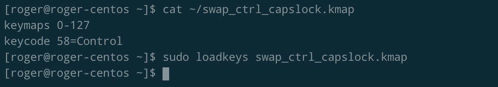

## 概述

对于使用 vim 和 emacs 的朋友来说，交换 capslock 和 control 的键位对于自己的习惯来说是至关重要的。那么如何设置才能交换呢，对于不同的操作系统有不同的方法。

## windows

在 windows 系统中，最简便的方式是使用 KeyTweak 这款软件。


另外有些笔记本自带有一些键位设置的软件。比如微星的 MSI PER KEY RGB KEYBOARD 软件就可以在系统级别进行设置。

## macos

在 macos 系统中，进入系统设置，键盘，修改键位就可以了。


另外推荐一款修改键位的神器，[Karabiner-Elements](https://karabiner-elements.pqrs.org/)，喜欢修改键位的朋友不要错过。

## ubuntu

在 ubuntu 系统中，修改/etc/default/keyboard 文件，设置 XKBOPTIONS="ctrl:nocaps"即可。


如果需要设置多个键位，用逗号隔开，例如 XKBOPTIONS="ctrl:nocaps,altwin:swap_alt_win"。

查看键位设置:

```bash
gsettings get org.gnome.desktop.input-sources xkb-options
```

如果不生效，重置键位:

```bash
gsettings reset org.gnome.desktop.input-sources xkb-options
```

## centos

在 centos 系统中，新建 swap_ctrl_capslock.kmap 文件，在文件中写入如下代码:

```bash
keymaps 0-127
keycode 58=Control
```

然后在命令行中执行:

```bash
sudo loadkeys swap_ctrl_capslock.kmap
```



如需每次开机自动生效，可以将该指令写入~/.bashrc 文件中。

由于该指令需要 root 权限，如果不是以 root 用户身份登陆，需要在/etc/sudoer 中写入 NOPASSWD 以免输入密码。

```bash
$username ALL=(ALL) NOPASSWD: ALL
```
