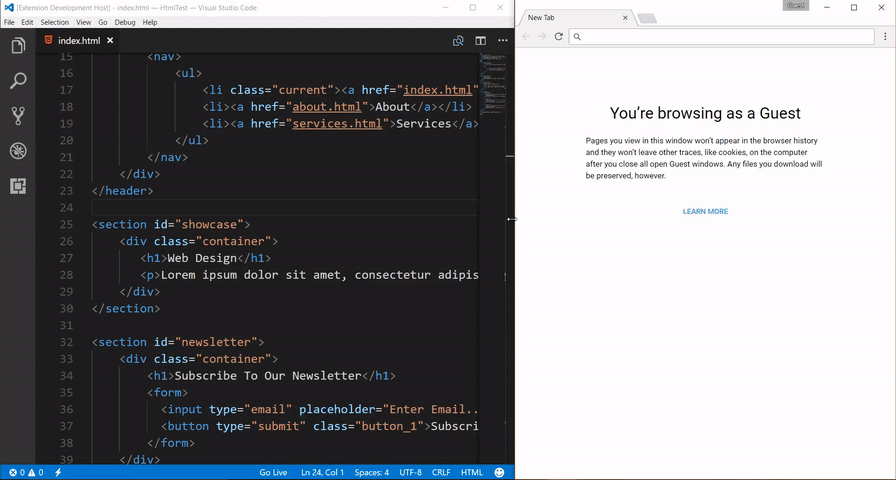

## 概述

在 web 前端的开发过程中，经常会手动修改了一段代码之后需要立刻查看效果的时候。于是切换到浏览器，然后刷新网页进行查看。这个过程其实还可以更无缝的实现。

live server 就是一款实时查看开发的 web 效果的插件。当你修改了 web 前端后，live server 会自动刷新并及时反映出目前 web 的效果。那么如果我们是在容器中开发项目呢，下面我们就来看看如何实现。

## 安装和使用 live server 插件

live server 插件的安装方式非常简单。在 VSCode 中的扩展中搜索到 live server 插件后选择安装即可。

安装完成后，我们来启动 live server 插件。

在 VSCode 的右下角，点击 Go Live 的图标启动服务。该插件默认会监听 5500 端口。

这时可以打开浏览器，输入需要查看的网址，也可以对 VSCode 文件管理器中的文件右键，选择用 live server 打开，然后在 VSCode 中更改选择的文件代码吧，你会发现，浏览器中内容也在不断更新以实时反映开发效果。

最终效果如下:

## 在容器中使用 live server

在容器中使用 live server，需要先在容器中安装 live server。

由于我们调试的是容器中的应用，因此需要在容器启动的时候将容器中 live server 的端口映射出来。容器中的 live server 默认监听的端口是 5500，因此需要将 5500 端口映射出来。

上图中，我的 web 服务器端口是 3000，live server 端口是 5500。

映射端口完成后，点击 VSCode 右下角 Go Live 按钮开启服务。 不过这时只能通过 live server 的 5500 端口观察到实时的效果。如果希望通过 3000 端口观察的话，需要额外安装 live server web extension 插件。

live server web extension 可以让 PHP，.NET 和 Node.js 中的代码一样的工作在 live server 的实时观察模式下。

[live server web extension](https://github.com/ritwickdey/live-server-web-extension)

安装完成后，在浏览器中打开该插件，在该插件中进行如下设置。

其中的各个设置说明如下:

- Live Reload: 打开或关闭实时查看功能。
- I don't want proxy setup(recommended): 是否不使用代理功能。
- Actual Server Address: 需要调试的服务器的地址。
- Live Server Address: live server 服务的地址。

在 Actual Server Address 和 live Server Address 中填入合适的地址后，点击 Apply 就应用成功了。

设置完成后，打开浏览器，输入需要查看的网址，然后在 VSCode 中更改选择的文件代码吧，你会发现，浏览器中内容也在不断更新以实时反映开发效果。

以上就是 live server 的基本使用方式和在容器中的使用方式。
