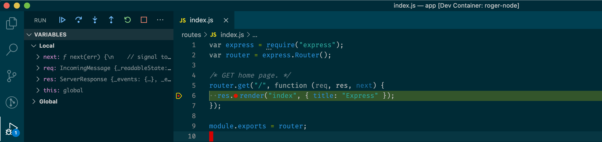

## 概述

在 vscode 的容器中，调试是比较麻烦的。主要是容器内外的端口需要映射，浏览器能正常连接后才能进行调试。根据调试的对象不同，方式也不尽相同。下面分别来进行说明。

## 调试 Node.js

用 vscode 进入容器后，打开调试面板，点击面板上方的设置按钮后，会打开 launch.json 配置文件，在该文件中进行如下设置。

```json
{
  "version": "0.2.0",
  "configurations": [
    {
      "type": "node",
      "request": "launch",
      "name": "Launch Node.js",
      "skipFiles": ["<node_internals>/**"],
      "program": "${workspaceFolder}/server.js"
    }
  ]
}
```

其中的各个参数说明如下:

- version: 配置文件的版本号。
- configurations: 配置调试器的地方，可配置多个。
- type: 表示调试的是 Node.js 代码。
- request: 表示每次启动调试的方式。
  - lauch: 会重新启动一个 Node.js 进程来进行调试。
  - attach: 会附加到一个已经存在的 Node.js 进程来进行调试。
- name: 调试配置的名字。
- skipFiles: 忽略掉不需要进行调试的文件。
- program: 启动调试后，程序的入口文件。

设置完成后，用 vscode 在容器中需要调试的地方打上断点，然后启动调试，用浏览器进行访问。如果没有问题，就可以看到程序已经停止在了断点处了。



## 调试普通 javascript 代码

在容器中调试 javascript，需要先在容器中安装 Debug for chrome 和 live server 两个插件。


**重要**: 由于我们调试的是容器中的应用，因此需要在容器启动的时候将容器中 live server 的端口映射出来。


如果对 live server 插件不熟悉，可以参考另外一篇关于 live server 的介绍。
首先启动 live server 插件。然后打开 launch.json 配置文件，在该插件中进行如下设置。

```json
{
  "version": "0.2.0",
  "configurations": [
    {
      "type": "chrome",
      "request": "launch",
      "name": "Launch Chrome",
      "url": "http://localhost:5500/public/show.html"
    }
  ]
}
```

其中最重要的参数是 url 的设置。它指向的是容器中的单个 html 文件。

设置完成后，在需要调试的地方打上断点，然后启动调试，用浏览器进行访问。如果没有问题，就可以看到程序已经停止在了断点处了。


以上就是在容器中调试的内容了，更多关于在 vscode 中的调试技术，请参考[vscode-recipes](https://github.com/microsoft/vscode-recipes)、[node-js-debugging](https://www.freecodecamp.org/news/node-js-debugging/)和[ndb](https://github.com/GoogleChromeLabs/ndb)。另外，在文中提到的 live server 是个很不错的插件，它同时也是一个结合浏览器实时查看开发效果的神器。关于它的介绍，请参考[用 live server 实时查看容器中的开发效果](https://roger.ink/2020/11/03/用live-server实时查看容器中的开发效果/)。
