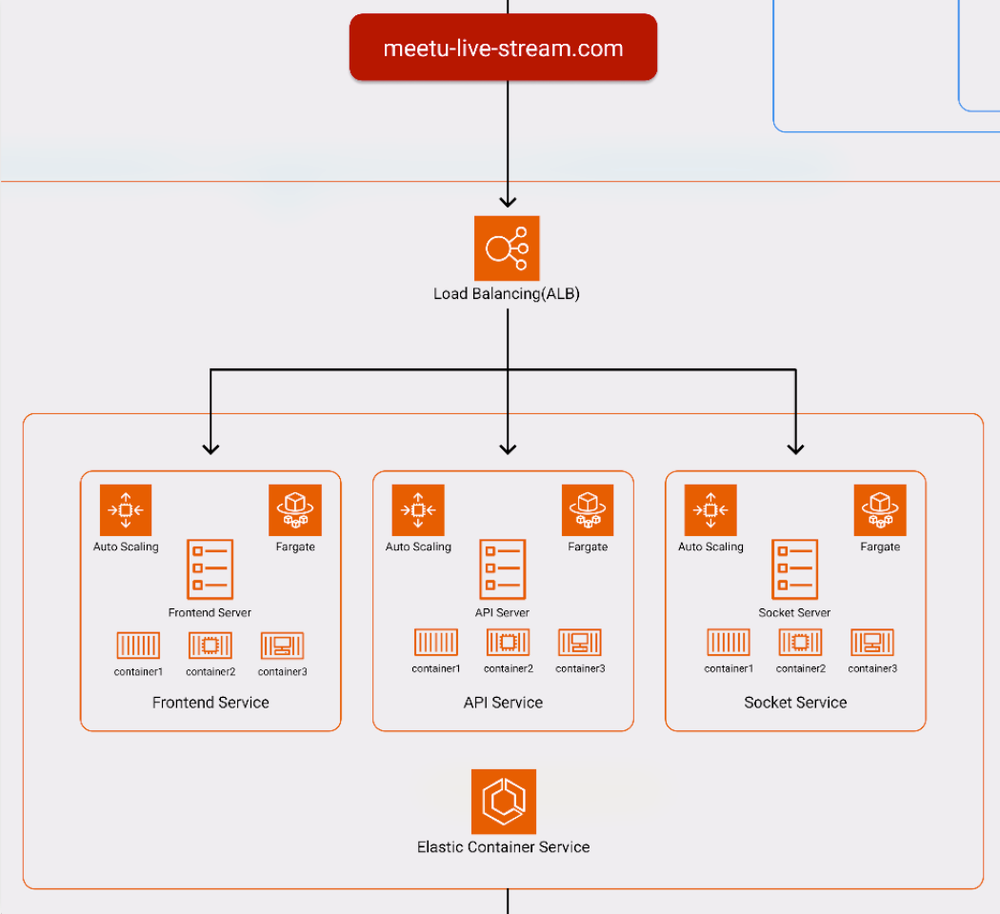

## 1. 从一个例子开始

## 2. 什么是 AWS ECS

Amazon Elastic Container Service (Amazon ECS) 是一种高度可扩展、快速的容器管理服务，可以轻松地在 Amazon EC2 实例集群上运行、停止和管理 Docker 容器。

## 3. Fargate 和 EC2 模式

AWS Fargate 是可与 Amazon ECS 结合使用的技术，使您在运行容器时不必管理 Amazon EC2 实例的服务器或集群。

使用 Fargate，您不必再预配置、配置或扩展虚拟机集群即可运行容器。这样一来，您就无需再选择服务器类型、确定扩展集群的时间和优化集群打包。

## 4. 为什么使用 AWS ECS

- 自动伸缩

- 高并发

- 高可用

- 安全

- 简单

## 5. 怎么使用 AWS ECS

## 6. Elastic Container Registry(ECR)

- 完全托管
  
  无需安装任何管理软件及提供基础设施资源，即可获得的 Docker容器 Registry。

- 安全
  
  通过 HTTPS 传输容器镜像，自动对容器镜像进行加密，通过 AWS IAM 策略管理镜像访问权限。

- 高可用
  
  ECR基于高可用高持久性及冗余架构设计，实现对应用程序的可靠部署。

- 简化工作流
  
  ECR和 ECS 以及 Docker CLI 高度集成，实现开发和生产环境工作流的简化。

## 7. 定义 AWS ECS 容器化应用基本步骤

1. 定义/更新任务

2. 创建/指定集群

3. 创建/更新服务

4. 运行服务

## 8. AWS ECS 编排工具

- aws 控制台

- aws-cli

- ecs-cli

- terrafrom

- aws cdk

- docker-compose

## 9. 基于 ALB 创建弹性的容器化服务

## 10. AWS ECS 状态监控

### 性能监控

- ECS Cluster

- Cloud Watch

### API 监控

- Cloud Trail

### 事件监控

- ECS Cluster event

## 11. AWS ECS 的价格

## 12. 总结
