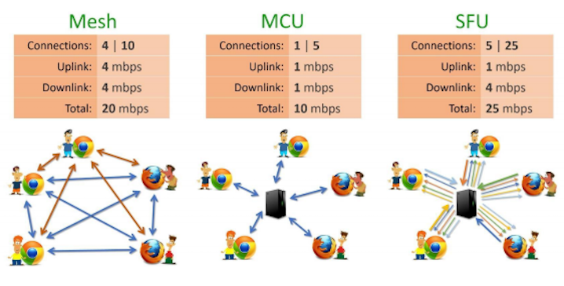
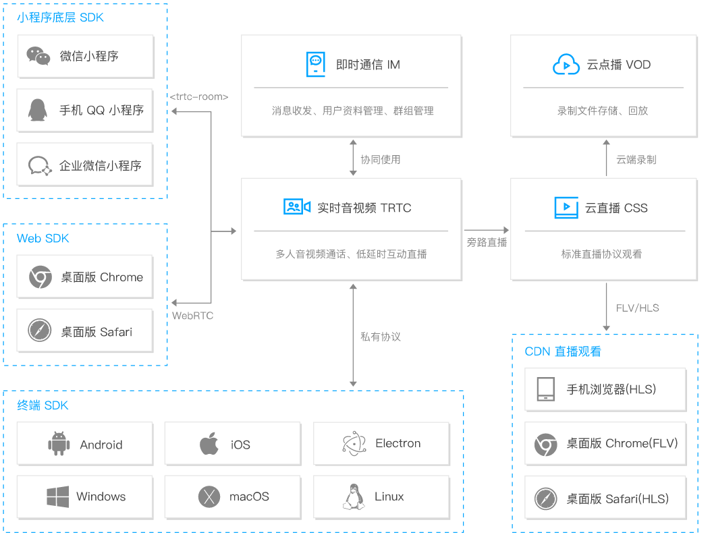
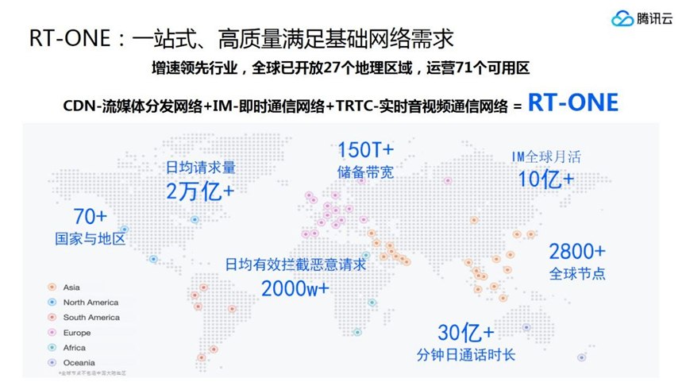
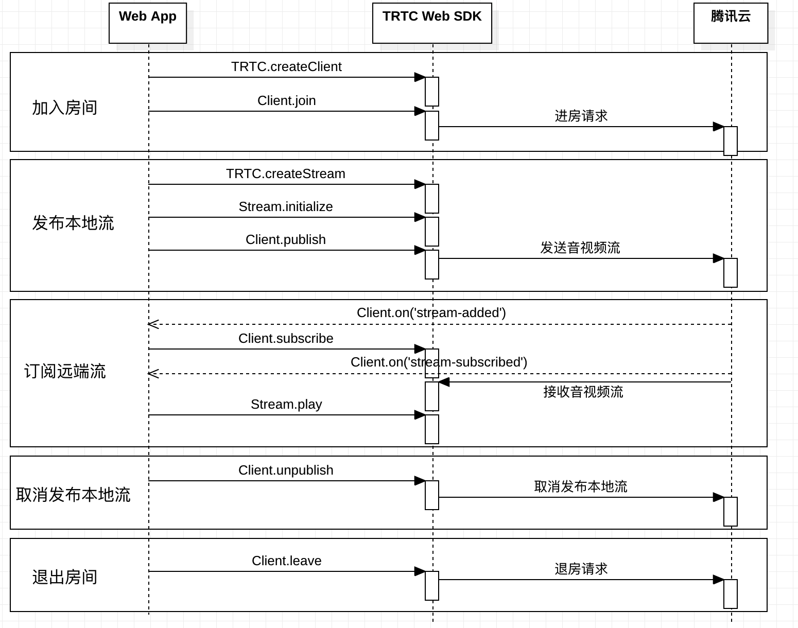
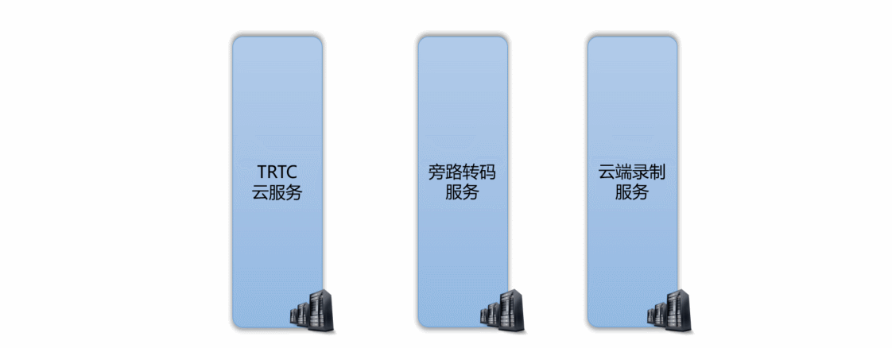
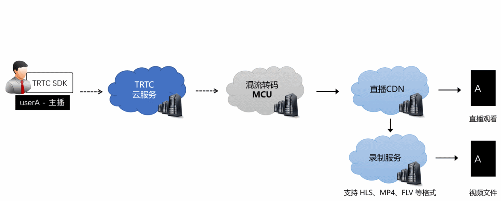
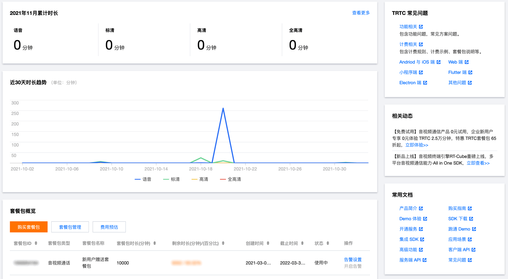
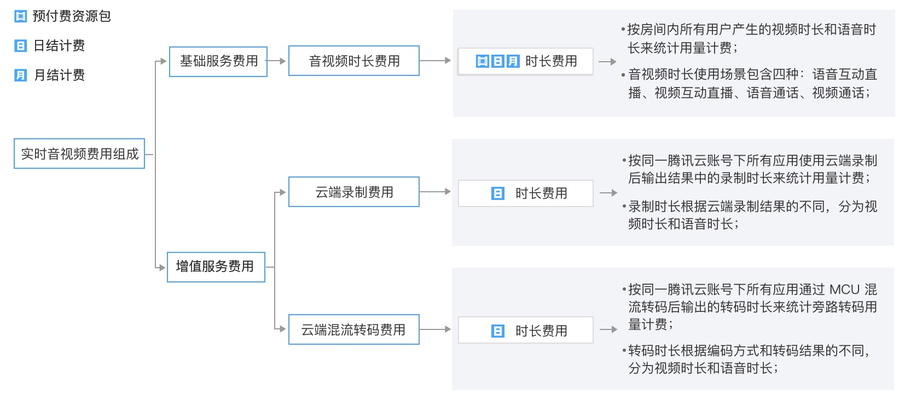
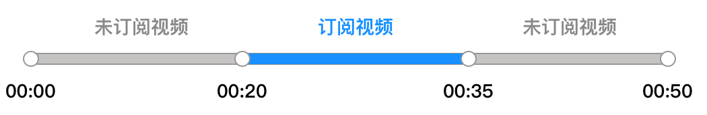

## 1. RTC

### 1.1 什么是RTC（Real-Time Communication）

- 实时通信

- 实时控制

- 实时内容

---

### 1.2 RTC的要求

- 低延迟

- 低卡顿

- 高质量传输

- 高品质音频

- 大规模高并发

- 全球接入

---

### 1.3 RTC的架构类型



- Mesh

- MCU（Multi-point Control Unit）

- SFU（Selective Forwarding Unit）

> **结论：SFU+MCU**

---

## 2. TRTC

### 2.1 什么是TRTC（Tencent Real-Time Communication）

**腾讯实时音视频**，基于腾讯21年来在网络与音视频技术上的深度积累，以多人音视频通话和低延时互动直播两大场景化方案，通过腾讯云服务向开发者开放，致力于帮助开发者快速搭建低成本、低延时、高品质的音视频互动解决方案。

---

#### 2.1.1 TRTC的产品架构交互图



---

#### 2.1.2 RT-ONE



- **TRTC** 实时音视频通信网络

- **IM** 即时通信网络

- **CDN** 流媒体分发网络

---

### 2.2 为什么使用TRTC

---

#### 2.2.1 TRTC的特点

- 端到端延迟 **小于300毫秒**。

- 超过 **80%** 抗丢包率和超过 **1000** 毫秒抗网络抖动。

- 单个房间支持 **300人** 同时在线和 **50人** 同时上行音视频。

- 视频支持 **720P**、**1080P** 高清画质，音频支持 **48kHz** 采样的高音质。

- 遍布全球的 **2000+** 加速节点。

---

#### 2.2.2 TRTC的应用场景

- 在线会议

- 在线教育

- 直播互动

- 线上活动

---

#### 2.2.3 TRTC的产品

- 腾讯会议

- 腾讯课堂

- 微信直播

- 全民K歌

---

### 2.3 如何使用TRTC

---

#### 2.3.1 TRTC的SDK

##### 平台

- Web

- Android

- iOS

- Windows

- Mac OS

- 微信小程序

- Electron

- Flutter

- React Native

- uni-app

##### 方案

###### 含UI集成方案（有的平台没有对应的SDK）

- 音视频通话（TUICalling）

- 多人视频会议（TUIRoom）

- 语音互动直播（TUIVoiceRoom）

- 视频互动直播（TUILiveRoom）

- 在线K歌（TUIKaraoke）

- 实时合唱（TUIChorus）

###### 无UI集成方案

- 进入和离开房间

- 发布和订阅音视频流

- 切换摄像头和麦克风

- 设置本地视频属性

- 动态关闭打开本地音频或视频

- 屏幕分享

- 音量大小检测

- 自定义采集与自定义播放渲染

- 检测浏览器支持性

- 检测网络通话质量

- 大小流传输

- 推流到CDN

- 云端混流和录制

---

#### 2.3.2 TRTC的实现流程



---

#### 2.3.3 TRTC的API

##### 客户端API

基于 WebRTC 的实时音视频通话解决方案，它通过 WebSocket 与腾讯云实时音视频后台服务器建立信令通道，信令通道主要是用来进行用户进退房、媒体能力交换、房间内用户状态变更通知等信令通信，音视频数据传输则通过 WebRTC 的 RTP/RTCP 进行。

##### 服务端API

- 房间管理相关接口
  
  - 踢人
  - 解散房间

- 通话质量监控相关接口
  
  - 查询历史房间列表
  - 查询详细事件
  - 查询历史用户列表
  - 查询历史房间和用户数

- 混流转码相关接口
  
  - 启动云端混流
  - 结束云端混流

- 其他接口
  
  - 查询旁路转码计费时长
  - 查询云端录制计费时长

---

#### 2.3.4 TRTC的模式

##### 实时音视频（rtc）

##### 互动直播（live）

- anchor（主播：上行和下行音视频）

- audience（观众：下行音视频）

---

#### 2.3.5 TRTC的浏览器支持情况

| 操作系统    | 浏览器     | 浏览器最低版本 | 接收  | 发送  | 屏幕分享       |
|:-------:|:-------:|:-------:|:---:|:---:|:----------:|
| Windows | Chrome  | 56+     | 支持  | 支持  | Chrome72+  |
|         | Firefox | 56+     | 支持  | 支持  | Firefox66+ |
|         | Edge    | 80+     | 支持  | 支持  | 支持         |
|         | Opera   | 46+     | 支持  | 支持  | Opera60+   |
|         | 微信      | -       | 支持  | 不支持 | 不支持        |
| Mac OS  | Safari  | 11+     | 支持  | 支持  | Safari13+  |
|         | Chrome  | 56+     | 支持  | 支持  | Chrome72+  |
|         | Firefox | 56+     | 支持  | 支持  | Firefox66+ |
|         | Edge    | 80+     | 支持  | 支持  | 支持         |
|         | Opera   | 46+     | 支持  | 支持  | Opera60+   |
|         | 微信      | -       | 支持  | 不支持 | 不支持        |
| Android | Chrome  | -       | 支持  | 支持  | 不支持        |
|         | 微信      | -       | 支持  | 支持  | 不支持        |
| iOS     | Safari  | 11+     | 支持  | 支持  | 不支持        |
|         | Chrome  | -       | 支持  | 支持  | 不支持        |
|         | 微信      |         | 支持  | 支持  | 不支持        |

---

#### 2.3.6 TRTC的一些限制

##### 协议限制

| 应用场景   | 协议               | 接收  | 发送  | 屏幕分享 | 备注  |
|:------:|:----------------:|:---:|:---:|:----:|:---:|
| 生产环境   | https协议          | 支持  | 支持  | 支持   | 推荐  |
| 生产环境   | http协议           | 支持  | 不支持 | 不支持  |     |
| 本地开发环境 | <http://localhost> | 支持  | 支持  | 支持   | 推荐  |
| 本地开发环境 | <http://127.0.0.1> | 支持  | 支持  | 支持   |     |
| 本地开发环境 | <http://[本机IP>]    | 支持  | 不支持 | 不支持  |     |
| 本地开发环境 | file:///         | 支持  | 支持  | 支持   |     |

##### 媒体限制

在用户与网页产生交互（例如点击、触摸页面等）之前，网页将被禁止播放带有声音的媒体。

- [Chrome 自动播放限制策略](https://developers.google.com/web/updates/2017/09/autoplay-policy-changes)

- [Safari 自动播放限制策略](https://webkit.org/blog/7734/auto-play-policy-changes-for-macos/)

##### 上行人数限制

单个房间内的上行用户个数限制是50人，超过50个人会出现发布失败的问题，需要让其他用户停止发布本地流，让出名额再发布。

---

#### 2.3.7 TRTC的云端录制

##### 云端分别录制



##### 云端混流录制


TRTC 云端录制文件会默认存储于云点播服务上，存储和播放会产生费用。

---

#### 2.3.8 TRTC的云端混流转码



---

#### 2.3.9 推流到TRTC（内测，需要申请）

在OBS中的串流密钥里面填写相应的参数：

```bash
房间号?sdkappid=应用&userid=用户名&usersig=签名
```

---

#### 2.3.10 TRTC的控制台



- 用量统计

- 监控仪表盘

- 开发辅助

- 套餐包管理

- 应用管理

---

### 2.4 TRTC的相关费用



---

#### 2.4.1 音视频时长费用

音视频时长费用 = 音频时长用量 × 音频单价 + 视频各分辨率档位时长用量 × 相应视频分辨率档位单价

##### 计费价格

| 计费类型     | 订阅视频的分辨率     | 单价（元/千分钟） |
|:--------:|:------------:|:---------:|
| 音频       | -            | 7元/千分钟    |
| 标清（SD）   | r<=480p      | 14元/千分钟   |
| 高清（HD）   | 480p<r<=720p | 28元/千分钟   |
| 全高清（FHD） | r>720p       | 105元/千分钟  |

##### 示例

用户A和B两人准备在 TRTC 房间内进行音视频通话。A进入房间后等了20分钟后B进入房间。A订阅B的高清视频，B订阅A的标清视频，双方进行了15分钟的视频通话后B离开房间，A继续待了15分钟后退出房间。



> **A的音频时长 = 在房时长 - 订阅视频的时长 = 50分钟 - 15分钟 = 35分钟**
>
> **A的视频时长 = 订阅视频时长 = 15分钟**
>
> **B的视频时长 = 订阅视频时长 = 15分钟**
>
> **A产生的音频费用** = 7元/千分钟 × (20分钟/1000) + 7元/千分钟 × (15分钟/1000) = 0.245 元
>
> **A产生的视频费用** = 28元/千分钟 x (15分钟/1000) = 0.42元
>
> **B产生的视频费用** = 14元/千分钟 x (15分钟/1000) = 0.21元
>
> **总费用** = A产生的费用 + B产生的费用 = 0.245元 + 0.42元 + 0.21元 = 0.875元
>
> 10万人的总费用 = 14元/千分钟 x (60分钟/1000) x 100000 = 84000元？

---

#### 2.4.2 云端录制费用

##### 云端录制计费价格

| 计费类型     | 录制视频的分辨率     | 单价（元/千分钟） |
|:--------:|:------------:|:---------:|
| 语音       | -            | 3.5元/千分钟  |
| 标清（SD）   | r<=480p      | 7元/千分钟    |
| 高清（HD）   | 480p<r<=720p | 14元/千分钟   |
| 全高清（FHD） | r>720p       | 52.5元/千分钟 |

不混流直接录制分别计算价格，混流后再录制按720p计算。

---

#### 2.4.3 云端混流转码费用

##### 云端混流转码计费价格

| 计费类型     | 混流视频的分辨率     | 单价（元/千分钟） |
|:--------:|:------------:|:---------:|
| 语音       | -            | 5.6元/千分钟  |
| 标清（SD）   | r<=480p      | 16元/千分钟   |
| 高清（HD）   | 480p<r<=720p | 32.5元/千分钟 |
| 全高清（FHD） | r>720p       | 63元/千分钟   |

---

### 2.5 TRTC的相关功能

---

#### 2.5.1 即时通信 IM

[即时通信 IM](https://cloud.tencent.com/document/product/269/11673)

---

#### 2.5.2 虚拟背景

[TensorFlow Lite](https://www.tensorflow.org/lite)

[虚拟背景](https://volcomix.github.io/virtual-background/)

---

#### 2.5.3 美颜

##### 腾讯特效引擎

[腾讯特效引擎](https://cloud.tencent.com/document/product/647/59129)

##### 相芯美颜

[相芯美颜](https://cloud.tencent.com/document/product/647/55124)

---

#### 2.5.4 语音识别

[语音识别 ASR](https://cloud.tencent.com/document/product/1093/68499)

---

#### 2.5.5 内容审核

[内容审核](https://cloud.tencent.com/document/product/647/69055)

---

## 3. 总结
